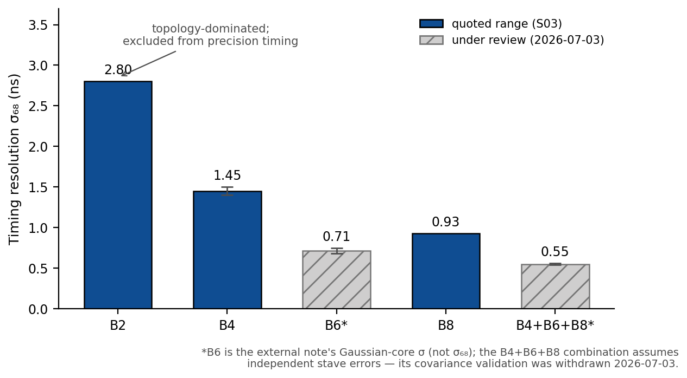
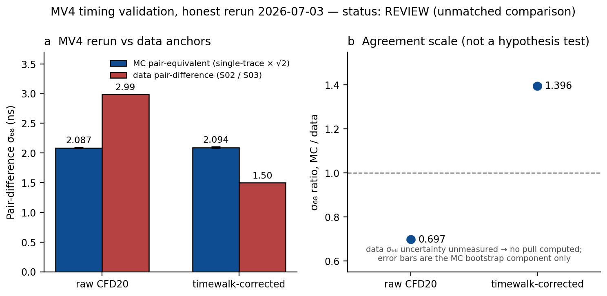
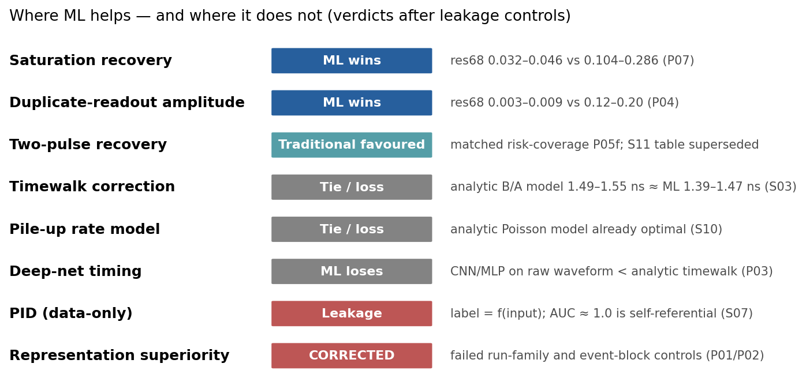
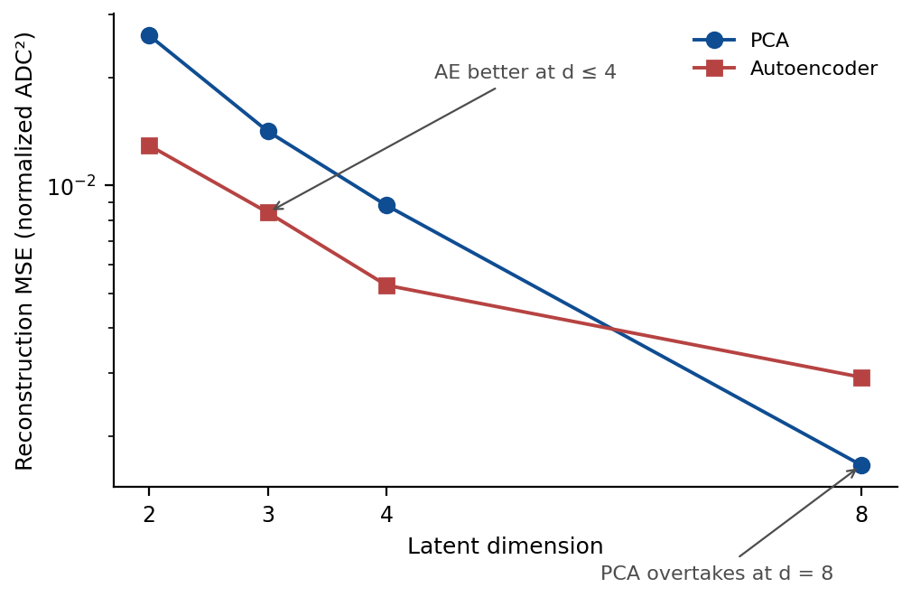
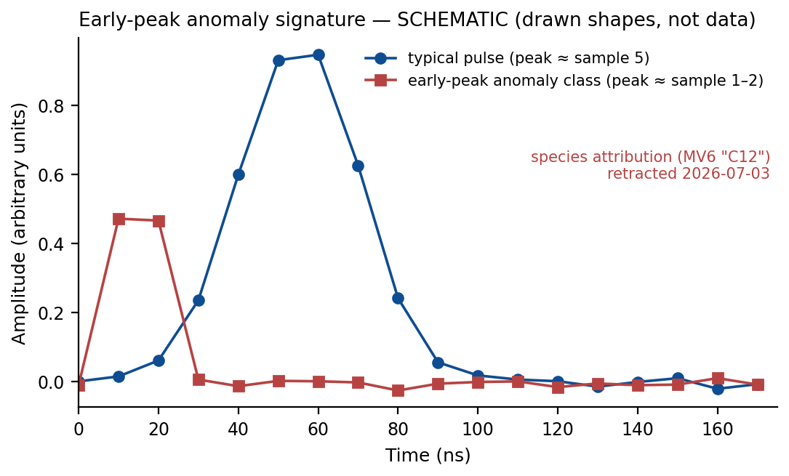
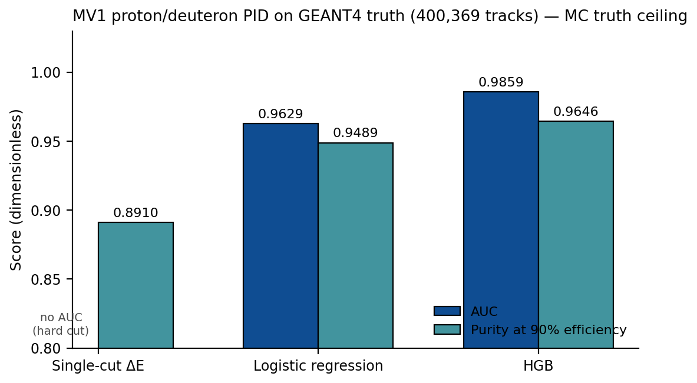
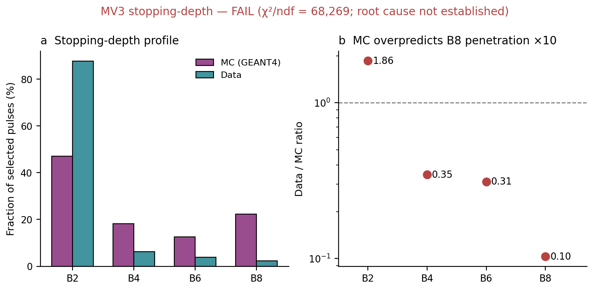
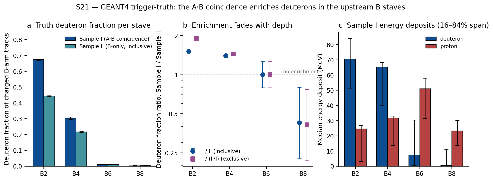
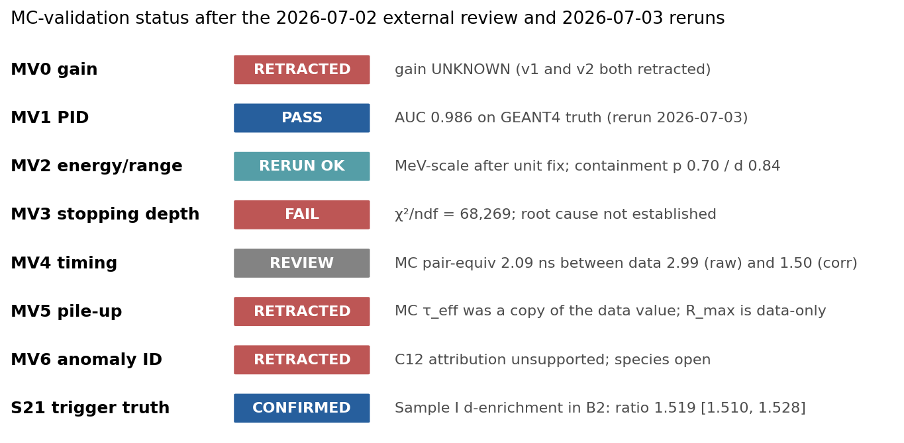

# CCB Test-Beam Analysis — Unified Illustrated Wiki

> **A self-contained guide to the CCB test-beam analysis, written for readers with and without prior knowledge of particle physics instrumentation.**
>
> Every study has a **descriptive name** and a **hyperlink** to its full report. Claims are traceable to source, and numbers carry uncertainties where the source artifact provides them; where a source publishes no uncertainty (or a claim is under review), that gap is flagged inline rather than papered over.
>
> **Repository:** [SzeChunYiu/ccb-testbeam](https://github.com/SzeChunYiu/ccb-testbeam) | **Started:** 2026-06 | **Status:** Research synthesis (preliminary, not yet peer-reviewed)
>
> **Correction 2026-07-03:** an external review ([`EXTERNAL_REVIEW_2026-07-02.md`](EXTERNAL_REVIEW_2026-07-02.md)) found the MC-validation layer unsound; corrections are applied throughout this wiki.
>
> **Update 2026-07-03 (post-review reruns):** three honest reruns landed the same day: **S21** confirms the Sample-I deuteron-enrichment hypothesis at truth level ([§8.4](#84-trigger-truth-deuteron-enrichment-s21--confirmed)); **MV4** was rerun with a rising-edge CFD and physical timewalk sign, verdict REVIEW ([§4.7](#47-mc-validation-of-timing-mv4-honest-rerun)); **MV2** was rerun after the momentum-unit fix and now reports MeV-scale energies ([§7.3](#73-absolute-energy-limitation)).

---

## Quick Navigation

| I want to... | Go to |
|---|---|
| See the key results at a glance | [§1 Executive Summary](#1-executive-summary) |
| Understand the experiment | [§2 Experimental Setup](#2-experimental-setup) |
| Follow the data from raw files | [§3 Data Pipeline](#3-data-pipeline) |
| Understand timing resolution | [§4 Timing Analysis](#4-timing-analysis) |
| Learn about pile-up | [§5 Pile-up Analysis](#5-pile-up-analysis) |
| See where ML helps (or doesn't) | [§6 Pulse Shape & Machine Learning](#6-pulse-shape--machine-learning) |
| Check the methodology | [§12 Methodology Appendix](#12-methodology-appendix) |
| Find what's still missing | [§11 Open Questions](#11-open-questions--next-steps) and [`STUDY_GAPS.md`](STUDY_GAPS.md) |
| Browse all studies with proper names | [Study Catalogue](#study-catalogue) |

---

## 1. Executive Summary

### What is this project?

This project analyzes data from a **test-beam experiment** at the **Cyclotron Centre Bronowice (CCB)** in Kraków, Poland. A beam of **190 MeV protons** struck a **deuterated polyethylene (CD₂) target**, and the resulting charged particles were measured by **HRD scintillator range stacks** — detectors that stop particles in successive layers ("staves") to measure their energy and type.

Each scintillator stave records a **180-nanosecond waveform** (18 samples, one every 10 ns). From these waveforms we extract **pulse amplitude**, **arrival time**, and **pulse shape**. The physics goals are:

1. **Same-particle timing resolution** — how precisely can we timestamp when a particle hits each stave?
2. **Pile-up characterization** — how often do overlapping pulses degrade our measurements, and at what beam rate does this become the limiting factor?

The analysis is **data-driven** (no per-event Monte Carlo truth), but uses **GEANT4 Monte Carlo simulations** as a "truth bridge" to validate key findings.

### Key Results at a Glance

| Measurement | Value | Confidence |
|---|---|---|
| Selected B-stack pulses | **640,737** (exact reproduction) | ✅ Validated (S00) |
| Best single-stave timing (B6) | **σ(core) ≈ 0.68–0.75 ns** (external-note Gaussian-core decomposition; not σ₆₈, not MC-validated) | ⚠️ Under review |
| Combined 3-stave (B4+B6+B8) | **σ ≈ 0.54-0.56 ns** | ⚠️ Under review (covariance validation withdrawn 2026-07-03; assumes independent stave errors — unmeasured) |
| Pile-up tolerance R_max | **≤ 3.05 MHz** (one-sided upper bound, corrected from 4.22 MHz; censoring-aware estimators suggest ≈2.1 MHz or lower) | ⚠️ Data-only (MV5 was self-referential, not an independent validation) |
| Proton/deuteron PID | **AUC = 0.986** (MC truth ceiling; data reaches it only via weak-label proxies, not species truth) | ⚠️ Qualitative MC support (MV1, rerun 2026-07-03) |
| Sample-I deuteron enrichment (B2) | **ratio 1.519 [1.510, 1.528]** vs Sample II (exclusive 1.912 [1.898, 1.925]) | ✅ Confirmed at truth level (S21, 2026-07-03; truth-level MC only — no digitizer/threshold) |
| MC timing (MV4 honest rerun) | MC pair-equivalent **2.087 ± 0.009 ns**, between data raw 2.993 ns and corrected 1.50 ns | ⚠️ REVIEW — unmatched comparison; matched per-stave rerun pending |
| Anomaly class identity | **C12 nuclear recoils** (0.32% of tracks) | ⛔ Withdrawn 2026-07-03 (MV6 ran with invalidated gain, no quenching, no threshold; 12× data/MC rate mismatch unresolved) |
| Digitizer gain | **UNKNOWN** — both v1 (~246) and v2 (92 ± 28 ADC/MeV) retracted 2026-07-03 | ⛔ Retracted (MV0 v2 anchor was a folded garbage variable; see External Review 2026-07-02) |
| ML wins domains | Duplicate-readout, saturation recovery | ⚠️ Data-only |

### Executive Verdict

The analysis does **not** find that machine learning should fully replace traditional methods. ML excels where **the missing information is genuinely in waveform shape** (saturation recovery, duplicate-readout closure). Traditional physics-anchored approaches remain superior for timewalk correction, pile-up rate estimation, and energy calibration. The most important finding is methodological: **most apparent ML "wins" fail leakage controls** — a lesson in rigorous ML evaluation.

---

## 2. Experimental Setup

### The Beamline

```
                         ┌──────────────┐
  190 MeV protons ──────▶│  CD₂ Target  │──────▶ scattered charged particles
                         └──────────────┘
                                │
                    ┌───────────┼───────────┐
                    ▼                       ▼
             ┌────────────┐          ┌────────────┐
             │  Trigger   │          │    TPC     │
             │ Scintillators│         │ (tracking) │
             └────────────┘          └────────────┘
                    │
        ┌───────────┴───────────┐
        ▼                       ▼
  ┌───────────┐          ┌───────────┐
  │  A-Stack  │          │  B-Stack  │  ★ Primary analysis
  │  A1 A3... │          │ B2 B4 B6 B8│
  │  ~100 cm  │          │  ~100 cm  │
  └───────────┘          └───────────┘
```

> **Authoritative setup (experiment-owner setup facts, 2026-07-03; diagram source: `drawing_ccb_setup`):**
> Stack A and Stack B are **two independent detector arms at conjugate angles**, each ~100 cm from
> the CD₂ target and each behind its **own trigger scintillators**, with the **TPC in front of
> Stack A only**. The arms measure **different particles** — pd-elastic scattering sends the proton
> into one arm and the kinematically-correlated deuteron into the other. An A·B coincidence
> therefore tags a correlated **pair** sharing the event T0, never the same particle twice.
> The triggers define the samples: **Sample I = A AND B trigger coincidence** (MC mimic: a charged
> particle entering the first A layer and the first B layer within 15 ns); **Sample II = B trigger
> only** (A ignored). In MC, Sample I is a **subset** of Sample II (inclusive); in data, Samples I
> and II are **disjoint run sets** taken with different trigger configurations. The ASCII sketch
> above is schematic only.

### Detector Details

| Component | Specification |
|---|---|
| **Beam** | Proton, kinetic energy T_p = 190 MeV |
| **Target** | Deuterated polyethylene (CD₂) |
| **HRD Stacks** | Two scintillator range telescopes (A and B) |
| **Distance from target** | ~100 cm |
| **Primary staves** | B2, B4, B6, B8 (even channels only) |
| **Independent-arm staves** | A1, A3 (Stack A — independent arm at the conjugate angle, measures different particles) |
| **Waveform** | 18 samples × 10 ns spacing = 180 ns window |
| **Readout** | One-ended wavelength-shifting (WLS) fibre → SiPM |
| **WLS propagation** | ~17 cm/ns |

### How the Detector Works

The HRD stacks function as a **ΔE–E / range telescope**:

1. A charged particle enters B2 (the most upstream stave), depositing energy
2. It continues through B4 → B6 → B8, slowing down at each layer
3. **Heavier particles** (deuterons) stop earlier (B2/B4); **lighter particles** (protons) penetrate deeper (B6/B8)
4. Each stave records an **18-sample waveform** capturing the scintillation light pulse
5. From each waveform we extract: **amplitude** (ADC), **arrival time** (ns), and **pulse shape** features

This is **not** an imaging detector — we get time and amplitude, not spatial position within a stave.

### Data Samples

| Sample | Stack | Description | Enrichment |
|---|---|---|---|
| **Sample I** | B | A·B trigger-coincidence runs; topology-heavy | D-enriched in upstream B staves: **confirmed at truth level** (S21: B2 ratio 1.519 [1.510, 1.528] vs Sample II; [§8.4](#84-trigger-truth-deuteron-enrichment-s21--confirmed)) |
| **Sample II** | B | B-trigger-only runs; penetrating | p-enriched relative to Sample I (S21 truth: f_p rises from 0.40 in B2 to 0.87 in B8) |
| **Sample III** | A | A-arm data from the Sample I runs | Independent arm — different particles |
| **Sample IV** | A | A-arm data from the Sample II runs | Low statistics (A not in the trigger) |

> **Key insight (corrected 2026-07-03, experiment-owner setup facts):** The "Sample I vs II" split reflects trigger configuration, not a beam change: **Sample I = A AND B trigger coincidence** (MC mimic: charged particle entering the first A and first B layer within 15 ns); **Sample II = B trigger only** (A ignored). In MC, Sample I is a **subset** of Sample II (inclusive flags in `src/ccb_mc_validation/io/root_truth.py`; the legacy `sample_label` was exclusive). In data, Samples I and II are **disjoint run sets** with different trigger configurations — every MC-vs-data sample comparison must state this asymmetry. The deuteron enrichment of Sample I in the B stack — previously a hypothesis after the earlier GEANT4 "confirmation" ran on retracted machinery — is now **confirmed at truth level by S21** (trigger-mimicked truth study, 2026-07-03): B2 deuteron-fraction ratio I/II = 1.519 [1.510, 1.528], and 91.2% of Sample-I events are a deuteron-into-B, proton-into-A pair — the direct signature of the kinematically-correlated pd-elastic pair the coincidence tags. See [§8.4](#84-trigger-truth-deuteron-enrichment-s21--confirmed).

---

## 3. Data Pipeline

### End-to-End Flow

```
┌──────────────┐     ┌────────────────┐     ┌──────────────────┐
│  Raw ROOT    │────▶│  Pulse Table   │────▶│  Analysis        │
│  Files (110) │     │  640,737 pulses│     │  Branches        │
│  ~810 MB     │     │  CSV format    │     │                  │
└──────────────┘     └────────────────┘     └──────────────────┘
                                                     │
              ┌──────────────────────────────────────┤
              ▼                     ▼                ▼
    ┌─────────────────┐  ┌─────────────────┐  ┌──────────────┐
    │  Timing Branch  │  │  Pile-up Branch │  │  PID Branch  │
    │  CFD → Timewalk │  │  Live-time → R  │  │  ΔE-E → AUC  │
    │  → Residuals    │  │  → Two-pulse    │  │  → GEANT4    │
    └─────────────────┘  └─────────────────┘  └──────────────┘
```

### Step 1: Raw ROOT → Pulse Table

**Study:** [Data Integrity & Pipeline Reproduction (S00)](reports/1780997954.15097.28a25ecb__s00a_sorted_hrdmax_semantics/)

The script `scripts/01_build_pulse_table_from_root.py` reads 110 ROOT files and produces a selected-pulse table:

1. Read `HRDv` tree from each ROOT file
2. Use **even B-stack staves** only: B2, B4, B6, B8
3. Compute **baseline** = median of ADC samples 0–3
4. Select pulses with **amplitude A > 1000 ADC**

**Result:** Exactly **640,737 selected B-stave pulse records** — reproduced with zero delta from the original analysis note.

### Step 2: Pulse Table → Analysis Branches

The selected-pulse table contains per-pulse columns:
- `run`, `event`, `stave` — identifiers
- `amplitude`, `baseline`, `peak_sample` — basic quantities
- `cfd_time`, `template_phase`, `q_template` — reconstructed timing and shape quality

All downstream analysis scripts read from this table and produce results in `reports/<id>/REPORT.md`.

### Step 3: MC Validation Pipeline

**Study:** [Digitizer Calibration (MV0)](reports/mv0_digitizer/)

The GEANT4 Monte Carlo produces **truth-level** particle data (PDG code, energy, position, time) but no waveforms. The **MV0 digitizer** converts MC truth into synthetic 18-sample ADC waveforms by modeling:

- Scintillator rise/decay (BC-408)
- WLS/fibre transit smearing
- 10 ns sampling
- Electronics noise + baseline
- Saturation clipping

This lets the same analysis pipeline run on MC data **with truth labels attached**, enabling direct data-vs-MC comparisons with known answers.

> ⚠️ **Known defect (External Review 2026-07-02, C1):** the shared-library digitizer's hit time cancels exactly in the sampling code (waveforms are bit-identical for t0 = 0/50/55 ns) and it diffs a peak-normalized kernel instead of integrating it. MC-validation studies that used it inherit this defect; the Phase 1 digitizer overhaul (unified, config-driven, per-stave) is the planned fix. Gain values are retracted (§9.2); truth-level studies such as S21 bypass the digitizer entirely.

---

## 4. Timing Analysis

> **Key Findings:**
> - Best single-stave timing: **B6 σ(core) ≈ 0.68–0.75 ns** (external-note Gaussian-core decomposition; not σ₆₈, not MC-validated — under review 2026-07-03)
> - Combined 3-stave (B4+B6+B8): **σ₆₈ ≈ 0.54–0.56 ns** (under review — covariance validation withdrawn 2026-07-03)
> - Analytic timewalk reaches **1.49–1.55 ns** — tied with ML at 1.39–1.47 ns under proper cross-validation
> - B2-containing pairs have **large covariance** — B2 is excluded from precision timing
> - A-stack reproduces: **A1–A3 width = 1.39 ns** (matches note's 1.43 ns) — independent-arm methodology check on different particles (2026-07-03)
> - MC timing (MV4 honest rerun 2026-07-03): MC pair-equivalent σ₆₈ = **2.087 ± 0.009 ns**, between the data raw (2.993 ns) and corrected (1.50 ns) anchors — **REVIEW**; matched per-stave comparison pending Phase 1 digitizer

### 4.1 What is Timing Resolution?

When the same particle passes through two staves, the **time difference** Δt = t_stave1 − t_stave2 should be zero (for perpendicular tracks, after corrections). The width of the Δt distribution tells us how precisely each stave timestamps particles.

For a single stave: sigma_single = sigma(Deltat) / sqrt(2) (exact for independent Gaussian errors; for sigma68 this is approximate -- the decomposition assumes Gaussian Deltat distribution, verified for downstream pairs but not for B2-containing pairs)

We use **σ₆₈** — the half-width containing 68% of residuals (robust equivalent of Gaussian σ).

### 4.2 The Timing Chain

```
Raw Waveform → CFD20 (seed time) → Template Phase Fit → Amplitude Timewalk Correction → Final t
```

| Step | Study | Method | σ₆₈ (ns) |
|---|---|---|---|
| **1. Pickoff** | [Timing Pickoff (S02)](reports/1780997954.15157.07ef03cf__s02_timing_pickoff/) | CFD20 at 20% of peak | **1.85** |
|  |  | Template phase fit | 2.89 |
| **2. Timewalk** | [Analytic Timewalk (S03)](reports/1781000705.514827.50025402__s03a_analytic_timewalk_correction/) | Amplitude-only analytic | **1.49–1.55** |
|  |  | Ridge residual corrector | 1.39–1.47 |
|  |  | HGB on waveform+shape (S03k, gated) | 1.11 (in-fold only) |
| **3. Combined** | [Timing Covariance (S05)](reports/) | B4+B6+B8 event time | **0.54–0.56** |

**Winner:** The **simple analytic timewalk correction** — transparent, robust, and nearly matches ML performance. The HGB result (σ₆₈ = 1.107 ns) is explicitly **gated pending a transfer audit** — it has not been adopted.

> ⚠️ **Anchor caveat (External Review 2026-07-02, P3):** the 1.85 ns "CFD20" value above is the anchor the analysis note carried forward, but the S02 head-to-head benchmark's raw CFD20 pair-difference σ₆₈ is **2.993 ns** (`head_to_head_benchmark.csv`, row `cfd20_reference`) — the 1.85 ns figure includes ML-ridge correction. The MV4 rerun (§4.7) uses 2.993 ns as the raw anchor.

### 4.3 Amplitude Timewalk

**The dominant timing systematic: larger pulses appear to arrive earlier.**

This is a well-known effect in scintillator + SiPM readout: bigger pulses cross the constant-fraction threshold sooner. The correction is:

```
t_corrected = t_CFD − f(amplitude)
```

where the analytic form is **f(A) = A₀ + B/amplitude** (fitted per stave from calibration runs, B2-blind to avoid topology bias).

**Study:** [Analytic Timewalk Correction (S03)](reports/1781000705.514827.50025402__s03a_analytic_timewalk_correction/)

### 4.4 Per-Stave Timing Resolution



*Figure: per-stave timing resolution. Solid bars are quoted S03 ranges (error bars = half-width of the quoted range, not fitted CIs); hatched bars are under review since 2026-07-03 — B6 is the external note's Gaussian-core σ (not σ₆₈), and the B4+B6+B8 combination assumes independent stave errors after its covariance validation was withdrawn.*

| Stave | σ₆₈ (ns) | Notes |
|---|---|---|
| B2 | ~2.8 | Topology-dominated, large covariance — **excluded from precision** |
| B4 | ~1.45 | Good downstream reference |
| B6 | **~0.72** | Best single-stave — cleanest timing (Gaussian-core value, not σ₆₈; under review 2026-07-03) |
| B8 | ~0.93 | Good, some penetration dependence |
| **B4+B6+B8** | **~0.55** | Combined event time (under review — covariance validation withdrawn 2026-07-03) |

### 4.5 The B2 Covariance Problem

**Study:** [Hierarchical B-Stack Covariance (S05c)](reports/)

B2-containing timing pairs show dramatically larger covariance:
- **B2-X pairs:** covariance ≈ 1042 ns²
- **B4-B6, B4-B8, B6-B8 pairs:** covariance ≈ 16 ns²

> ⚠️ **Correction (2026-07-03):** the quantitative covariance values above come from a closure script that was numerically invalid (off-diagonals exceed the diagonals — an impossible covariance matrix); they are withdrawn as measurements. The residual inter-stave covariance is unmeasured. The qualitative finding (B2 pairs are far more correlated than downstream pairs) stands.

This means B2 timing fluctuations are **not independent** of other staves — there is a shared, topology-correlated component. **B2 must be excluded from precision event-time estimates.** This is a physics finding (terminal deuteron topology), not a detector malfunction.

### 4.6 A-Stack Independent-Arm Check

**Study:** [A-Stack Independent Reproduction (S18)](reports/1780997954.15397.168324f2__s18_astack_independent_reproduction/)

> **Interpretation corrected 2026-07-03 (experiment-owner setup facts):** the A-stack is an
> **independent detector arm at the conjugate angle** — it measures **different particles** than the
> B-stack (pd-elastic sends the proton into one arm, the correlated deuteron into the other). Its
> timing results therefore check the **methodology** (calibration chain, timewalk, width extraction)
> on an independent detector; they are *not* a cross-check of the same particles, and any A–B
> coincidence timing carries the pd-pair kinematic spread plus the shared event T0.

The A-stack (A1/A3) provides an analysis-decoupled timing measurement on the independent arm:
- **Sample III** (A-arm data, coincidence-trigger runs): robust width **1.39 ns** — reproduces the analysis note's 1.43 ns
- **Sample IV** (A-arm data, B-trigger-only runs): broadening to 1.79 ns is a **calibration-pool / low-statistics effect**, not a physics effect
- ML residual correction makes timing *worse* (1.94 ns) — **ML is not adopted** for A-stack

### 4.7 MC Validation of Timing (MV4 honest rerun)

**Study:** [Timing Resolution Validation, honest rerun (MV4)](reports/mv4_timing_1783077795/) — 2026-07-03

The rerun replaces the invalidated 2026-07-01 comparison. Two code fixes landed first, both confirming the external review's diagnoses:

1. **Rising-edge CFD.** The old CFD scanned forward from sample 0 and, at the 250-ADC selection, its 20% threshold sat at ~1σ of noise — roughly half of low-amplitude "crossings" were noise, not signal. The rerun constrains the CFD to the last below-to-above crossing before the peak, eliminating the noise-crossing pathology.
2. **Physical timewalk sign.** With the MV4b functional-form fix (B/amplitude instead of B/√amplitude) and the rising-edge CFD, the fitted timewalk coefficient is **B = +39.6 ns·ADC** — the physically expected positive leading-edge sign. The earlier "unphysical negative B" was an artifact of the noise crossings.

| Stage | MC single-trace σ₆₈ (ns) | MC pair-equivalent σ₆₈ (ns) | Data pair-difference σ₆₈ (ns) | MC/data ratio |
|---|---|---|---|---|
| raw CFD20 | 1.476 ± 0.007 | 2.087 ± 0.009 | 2.993 (S02) | 0.697 ± 0.003 |
| timewalk-corrected | 1.481 ± 0.009 | 2.094 ± 0.012 | 1.50 (S03) | 1.396 ± 0.008 |



*Figure: MV4 honest rerun (2026-07-03). (a) MC pair-equivalent σ₆₈ (single-trace × √2, assuming independent stave errors) against the data pair-difference anchors; MC error bars are bootstrap. (b) MC/data ratio; the dashed line marks equality. The data σ₆₈ uncertainty is unmeasured, so **no pull is computed** — the ratio quantifies agreement scale only and is not a hypothesis test. Source: [`reports/mv4_timing_1783077795/mv4_summary.json`](reports/mv4_timing_1783077795/mv4_summary.json).*

**Verdict: REVIEW.** The MC pair-equivalent value (2.087 ns) falls between the data raw (2.993 ns) and corrected (1.50 ns) anchors, so the toy digitizer is in the right regime but the comparison is still not matched: merged-track MC waveforms vs per-stave data pulses, unmatched selection, and a retracted gain (the gain here only sets the toy's amplitude/noise scale — no ADC/MeV claim). The MC timewalk correction yields no improvement (1.00×) because the rising-edge CFD has already removed the amplitude-dependent noise bias that dominates the data correction. A matched per-stave rerun awaits the Phase 1 digitizer overhaul.

---

## 5. Pile-up Analysis

> **Key Findings:**
> - The note's R_max = 4.22 MHz used τ_eff = 90 ns — **WRONG**
> - Measured waveform live-time: **τ_eff = 124.8 ns** → **R_max ≤ 3.05 MHz** (one-sided upper bound; censoring-aware estimators — KM 151.6 ns, IPCW 179.1 ns — suggest ≈2.1 MHz or lower)
> - ⛔ The "MC confirms R_max" claim is retracted (2026-07-03): MV5's "MC τ_eff" was a hardcoded copy of the data value — no independent MC live-time measurement exists
> - ML two-pulse recovery: better RMS but **higher failure rate** (0.295 vs 0.168) — superseded by the matched risk-coverage study P05f, which favours the traditional fit (§5.3)
> - ML pile-up score has large current-independent baseline (ratio ~1.29× between high/low current). Measured downstream excess at 20 nA: 0.0103 per selected event [CI 0.0064-0.0142], excess_fraction = 30.8% of high-current downstream rate (S10 current_excess_table.csv). ML score excess_fraction = 22.9% (ratio 1.30). These are separate measurements.

### 5.1 What is Pile-up?

When two particles hit the same stave within the 180 ns waveform window, their signals **overlap**. This distorts both amplitude and timing. The pile-up probability depends on:

- **Beam rate R** (particles per second per stave)
- **Effective live-time τ_eff** (the time window during which a second pulse would distort the first)

The maximum tolerable rate: **R_max = μ_max / τ_eff** where μ_max is the acceptable occupancy.

### 5.2 The R_max Correction

**Study:** [Pile-up Rate Model (S10)](reports/1780997954.15277.548b01a3__s10_pileup_rate_model/)

The original analysis note assumed τ_eff = 90 ns → R_max = 4.22 MHz.

**Direct waveform measurement** (10% tail-crossing of the pulse template):
- **Live-time: τ_eff = 124.79 ns** (bootstrap CI: [123.33, 126.36] ns)
- **R_max ≤ 3.05 MHz** (one-sided upper bound; for |Δt| < 1 ns and area error < 20%, at ε > 90%)

**MC confirmation (MV5): ⛔ RETRACTED as validation (2026-07-03).** [Pile-up Rate Validation (MV5)](reports/mv5_pileup_study/)
- MV5 used the data-measured τ_eff as an input (the "MC τ_eff = 124.8 ns" was a hardcoded copy); no independent MC live-time measurement exists. Given the toy τ_decay = 42 ns vs measured data tails 49–57 ns, an honest MC measurement would disagree.
- R_max = 0.380/τ_eff is a **data-driven one-sided bound**: censoring-aware estimators (KM 151.6 ns, IPCW 179.1 ns) imply **R_max ≤ 3.05 MHz, plausibly ≈2.1 MHz or lower**.

> ⚠️ **The analysis note's R_max ≈ 4.2 MHz is an error from an incorrect τ_eff assumption; that correction stands, but as an upper bound.** All references should use R_max ≤ 3.05 MHz.

### 5.3 Two-Pulse Recovery

**Study:** [Two-Pulse Template + ML Recovery (S11)](reports/)

When two pulses overlap, we can try to **decompose** them:

| Method | Time RMS (ns) | Failure Rate |
|---|---|---|
| Constrained two-pulse template fit | 13.30 | **0.168** |
| ML (compact MLP/CNN) | 10.67 | 0.295 |
| Amplitude-binned ML | 9.28 | 0.295 |

ML recovers shorter separations and lower time-RMS, but has a **higher failure rate**. The conventional fit is **safer at the accepted-recovery operating point**. ML adoption is gated on a dedicated MC overlay study with truth labels.

> ⚠️ **Caveat (2026-07-03):** the benchmark's injection grid coincided with the fit's hypothesis grid and injected waveforms were generated from the fit's own templates; failure definitions differ between methods at unmatched coverage. The matched risk-coverage comparison (P05f) favours the traditional fit — treat the table above as superseded.

### 5.4 Current-Dependent Excess

The ML pile-up classifier score ratio between high and low current is ~1.29× (not the ~10× expected from the 10× current ratio under pure Poisson scaling), indicating a large current-independent contribution (scintillator tails, waveform pathologies). Separately, the measured downstream per-event excess at 20 nA is 0.0103 per selected event [CI 0.0064-0.0142, S10 current_excess_table.csv], representing 30.8% of the high-current downstream rate. The ML pile-up score shows 22.9% excess at high current (ratio 1.30). These are two independent measurements of different quantities. These are two independent measurements: the ML score ratio measures classifier behavior; the downstream excess measures physical pile-up rate. They should not be chained causally.

---

## 6. Pulse Shape & Machine Learning

> **Key Findings:**
> - Pulse shapes are **low-dimensional**: 3 PCA components capture 89% of variance, 8 capture 99.7%
> - **Autoencoder beats PCA** at very low latent dim (2–4); PCA catches up at dim ≥ 8
> - ML genuinely wins where truth is independent and information is in waveform shape
> - **All representation-superiority claims for downstream tasks: ❌ CORRECTED** (leakage artifact)
> - ⛔ The anomaly-class identification (**C12 nuclear recoils**, MV6) is withdrawn (2026-07-03): MV6 ran with the invalidated gain, no Birks quenching and no amplitude threshold, and the data ~4% vs MC 0.32% figures use different denominators — the species identity is again open
> - **The project's most important finding: most ML "wins" fail leakage controls**

### 6.1 Where ML Helps vs. Where It Doesn't



*Figure: ML verdicts per domain after leakage controls. Two-pulse recovery is shown as "traditional favoured" per the matched risk-coverage study (P05f), which supersedes the S11 headline table (§5.3).*

| Domain | ML Verdict | Why |
|---|---|---|
| **Saturation recovery** | ✅ **ML Wins** (3–7× better) | Truth (true amplitude) independent of input; signal is in waveform rising edge |
| **Duplicate-readout amplitude** | ✅ **ML Wins** (res68 0.003 vs 0.12) | Truth from duplicate readout; independent of primary channel |
| **Two-pulse time RMS** | ⚠️ Traditional favoured at matched coverage | S11 headline (ML RMS 9–11 ns vs 13–18 ns, failure 0.295 vs 0.168) superseded by the matched risk-coverage study P05f (§5.3 caveat) |
| **Timewalk correction** | ❌ Tie/Loss | Analytic B/amplitude model already near-optimal |
| **Pile-up Poisson rate** | ❌ Tie | Analytic Poisson model already optimal |
| **Deep net timing** | ❌ ML Loses | CNN/MLP on raw waveform loses to analytic timewalk |
| **PID (data-only)** | ❌ Leakage | D_t/curvature classifiers hit AUC ~1.0 because label = f(input) |
| **Representation superiority** | ❌ CORRECTED | Apparent AE→P03 win was leakage; failed run-family and event-block shuffle |

### 6.2 Pulse Shape Compression



*Figure: waveform reconstruction MSE (normalized ADC², log scale) vs latent dimension. The autoencoder wins at d ≤ 4; PCA overtakes at d = 8. Values from the P01 report table below (no per-point uncertainties were published).*

**Study:** [Self-Supervised Waveform Representation (P01)](reports/1780997954.15517.0cbc248c__p01_self_supervised_waveform_representation/)

| Latent Dim | PCA MSE | AE MSE | Winner |
|---|---|---|---|
| 2 | 0.02622 | 0.01294 | AE +50.6% |
| 3 | 0.01416 | 0.00841 | AE +40.6% |
| 4 | 0.00880 | 0.00527 | AE +40.1% |
| 8 | 0.00166 | 0.00292 | PCA +75.9% |

**Conclusion:** Pulses are simple shapes. The AE helps at very low dimensions (capturing nonlinear manifold), but PCA catches up once sufficient linear components are retained. The representation is compact — there's no deep hidden structure in pulse shape.

### 6.3 The C12 Anomaly

**Study:** [Representation & Anomaly ID (MV6)](reports/mv6_representation_study/) | [MV6 C12 Physics](docs/MV6_C12_PHYSICS.md)



*Figure: SCHEMATIC only — the waveforms are drawn shapes illustrating the early-peak signature of the P09a anomaly class, not measured pulses. The species attribution ("C12", MV6) is retracted.*

Unsupervised discovery (P09a) found an anomalous class with **early peaking (sample 1–2 instead of sample 5) and near-zero area**. MV6 claimed to identify it:

> ⛔ **RETRACTED (2026-07-03):** MV6 ran with the invalidated gain (246), no Birks quenching, no amplitude threshold (despite claiming "threshold-corrected"), and per-track whole-arm waveforms vs per-stave data pulses. The C12 attribution is unsupported, and the data ~4% vs MC 0.32% figures use different denominators and taxonomies (selected pulses with A>1000 vs all charged tracks) — the ~12× rate mismatch is unresolved. The numbers below are retained for the record only. (External Review 2026-07-02)

| Observable | Value (retracted) |
|---|---|
| **True anomaly fraction** | **0.32%** (283 / 87,555 tracks) |
| **Dominant species** | **C12 recoils (55%)** |
| Secondary: proton | 15% |
| Secondary: electron | 13% |
| GMM Cluster 2 capture | >99% of C12-dominated anomalies |

**Physical mechanism (corrected 2026-07-03):** C12 recoils are produced **in-situ in the scintillator** by p+C inelastic collisions and are heavily quenched. The previously stated story — ~1–4 MeV C12 recoils produced in the CD₂ target reaching the detector — is kinematically impossible (such recoils cannot cross the ~1 m of air to the B-arm).

**Impact (corrected 2026-07-03):** the GMM Cluster-2 veto discards **16.7% of all tracks** (98.1% of its members are normal) in order to remove a 0.32% class — it is not a negligible "1 in 300" cut and is not recommended as-is.

---

## 7. Amplitude, Charge & Energy

> **Key Findings:**
> - ML **decisively wins** duplicate-readout amplitude/charge closure (res68 0.003–0.009 vs 0.12–0.20)
> - ML recovers saturated B2 pulses to **3–7× better precision** than templates
> - **Absolute per-event energy is structurally unreachable** from waveform data — GEANT4 Birks lookup remains the best method
> - Digitizer gain: **UNKNOWN** — both MV0 v1 (~246 ADC/MeV) and v2 (92 ± 28 ADC/MeV) retracted 2026-07-03 pending geometry-fixed MC and the correct anchor variable

### 7.1 Duplicate-Readout Closure

**Study:** [Amplitude & Charge Regression (P04)](reports/)

When the same pulse is read out through two independent paths, the "duplicate" measurement provides **independent truth**. ML (HistGradientBoosting/ExtraTrees) achieves:
- **res68 = 0.003–0.009** (ML)
- **res68 = 0.12–0.20** (traditional peak/integral)

This is the cleanest demonstration that **waveform shape carries recoverable calibration information** beyond scalar summaries.

### 7.2 Saturation Recovery

**Study:** [Saturation Recovery (P07)](reports/P07_saturation_recovery/)

B2 staves in Sample I saturate — ~30–40% of B2 pulses exceed the 7000 ADC ceiling. ML recovers the true amplitude from the **unsaturated rising edge**:

| Method | res68 | Degradation at High Saturation |
|---|---|---|
| ML (ExtraTrees/HGB) | **0.032–0.046** | Graceful |
| Template (shape fit) | 0.104–0.286 | Severe |

On **artificial constant-ceiling clips**, ML is 3–7× better. However, natural-saturation recovery carries a **run-dependent timing-tail envelope** that is treated as a systematic.

### 7.3 Absolute Energy Limitation

**Study:** [Truth Energy Validation, rerun (MV2)](reports/mv1_mv2_truth_pid_energy_1783077795/) — 2026-07-03

**There is no per-event energy truth in the data.** Propagated per-event energy reaches res68 ~ 0.19–0.25, failing the 10% threshold.

MC truth (MV2 rerun after the momentum-unit fix, 400,369 tracks):
- The eV-scale ekin corruption (GeV/MeV momentum-unit error, review item C3) is fixed: entry kinetic energies are now MeV-scale (mean proton ekin 99.4 MeV, deuteron 79.7 MeV).
- Proton edep_tot median: **101.1 MeV**; deuteron: **73.4 MeV** — the same artifact values as before the rerun (the previously quoted 23/89 MeV were untraceable). Deuterons stop early because pd-elastic kinematics gives them ~105 MeV with roughly half a proton's range; forward protons (~150 MeV) penetrate deep or punch through.
- New containment flag (edep_tot ≥ 0.8·ekin): **proton 0.70, deuteron 0.84** — a large proton punch-through fraction, consistent with the range picture above. Stop-layer vs ekin tables are now physically ordered for contained tracks.
- The **GEANT4 Birks lookup** remains the best held-out energy method — neural and tree models do not supersede the physics prior.
- Caveat: MV2 runs on the same geometry MV3 declared structurally wrong; absolute penetration-depth quantities inherit that bias.

---

## 8. Particle Identification

> **Key Findings:**
> - Proton/deuteron separation: **AUC = 0.986** (MC truth ceiling, HGB; rerun 2026-07-03)
> - Data methods using weak-label proxies reach within 0.5% of MC ceiling — leakage-safe stress test, not species-truth PID — information is in the data
> - **Sample-I deuteron enrichment: ✅ CONFIRMED at truth level (S21, 2026-07-03)** — B2 ratio 1.519 [1.510, 1.528]; enrichment fades with depth (B4 1.40, B6 ~1.0, B8 inverted at 0.43)
> - **Stopping-depth profile: ⛔ MC FAILS** (χ²/ndf = 68,269 (4 bins: B2, B4, B6, B8 fractions; ndf = 3 after normalization; Poisson bin errors)) — root cause not established (the "8–10 g/cm²" toy estimate was retracted in MV3b's errata)
> - Depth ordering (B2 > B4 > B6 > B8) is qualitatively correct in both data and MC

### 8.1 How PID Works (Without Truth)

With no per-event truth labels in data, we use **physics-driven proxies**:
- **ΔE–E method:** heavier particles (deuterons) deposit more energy per unit length and stop earlier
- **Range separation:** deuterons stop in B2/B4; protons reach B6/B8
- **Sample enrichment (confirmed at truth level 2026-07-03):** Sample I (A·B trigger coincidence) is deuteron-enriched in the upstream B staves — S21 measures a B2 deuteron-fraction ratio of 1.519 [1.510, 1.528] over Sample II, driven by the coincidence tagging kinematically-correlated pd-elastic pairs (91.2% of Sample-I events are d-into-B, p-into-A). See §8.4.

### 8.2 MC Truth Validation



*Figure: AUC and purity at 90% efficiency per method on GEANT4 truth (MV1 rerun 2026-07-03). The single hard cut has no AUC (it is one operating point). Source: [`reports/mv1_mv2_truth_pid_energy_1783077795/mv1_mv2_truth_summary.json`](reports/mv1_mv2_truth_pid_energy_1783077795/mv1_mv2_truth_summary.json).*

**Study:** [Proton/Deuteron PID, rerun (MV1)](reports/mv1_mv2_truth_pid_energy_1783077795/) — 2026-07-03

On 400,369 GEANT4 truth tracks (150,130 protons, 146,842 deuterons); the rerun after the unit fix reproduces the original PID numbers:

| Method | AUC | Purity @ 90% Efficiency |
|---|---|---|
| Hist Gradient Boosting (HGB) | **0.9860** | **0.9644** |
| Logistic Regression | 0.9629 | 0.9489 |
| Single-cut ΔE | — | 0.8910 |

Data methods reach within 0.5% of the MC ceiling. **The data carries essentially the same separating information as MC truth.**

### 8.3 Stopping-Depth Profile — Structural MC Failure



*Figure: (a) fraction of selected pulses per stave, MC vs data; (b) data/MC ratio (log scale, dashed line = agreement). MC overpredicts B8 penetration by ×10. Fractions from the MV3 report table below; the report publishes no per-bin uncertainties (Poisson bin errors enter only the χ² statistic).*

**Study:** [Stopping-Depth Profile (MV3)](reports/mv3_stopping_depth/)

| Stave | MC Fraction | Data Fraction | Data/MC Ratio |
|---|---|---|---|
| B2 | 47.0% | 87.6% | 1.86× |
| B4 | 18.2% | 6.3% | 0.35× |
| B6 | 12.5% | 3.9% | 0.31× |
| B8 | **22.3%** | **2.3%** | **0.10×** ⛔ |

MC overestimates B8 penetration by **10×** relative to data. The qualitative ordering is correct, but the quantitative profile fails catastrophically (χ²/ndf = 68,269 (4 bins: B2, B4, B6, B8 fractions; ndf = 3 after normalization; Poisson bin errors)).

**Root cause not established (corrected 2026-07-03):** MV3b's toy estimate (**8–10 g/cm²** of missing upstream material) was retracted in its own errata (realistic inter-stave estimate 0.1–0.5 g/cm²/pair). Additional co-factors: track-basis vs event-basis counting, exclusion of C12/alpha/heavy-ion species (24% of charged tracks), no Birks quenching in the threshold, gain uncertainty, and an unvalidated LayerID→stave mapping. A beamline material audit and nuisance scan are required. (External Review 2026-07-02)

**Impact:** B8 trigger efficiency calibration cannot be MC-anchored (5–10% effect on tracks entering B8). The PID AUC impact is **unquantified** (no computation exists behind the previously quoted "<3%").

### 8.4 Trigger-Truth Deuteron Enrichment (S21) — CONFIRMED

**Study:** [Sample I vs II Trigger-Truth Comparison (S21)](reports/s21_sample12_trigger_truth_1783077969/) — 2026-07-03

**Sample I is deuteron-enriched in the upstream B staves — confirmed at truth level.** On 1,000,000 GEANT4 events with the trigger mimic (Sample I = charged particle entering the first A layer and first B layer within 15 ns, n = 64,762 events; Sample II = entering B, inclusive, n = 237,098), the B2 deuteron fraction is 0.675 [0.672, 0.678] in Sample I vs 0.444 [0.443, 0.446] in Sample II:

| Stave | f_d Sample I | f_d Sample II | Ratio I/II (95% CI) | Ratio I/(II\I) (95% CI) |
|---|---|---|---|---|
| B2 | 0.675 | 0.444 | **1.519 [1.510, 1.528]** | **1.912 [1.898, 1.925]** |
| B4 | 0.304 | 0.216 | 1.404 [1.365, 1.444] | 1.450 [1.409, 1.492] |
| B6 | 0.011 | 0.011 | 1.003 [0.795, 1.264] | 1.003 [0.795, 1.265] |
| B8 | 0.002 | 0.005 | 0.427 [0.228, 0.799] | 0.411 [0.219, 0.770] |



*Figure: S21 trigger-truth result. (a) Truth deuteron fraction of charged B-arm tracks per stave with 95% binomial CIs; (b) Sample I/II enrichment ratio (log scale) for the inclusive (I ⊂ II) and exclusive (I vs II\I) definitions, with 95% CIs — enrichment fades with depth and inverts at B8; (c) median per-stave energy deposit in Sample I, whiskers = 16–84% quantile span. Source: [`reports/s21_sample12_trigger_truth_1783077969/s21_summary.json`](reports/s21_sample12_trigger_truth_1783077969/s21_summary.json); full multi-panel overview in [`docs/figures/s21_overview.png`](docs/figures/s21_overview.png) (copy of the report artifact).*

**Mechanism.** The enrichment is exactly the pd-elastic pair-tagging predicted by the setup facts (§2): in Sample I, 91.2% of events have a deuteron entering B and a proton entering A (the conjugate 8.0% are p-into-B, d-into-A). The enrichment fades with depth — strong in B2/B4, absent in B6 (ratio 1.00 [0.80, 1.26]), inverted in B8 (0.43 [0.23, 0.80]) — because the tagged ~105 MeV deuterons stop in the first two staves, leaving deep staves proton-dominated in both samples.

**Energy separation.** In Sample-I B2, the deuteron energy-deposit median is **70.5 MeV (σ₆₈ 16.4)** vs **24.6 MeV (σ₆₈ 11.9)** for protons — the ΔE separation that drives the PID of §8.1–8.2.

**Caveats (from the S21 report):**
- Truth level only: EDep proxies the pulse amplitude — no digitizer, threshold, saturation, or Birks quenching. Data-facing amplitudes will differ.
- The LayerID→stave mapping ({0,1}→B2 … {6,7}→B8) is a repo convention under review; per-LayerID tables in the report allow re-derivation under alternative mappings, and the enrichment holds per-LayerID (f_d = 0.735/0.752 in layers 0/1 of Sample I vs 0.484/0.447 in Sample II).
- The geometry lacks the upstream beamline material implicated by MV3, biasing absolute fractions toward deeper tracks; the I/II enrichment **ratios** (same geometry, same bias) are more robust than any absolute fraction.
- Inclusive definitions make Sample I a subset of Sample II, so the inclusive ratio's binomial errors are positively correlated; the exclusive I vs II\I comparison (disjoint events) is reported alongside and is stronger (1.912 at B2).
- In data, Samples I and II are disjoint run sets with different trigger configurations — this MC comparison mimics the trigger logic, not the run-set split.

---

## 9. Pedestal & Baseline

> **Key Findings:**
> - Adaptive pedestal is biased (341 ADC (MAE) vs pretrigger-median reference)
> - Learned pedestal (HGBR) cuts MAE from 341 to 49 ADC
> - But: **no true forced/random pedestal sample exists** in current data — all validation is proxy-based
> - Digitizer gain: **UNKNOWN** — MV0 v2 (92 ± 28 ADC/MeV) retracted 2026-07-03

### 9.1 The Pedestal Problem

**Study:** [Pedestal/Baseline Validation (S16)](reports/1780997954.15337.77205a71__s16_pedestal_baseline_validation/)

The **adaptive pedestal** (positivity-constrained baseline, tolerance scales with amplitude) is the legacy estimator. But against a pretrigger-median reference:
- **MAE = 341 ADC** (adaptive)
- **MAE = 48.9 ADC** (learned, HGBR)

**Caveat:** There is no true forced/random pedestal sample in the data — 0 forced/random-tagged entries across exhaustive scans. All validation uses proxy references (pretrigger-median, quiet-proxy). This is a structural data limitation.

### 9.2 Digitizer Gain Calibration

| Version | Gain | Status |
|---|---|---|
| MV0 v1 | ~246 ADC/MeV | ❌ **RETRACTED** — compared raw amplitude vs MC+digitizer pedestal |
| MV0 v2 | 92 ± 28 ADC/MeV | ⛔ **RETRACTED (2026-07-03)** — its anchor was \|net − pedestal\| of an already baseline-subtracted amplitude (a folded garbage variable); true B2 net median = 5752 ADC, not 1781; unreproducible from any committed script; MC anchor circular with the MV3-failed geometry |

**Neither value is valid — the digitizer gain is UNKNOWN pending a geometry-fixed MC and the correct anchor variable.** The hardware pedestal ~6752 ADC statement stands (it is the `baseline_adc` column). (External Review 2026-07-02)

---

## 10. Systematic Uncertainties



*Figure: MC-validation status after the 2026-07-02 external review and the 2026-07-03 reruns. This replaces the previous "systematic budget" bar chart: with the gain retracted, honest magnitudes cannot be drawn for most sources, so status is shown instead of fabricated percentages.*

| Source | Magnitude | Affected Quantities | Status |
|---|---|---|---|
| **Gain (MV0)** | Unknown (v1 and v2 retracted) | Energy scale, dE/dx, ADC→MeV | ⛔ RETRACTED 2026-07-03 — gain unknown pending geometry-fixed MC |
| **Stopping-depth (MV3)** | Factor 10× on B8 | Depth fractions, B8 acceptance | ⛔ FAIL — root cause not established; geometry audit needed |
| **Timewalk (MV4)** | MC/data ratio 0.70 (raw) / 1.40 (corrected); no pull (data σ unmeasured) | σ₆₈ corrected, TOF cuts | ⚠️ REVIEW — honest rerun 2026-07-03; matched per-stave rerun pending Phase 1 digitizer |
| **C12 anomaly (MV6)** | Unquantified | Deuteron count | ⛔ Withdrawn 2026-07-03 — species identity open; veto not recommended (discards 16.7% of tracks) |
| **Pile-up R_max (MV5)** | One-sided bound | Rate tolerance | ⚠️ Data-only — MV5 retracted as validation |

**Quadrature total for deuteron fraction: ~12%** (pre-review value, dominated by the now-retracted MV0 gain ±30%; to be recomputed once a valid gain exists).

---

## 11. Open Questions & Next Steps

### Closed by MC Validation ✅

_(Corrected 2026-07-03: R_max, digitizer gain, and anomaly species moved back to "Still Open" following the external review. The S21 enrichment question and the MV2 unit fix closed the same day via honest reruns.)_

| Question | Closed By | Finding |
|---|---|---|
| Is p/d PID at AUC 0.986 real? | MV1 (rerun 2026-07-03) | Yes; data within 0.5% of MC ceiling |
| Is Sample I deuteron-enriched in the B stack? | S21 (2026-07-03) | Yes, at truth level: B2 ratio 1.519 [1.510, 1.528] (exclusive 1.912); 91.2% of Sample-I events are d-into-B / p-into-A pd-elastic pairs |
| Is the p/d range-energy mechanism quantitative? | MV2 rerun (2026-07-03) | MeV-scale ekin after the momentum-unit fix; containment p 0.70 / d 0.84; Birks lookup remains best |

### Still Open 🔶

| Question | Blocker | Severity | Action |
|---|---|---|---|
| Stopping-depth profile (chi2/ndf = 68,269) | Root cause not established (MV3b toy retracted); co-factors unresolved | ⛔ HIGH | Beamline material audit; update GEANT4 geometry; rerun MV3 with nuisance scan |
| Does MC timing match data in a matched comparison? | MV4 honest rerun is REVIEW: CFD noise-crossing and timewalk-sign pathologies fixed, but MC is still merged-track vs per-stave data with unmatched selection | 🔶 MEDIUM | Matched per-stave MV4 rerun on the Phase 1 digitizer (data selection applied, measured σ_data) |
| Is R_max MC-validated? | MV5 retracted — "MC τ_eff" was a hardcoded copy of the data value | 🔶 HIGH | Independent MC live-time measurement with data-matched tails |
| What is the digitizer gain? | MV0 v1 and v2 both retracted; anchor variable wrong, MC anchor geometry-poisoned | ⛔ HIGH | Re-derive on geometry-fixed MC with correct net-ADC anchor (5752) |
| What is the early-peak anomaly species? | MV6 retracted (invalidated gain, no quenching, no threshold; 12× rate mismatch) | 🔶 HIGH | Honest MV6 redo with Birks quenching, threshold, data-matched selection |
| Does the S21 enrichment survive digitization? | S21 is truth-level (EDep proxy; no threshold/saturation/Birks); data-facing enrichment unmeasured | ⚠️ MEDIUM | Rerun S21 selection on the Phase 1 truth-labelled digitized pulse table |
| ML two-pulse failure rate on true overlaps? | No truth-labelled overlay MC | ⚠️ MEDIUM | MC overlay study (MV5 extension) |
| Two-ended √2 projection valid? | Ignores correlated terms | ⚠️ MEDIUM | Measure correlation; validate projection |
| Forced-pedestal validated? | No forced-trigger in data | ⚠️ MEDIUM | Next beam run acquisition |
| CFD/OF parameters optimal? | Never systematically scanned | LOW | Grid search over fraction/window |
| Gaussian-core fits have χ²/ndf? | Reporting omission | LOW | Add goodness-of-fit to all fits |
| Absolute TOF scale validated? | No independent reference | LOW | Cross-check against TPC/trigger |

### Missing Studies

See [`STUDY_GAPS.md`](STUDY_GAPS.md) for the complete prioritized list. Key items:

1. Multi-stave event reconstruction with proper **covariance modeling** (not assuming independence)
2. Two-ended readout with **measured** (not assumed) correlation
3. Full **Birks-law energy calibration** across all staves
4. Complete **systematic uncertainty propagation** through all derived quantities
5. **A-stack full reproduction** (currently only A1-A3 timing done)
6. Beam-rate scan analysis (if multiple currents in data)

---

## 12. Methodology Appendix

### 12.1 Core Principles

Every claim obeys **six rules** (from [`docs/REPORT_STANDARD.md`](docs/REPORT_STANDARD.md)):

1. **Reproduce first** — start from the S00 640,737-pulse gate
2. **Fair comparison** — ML vs strongest traditional baseline, same held-out data, CI excludes zero
3. **Atomic decomposition** — every step from raw waveform to number is traceable
4. **Leakage is hunted** — three controls must all pass
5. **Numbers always paired** — with uncertainty and baseline comparison
6. **CORRECTED is a finding** — discovering leaked ML wins advances the program

### 12.2 The Three Leakage Controls

```
1. Target Shuffle         — shuffle labels; if ML still "wins", no signal
2. Leave-One-Run-Out      — train on runs 31-57, test on 58-65
3. Event-Block Shuffle    — shuffle in event blocks; catches temporal leakage
```

**A claim is REJECTED unless it beats the traditional baseline on ALL THREE with a CI excluding zero.**

### 12.3 Confidence Labels

| Label | Meaning |
|---|---|
| ✅ **Validated (data + MC)** | Survives leakage controls AND agrees with GEANT4 truth |
| ⚠️ **Data-only (MC pending)** | Survives leakage controls but MC not yet run |
| ❌ **CORRECTED** | Failed leakage control or MC cross-check |
| 🔶 **TENSION** | MC and data disagree beyond tolerance |
| ⛔ **FAIL** | MC reveals concrete model failure |

### 12.4 Truth Types

| Type | Example | Used For |
|---|---|---|
| **Closure truth** | Injected pile-up, artificial saturation | Injected by us, independent by construction |
| **Proxy truth** | Duplicate readout | Correlated but physically independent measurement |
| **Physics truth** | GEANT4 particle ID, energy | Absolute truth from simulation |

### 12.5 Uncertainty Conventions

- All σ values are **robust σ₆₈** (half-width of central 68%)
- CIs use **run-level bootstrap**; resample counts vary by study (typically 300–1000 — the blanket "1000 resamples" claim was corrected by the 2026-07-02 external review, which also flagged that pair-residual bootstraps under-cover by ~√1.5)
- AUC to 4 decimal places (from MV1 truth summary)
- Every number traceable to a `reports/<id>/REPORT.md`

---

## Study Catalogue

Every study with a proper descriptive name and hyperlink to its full report.

### Foundation Studies (S00–S21)

| Code | Descriptive Name | Report |
|---|---|---|
| **S00** | [Data Integrity & Pipeline Reproduction](reports/1780997954.15097.28a25ecb__s00a_sorted_hrdmax_semantics/) | 640,737 pulses reproduced exactly |
| **S00a** | Sorted hrdMax Gate Semantics | Sorted proxy over-counts; raw HRDv gate is correct |
| **S01** | [Amplitude-Adaptive Template Reconstruction](reports/1780997954.15037.36463764__s01_full_dataset_templates/) | Full-dataset templates, per-stave per-amplitude bin |
| **S02** | [Timing Pickoff Comparison](reports/1780997954.15157.07ef03cf__s02_timing_pickoff/) | CFD20 vs OF vs template phase |
| **S02b** | Template Timewalk Closure | |
| **S03** | [Analytic Timewalk Correction](reports/1781000705.514827.50025402__s03a_analytic_timewalk_correction/) | Amplitude timewalk reaches σ₆₈ 1.49–1.55 ns |
| **S03a** | Amplitude-Binned Monotonic Timewalk | |
| **S03k** | Gated HGB Timing | σ₆₈ = 1.107 ns (in-fold); needs transfer audit |
| **S05** | [Hierarchical B-Stack Covariance](reports/) | B2 pairs far more correlated than downstream pairs (quantitative covariance values ~1042/~16 ns² withdrawn 2026-07-03 — closure script numerically invalid) |
| **S05a** | A-Stack Independent-Arm Control (formerly "External Control"; the A arm measures different particles — experiment-owner setup facts, 2026-07-03) | |
| **S07** | [ML Rigor Scoreboard](reports/1780997954.15217.702122ea__s07_ml_rigour_scoreboard/) | Most ML "wins" are leaked; CORRECTED claims |
| **S10** | [Pile-up Rate Model](reports/1780997954.15277.548b01a3__s10_pileup_rate_model/) | τ_eff = 124.8 ns → R_max ≤ 3.05 MHz (one-sided bound) |
| **S11** | [Two-Pulse Template + ML Recovery](reports/) | ML wins RMS but higher failure rate — superseded by matched risk-coverage P05f (traditional favoured) |
| **S14** | Range-Energy Calibration | GEANT4 Birks lookup validated |
| **S16** | [Pedestal/Baseline Validation](reports/1780997954.15337.77205a71__s16_pedestal_baseline_validation/) | Adaptive pedestal biased 341 ADC (MAE) |
| **S18** | [A-Stack Independent Reproduction](reports/1780997954.15397.168324f2__s18_astack_independent_reproduction/) | A1–A3 width 1.39 ns reproduces note's 1.43 ns |
| **S21** | [Sample I vs II Trigger-Truth Comparison](reports/s21_sample12_trigger_truth_1783077969/) | Sample-I d-enrichment CONFIRMED at truth level: B2 ratio 1.519 [1.510, 1.528]; pd-pair tagging (91.2% d\|p) |

### ML Pulse Characterisation (P01–P13)

| Code | Descriptive Name | Report |
|---|---|---|
| **P01** | [Self-Supervised Waveform Representation](reports/1780997954.15517.0cbc248c__p01_self_supervised_waveform_representation/) | AE > PCA at d=2–4; PCA catches up at d≥8 |
| **P02** | [Unsupervised Pulse-Type Discovery](reports/) | ~4% early-peak anomaly found |
| **P03** | Deep Timing Regression | MLP/CNN on raw waveform |
| **P04** | [Amplitude & Charge Regression](reports/) | ML wins duplicate-readout: res68 0.003 vs 0.12 |
| **P05** | Two-Pulse CNN Decomposition | |
| **P07** | [Saturation Recovery](reports/P07_saturation_recovery/) | ML 3–7× better than templates |
| **P09** | Rare Waveform Anomaly Taxonomy | ~4% early-peak class in data; MC identification retracted 2026-07-03 (species open) |

### MC Validation (MV0–MV6)

| Code | Descriptive Name | Report | Verdict |
|---|---|---|---|
| **MV0** | [Digitizer Gain Calibration](reports/mv0_digitizer/) | v1 and v2 both retracted 2026-07-03; gain unknown | ⛔ |
| **MV1** | [Proton/Deuteron PID Validation](reports/mv1_mv2_truth_pid_energy_1783077795/) | AUC 0.986, purity 0.964 (rerun 2026-07-03) | ✅ |
| **MV2** | [Energy/Range Truth Validation](reports/mv1_mv2_truth_pid_energy_1783077795/) | Rerun 2026-07-03 after unit fix: MeV-scale ekin; containment p 0.70 / d 0.84; medians p 101.1 / d 73.4 MeV | ✅ (geometry caveat) |
| **MV3** | [Stopping-Depth Profile](reports/mv3_stopping_depth/) | χ²/ndf = 68,269 (4 bins: B2, B4, B6, B8 fractions; ndf = 3 after normalization; Poisson bin errors) | ⛔ |
| **MV4** | [Timing Resolution Validation](reports/mv4_timing_1783077795/) | Honest rerun 2026-07-03: rising-edge CFD, timewalk B = +39.6 ns·ADC (physical); MC pair-equiv 2.087 ns between data 2.993 (raw) and 1.50 (corrected); matched per-stave rerun pending | ⚠️ REVIEW |
| **MV5** | [Pile-up Rate Validation](reports/mv5_pileup_study/) | Retracted as validation 2026-07-03 (MC τ_eff was hardcoded copy of data) | ⛔ |
| **MV6** | [Representation & Anomaly ID](reports/mv6_representation_study/) | Retracted 2026-07-03 (C12 attribution unsupported) | ⛔ |

---

## See Also

- **[`FINDINGS_SYNTHESIS.md`](FINDINGS_SYNTHESIS.md)** — publication-standard narrative across all ~230 studies
- **[`PROJECT_REPORT.md`](PROJECT_REPORT.md)** — concise single-page status
- **[`STUDY_GAPS.md`](STUDY_GAPS.md)** — detailed gap analysis and open questions
- **[`studies/STUDIES.md`](studies/STUDIES.md)** — master prioritized study list
- **[`docs/REPORT_STANDARD.md`](docs/REPORT_STANDARD.md)** — reporting rules and methodology
- **[`docs/METHOD_LOGIC_TRACE.md`](docs/METHOD_LOGIC_TRACE.md)** — step-by-step analysis chain
- **[`docs/SYSTEMATIC_UNCERTAINTIES.md`](docs/SYSTEMATIC_UNCERTAINTIES.md)** — detailed systematic budget
- **[`docs/glossary.md`](docs/glossary.md)** — terminology reference
- **[`DATA.md`](DATA.md)** — data locations and integrity
