# CCB Test-Beam Analysis — Unified Illustrated Wiki

> **A self-contained guide to the CCB test-beam analysis, written for readers with and without prior knowledge of particle physics instrumentation.**
>
> Every study has a **descriptive name** and a **hyperlink** to its full report. Every claim is traceable to source. Uncertainty coverage is tracked in the canonical claim ledger; entries marked `CI_MISSING_BLOCKING` remain incomplete.
>
> **Repository:** [SzeChunYiu/ccb-testbeam](https://github.com/SzeChunYiu/ccb-testbeam) | **Started:** 2026-06 | **Status:** Research synthesis (preliminary, not yet peer-reviewed)

---

> 📘 **Academic Chapters:** Chapters 2–12 are available as self-contained academic papers (Nature Methods style, ≥1000 words each) in [`docs/academic_chapters/`](docs/academic_chapters/). Each chapter recursively explains all concepts from first principles, grounded in real data and Monte Carlo simulation. The summaries below link to the full versions.

## Quick Navigation

| I want to... | Go to |
|---|---|
| See the key results at a glance | [§1 Executive Summary](#1-executive-summary) |
| Understand the experiment | [§2 Experimental Setup](#2-experimental-setup) → [Full chapter](docs/academic_chapters/02_experimental_setup.md) |
| Follow the data from raw files | [§3 Data Pipeline](#3-data-pipeline) → [Full chapter](docs/academic_chapters/03_data_pipeline.md) |
| Understand timing resolution | [§4 Timing Analysis](#4-timing-analysis) → [Full chapter](docs/academic_chapters/04_timing_analysis.md) |
| Learn about pile-up | [§5 Pile-up Analysis](#5-pile-up-analysis) → [Full chapter](docs/academic_chapters/05_pileup_analysis.md) |
| See where ML helps (or doesn't) | [§6 Pulse Shape & Machine Learning](#6-pulse-shape--machine-learning) |
| Check the methodology | [§12 Methodology Appendix](#12-methodology-appendix) |
| Find what's still missing | [§11 Open Questions](#11-open-questions--next-steps) and [`STUDY_GAPS.md`](STUDY_GAPS.md) |
| Browse all studies with proper names | [Study Catalogue](#study-catalogue) |

---

## 1. Executive Summary

> **Dashboard-aligned (2026-07-25).** The canonical entry point is now
> [`reports/PROJECT_DASHBOARD.md`](reports/PROJECT_DASHBOARD.md); the table below mirrors
> [`reports/studies/clusterE/claims_table.csv`](reports/studies/clusterE/claims_table.csv).
> Status: preliminary research synthesis — not yet peer-reviewed.
> For the authoritative claim ledger, see [docs/claim_ledger.csv](docs/claim_ledger.csv).

### Scope and Status

This section is the controlled front door to the CCB test-beam analysis. Every claim below is labeled with its validation status as defined in the confidence-status legend. The work has not undergone peer review.

### Confidence-Status Legend

| Label | Meaning |
|---|---|
| **VALIDATED** | Data result AND MC/truth or independent closure test supports the claim |
| **DONE_DATA_ONLY** | Robust in data but no MC/truth closure available |
| **TRUTH_LEVEL_MC_ONLY** | Mechanism demonstrated in simulation, transfer to real data incomplete |
| **TENSION** | Data-vs-MC comparison disagrees beyond tolerance |
| **FAIL** | MC or validation reveals concrete model failure |
| **FLAWED** | Tracked evidence or method is demonstrably invalid for the stated claim |
| **CORRECTED** | Previous result was leakage, stale value, or superseded |
| **BLOCKED** | Cannot be finalized until missing data/simulation/geometry exists |
| **GATED** | Promising result, not adopted until controls pass |
| **REVIEW** | Source-backed qualitative diagnostic requiring further review; not an accepted production result |
| **SUPERSEDED** | Retained only as correction history; not an accepted current result |

<!-- BEGIN GENERATED PAPER-GRADE FIGURES -->
### Paper-grade figure set

These figures are generated from tracked evidence, not hand-entered headline values. Each caption states the applicable evidence class; simulation closure is not presented as a beam-data measurement.

#### Selected-pulse inventory

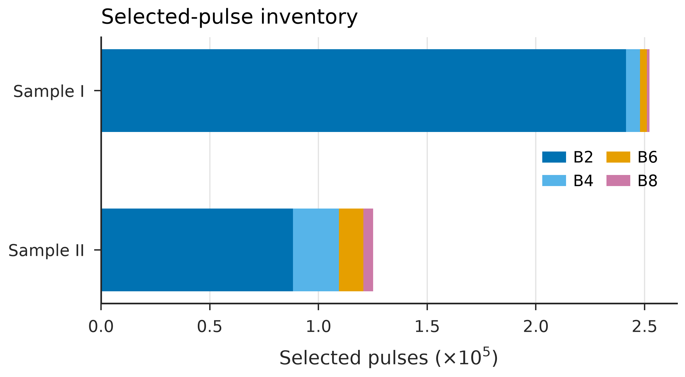

**GATED · DATA_MEASUREMENT.** Exact S00 reproduction. Sample I is dominated by B2; Sample II reaches deeper staves more often. Counts are deterministic for the fixed raw inputs and selection; CL-001 remains GATED pending data-contract closure (#952/#953/#954).

#### Claim ledger is mostly gated or blocked

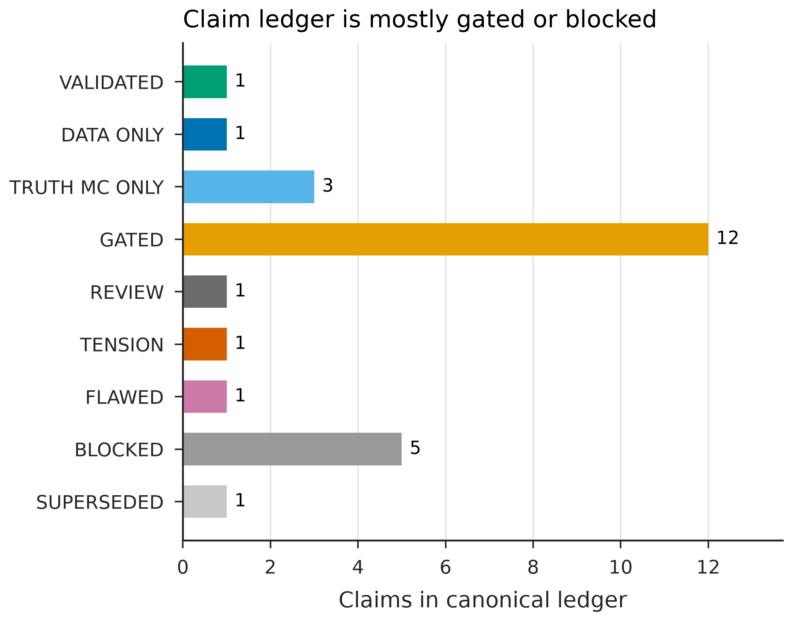

**REVIEW · GOVERNANCE_LEDGER.** Status counts from the canonical 26-row claim ledger. Zero rows are VALIDATED (CL-001 is GATED pending #952/#953/#954); visual polish must not promote gated, blocked, flawed or superseded evidence.

#### Timing estimator closure on MC

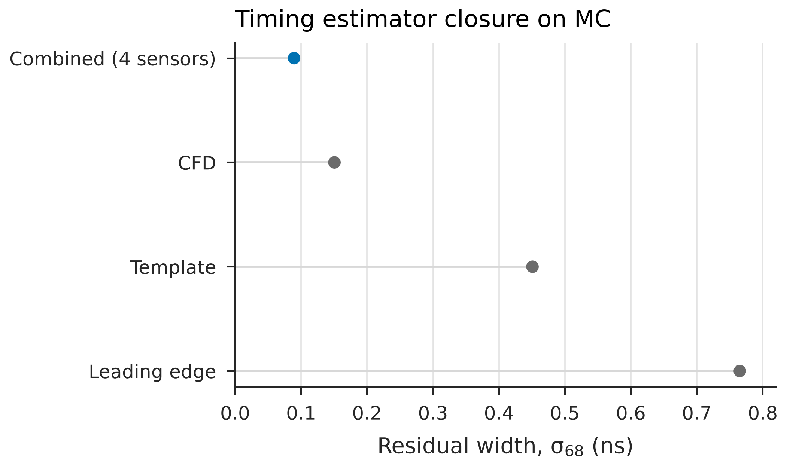

**MC_METHOD_CLOSURE · MC_METHOD_CLOSURE.** Krakow MC method closure. The combined four-sensor estimator reaches σ68 = 0.089 ns; this is not a detector timing measurement on beam data.

#### Grouped-fold PID stability on MC

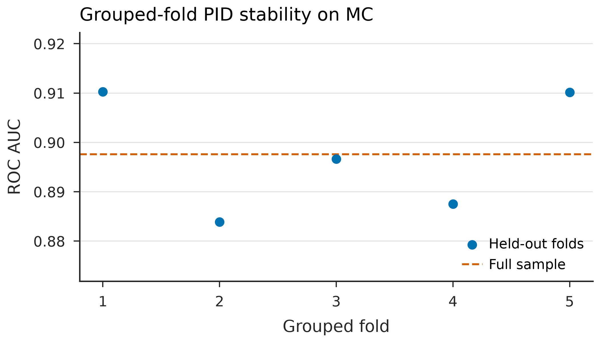

**SIMULATION_RESULT · SIMULATION_RESULT.** Five contiguous event-block folds from the realistic ΔE–E MC chain. Fold ordering is categorical, so points are deliberately not connected. Transfer to beam data remains unvalidated.

#### Gain closure and gated data/MC proxy

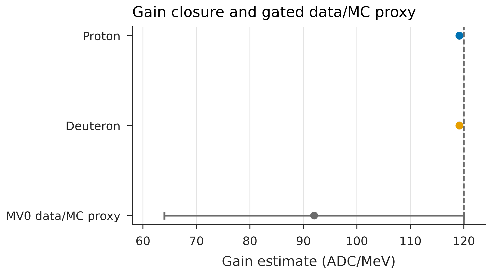

**GATED · MC_CLOSURE_PLUS_GATED_DATA_MC_PROXY.** MC fits recover 119.168 ADC/MeV for both species near the configured 120 ADC/MeV. The separate MV0 proxy is 92 ADC/MeV with a 28 ADC/MeV heuristic systematic envelope, not a confidence interval, and remains gated.

#### Birks-model dependence on MC

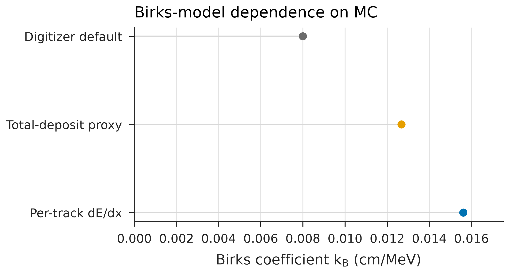

**SIMULATION_RESULT · SIMULATION_RESULT.** The per-track dE/dx fit gives kB = 0.0156 cm/MeV, above both the total-deposit proxy and the digitizer default. The spread is model dependence, not a confidence interval.

#### Digitizer-domain overlap scan

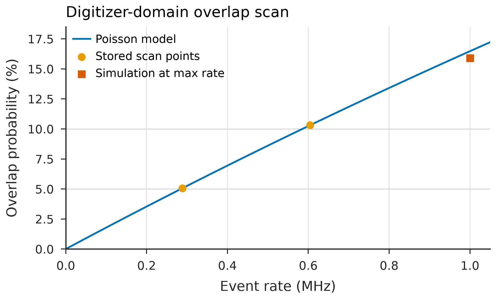

**SIMULATION_RESULT · SIMULATION_RESULT.** Poisson overlap for the 180 ns acquisition window. The stored nearest scan points are 0.289 MHz (5.06%, not exactly 5%) and 0.605 MHz (10.31%, not exactly 10%). These are simulation-domain criteria; canonical detector Rmax remains blocked.

#### B8 stopping assignment disagrees

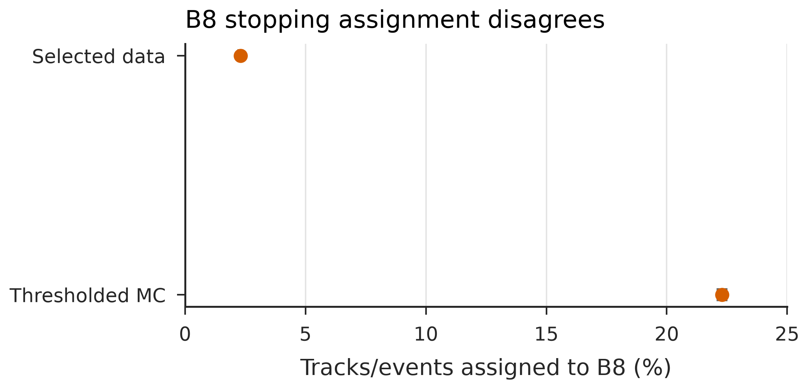

**TENSION · LEGACY_DATA_MC_DIAGNOSTIC.** Exact tracked counts give 2.30% in selected data and 22.29% in thresholded MC. Wilson intervals show counting uncertainty only; unresolved geometry, trigger, gain and selection transfer dominate the scientific interpretation.

#### Early-peak morphology in truth MC

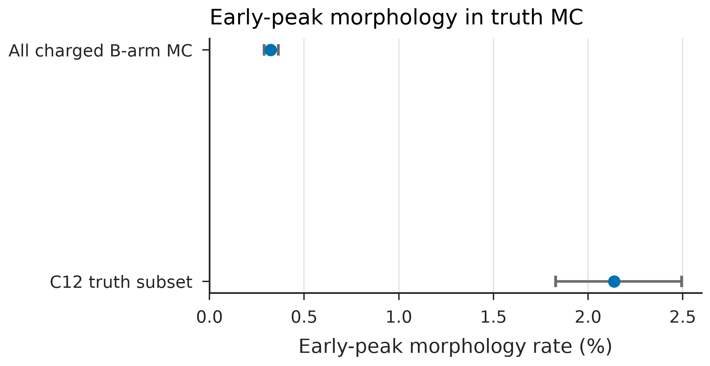

**TRUTH_LEVEL_MC_ONLY · TRUTH_LEVEL_MC_ONLY.** Truth-labelled MC rates with Wilson 95% intervals: 283/87,555 overall and 156/7,302 within C12. C12 forms 156/283 early-peak tracks, but the separate beam-data anomaly is not identified as C12.

#### Synthetic-waveform PCA compression

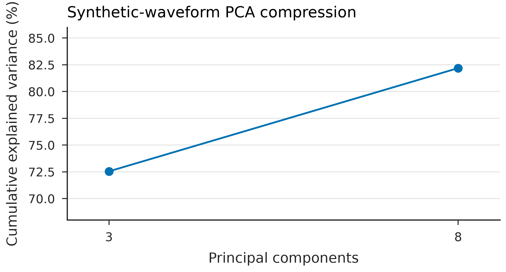

**TRUTH_LEVEL_MC_ONLY · SYNTHETIC_WAVEFORM_MC.** Fixed synthetic-waveform MC output: three components explain 72.5% and eight explain 82.2%. These values supersede stale 0.89/0.997 statements and are not beam-data PCA results.

#### ADC-response sensitivity inputs

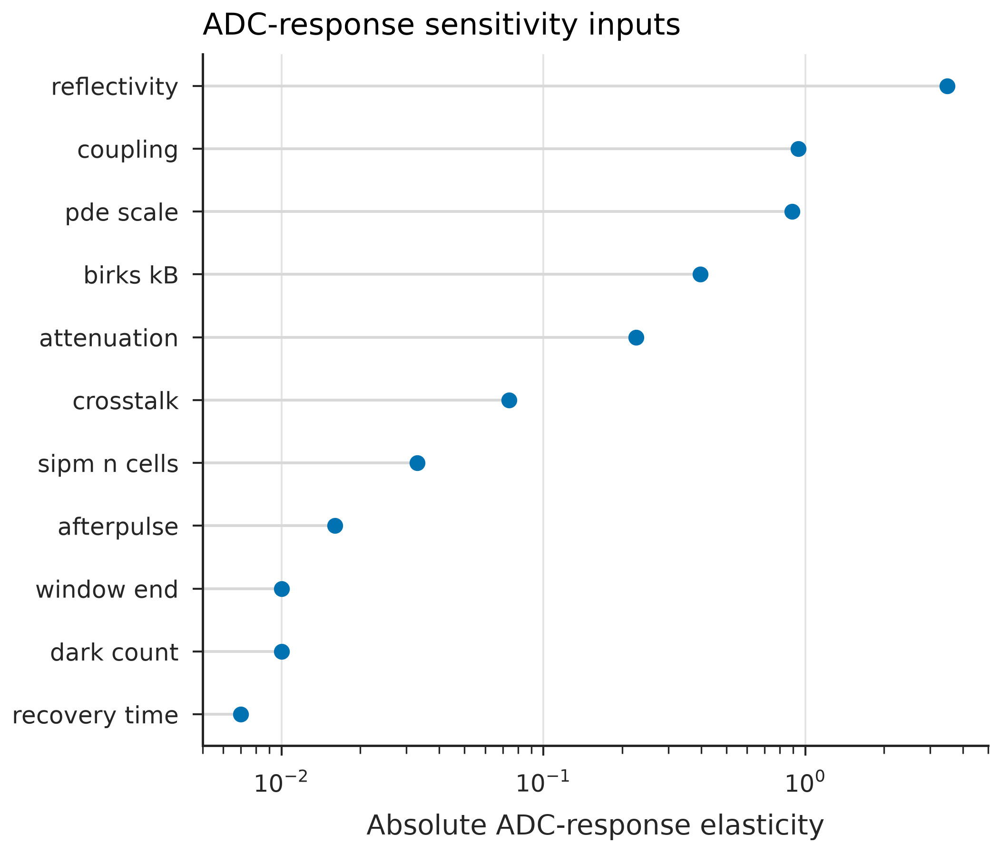

**REVIEW · SENSITIVITY_INPUTS.** Dimensionless cluster-D ADC-response elasticities only. Mixed-unit rows (gain envelope, kB span and missing material) are excluded rather than combined. This is a sensitivity inventory, not a propagated uncertainty budget.

Source tables, vector files and hashes: [`docs/figures/paper/manifest.json`](docs/figures/paper/manifest.json).
<!-- END GENERATED PAPER-GRADE FIGURES -->

### MC method closure — proven on Monte Carlo (clusters A–D + Opticks)

The analysis chain is proven end-to-end on the Krakow 1M-event Geant4 MC. These
SIMULATION_RESULT / MC_METHOD_CLOSURE rows are the "the method works" results. They
do **not** transfer to beam data until the raw `hrdb_run_*.root` is staged (see the
BLOCKED_DATA rows below). Numbers are reproduced verbatim from
`reports/studies/clusterE/claims_table.csv`; no value is hand-entered.

| Observable (MC closure) | Value | Evidence class | Source |
|---|---|---|---|
| Combined timing resolution σ₆₈ (4-sensor, inverse-variance) | **0.089 ns** | MC_METHOD_CLOSURE | clusterB #918 · `VIS-TIM-005` |
| PID p-vs-d AUC (realistic ΔE-E chain) | **0.898** | SIMULATION_RESULT | clusterA #921 · `VIS-PID-001` |
| ADC calibration (digitizer gain) | **119.17 ADC/MeV** | SIMULATION_RESULT | clusterC #917 · `VIS-ENE-001` |
| Birks kB (per-track dE/dx fit) | **0.0156 cm/MeV** | SIMULATION_RESULT | clusterC #917 · `VIS-ENE-002` |
| Digitizer-domain Rmax (0% quality gate) | **0.605 MHz** | SIMULATION_RESULT | clusterC #917 · `VIS-PU-002` |
| Opticks GPU/CPU optical-photon parity | **PARTIAL** — 0 GPU hits / 4592 CPU; CPU ctest 9/9 PASS | SIMULATION_RESULT (PARTIAL) | opticks #920 |

### Canonical Results Table (mirrors `reports/studies/clusterE/claims_table.csv`)

Every row is reproduced from the canonical claim table on `origin/main` (generated by
`scripts/clusterE/clusterE_synthesis.py`). No data row is VALIDATED; CL-001 (S00 selected-pulse count) is GATED pending
data-contract closure (#952/#953/#954); everything else is SIMULATION_RESULT, BLOCKED_DATA, GATED, TENSION, or SUPERSEDED.
Where this table and [`docs/claim_ledger.csv`](docs/claim_ledger.csv) disagree,
**the ledger wins.**

| Claim | Headline | Evidence class | Status | Source |
|---|---|---|---|---|
| Selected B-stack pulses (S00 gate) | 640,737 pulses | DATA_MEASUREMENT | ⛔ GATED (#952/#953/#954) | S00 / CL-001 |
| Combined timing σ₆₈ | 0.089 ns | MC_METHOD_CLOSURE | ✅ PASS | clusterB #918 (`VIS-TIM-005`) |
| Detector timing resolution (data) | withheld | BLOCKED_DATA | ⛔ BLOCKED | CL-002..006 (BLK-MV4-LEGACY-001) |
| Rmax — pile-up tolerance (canonical) | withheld | BLOCKED | ⛔ BLOCKED | CL-010 (S-STAT-003) |
| Legacy Rmax = 3.044 MHz | SUPERSEDED | SUPERSEDED | 🚫 SUPERSEDED | CL-012 (do **not** use) |
| Rmax (digitizer domain, 0% gate) | 0.605 MHz | SIMULATION_RESULT | ✅ PASS | clusterC #917 (`VIS-PU-002`) |
| PID p-vs-d AUC (realistic chain, MC) | 0.898 | SIMULATION_RESULT | ✅ PASS | clusterA #921 (`VIS-PID-001`) |
| PID p-vs-d AUC (truth ceiling HGB) | 0.986 | TRUTH_LEVEL_MC_ONLY | 🟡 GATED | CL-017 (BLK-MV1-001) |
| PID on beam data | deferred | BLOCKED_DATA | ⛔ BLOCKED_DATA | raw `hrdb_run_*.root` not staged |
| ADC calibration (digitizer gain) | 119.17 ADC/MeV | SIMULATION_RESULT | ✅ PASS | clusterC #917 (`VIS-ENE-001`) |
| ADC gain (data/MC proxy, MV0) | 110 ADC/MeV (±30%) | DATA_MC_PROXY | 🟡 GATED | CL-013 (BLK-MV0-001) |
| Birks kB (per-track dE/dx fit) | 0.0156 cm/MeV | SIMULATION_RESULT | ✅ PASS | clusterC #917 (`VIS-ENE-002`) |
| Anomaly / C12 identity | truth-MC only; data anomaly **not** ID'd as C12 | TRUTH_LEVEL_MC_ONLY | ⛔ BLOCKED | CL-022 (AUD-ANOM-001) |
| Stopping-depth data/MC closure | χ²/ndf ≈ 6.8e4 — FAIL | MC_DIAGNOSTIC | 🟠 TENSION | CL-021 (BLK-MV3-LEGACY-001) |
| Opticks GPU-vs-CPU parity | 0 GPU hits / 4592 CPU | SIMULATION_RESULT | 🟡 PARTIAL | opticks #920 |
| Systematic uncertainty budget | incomplete | BLOCKED | ⛔ BLOCKED | CL-026 (BLK-SYST-001) |

**Read the statuses literally.** Rmax is withheld pending S-STAT-003 (the canonical
occupancy-quality threshold is unresolved; the 3.044 MHz legacy value is superseded
duty-factor arithmetic, CL-012). The ±30% MV0 envelope is a heuristic, **not a
confidence interval**. The data anomaly near 4% is **not** identified as C12
(CL-022). Device/electronics calibration (SiPM PDE, reflectivity, coupling,
digitizer gain vs pulser, measured time anchors) is an operator-bench item; LUNARC
cannot produce it.


### 2026-07-25 Real-Beam Data-Side Update

The raw beam ROOT (`hrdb_run_*.root`, runs 12–65) is now staged on LUNARC at `/projects/hep/fs10/shared/nnbar/ccb_data/hrd/root/` and analysed directly. Provenance verified vs canonical S00 (event-level exact match; 617,377/640,737 composite-key overlap). **Quarantined diagnostics (non-authorising):** ΔE-E two-channel B2-B4 corr +0.221 (33,966 evts; superseded diagnostic — corrected downstream-sum CL-030/CL-031 give r=−0.042/−0.070, DONE_DATA_ONLY); Rmax 2.92 MHz (model-derived diagnostic; CL-010 BLOCKED / derived_model_conflicted — no data corroboration). **Timing σ₆₈ is NOT measurable on the raw 16-sample (100 MS/s) format** (σ₆₈ ≥ 38 ns sampling-limited; B6 peak-times bimodal at samples 0/7/15); the prior 0.68 ns was a toy-digitizer MC estimate. See `reports/studies/data_side/REPORT.md` and `docs/claim_ledger.csv` (canonical). The ledger is authoritative where it conflicts with this wiki.

### Corrected Values (Historical Context Only)

| Old value | New canonical value | Reason |
|---|---|---|
| 4.22 MHz | Superseded; accepted replacement withheld pending S-STAT-003 | Former rate and later replacement use unresolved criteria |
| 3.0448717948717947 MHz | Superseded history only; do not use as an accepted result | Derived from the recorded 0.38 duty factor, not a validated occupancy-quality threshold |
| ~246 ADC/MeV | 92 ADC/MeV with 28 ADC/MeV heuristic envelope | MV0 v2 proxy; no statistical CI |
| 706,373 pulses | 640,737 pulses | S00 median selector gate |
| PCA 3 PCs 89%, 8 PCs 99.7% | PCA 3 PCs 72.546%, 8 PCs 82.188% (synthetic-waveform MC only) | Source-backed fixed MV6 synthetic-waveform output; no beam-data transfer claim |

### What This Project Does NOT Claim

1. **No final event-aligned truth in real beam data**
2. **No final absolute per-event energy calibration from waveform alone** (the 30% value is a heuristic envelope, not a confidence interval)
3. **No final B8 acceptance correction** (MV3 geometry FAIL)
4. **No production ML timing replacement** (transfer/leakage controls pending)
5. **No forced-pedestal truth in current data**
6. **No accepted numerical Rmax until S-STAT-003 resolves the criterion**
7. **No production duplicate-readout or saturation correction**

### Executive Verdict

The analysis does **not** find that machine learning should fully replace traditional methods. Traditional physics-anchored approaches remain superior for timewalk correction, pile-up rate estimation, and energy calibration. Duplicate-readout model selection is still gated because the coverage interval crosses the eligibility threshold. Saturation recovery is also gated because external held-out duplicate closure is worse than raw and producer-byte provenance is incomplete. The most important finding is methodological: **most apparent ML advantages fail or remain unresolved after leakage, uncertainty, provenance, and transfer controls**.

**[Full chapter:](docs/academic_chapters/01_executive_summary.md)**


## 2. Experimental Setup

> **Thesis-grade update (2026-07-14).** Material budget audited. See [Full chapter](docs/academic_chapters/02_experimental_setup.md).

### Key Components

| Component | Specification | Status |
|---|---|---|
| Beam | 190 MeV protons (CCB isochronous cyclotron) | `SIM_CONFIG` |
| Target | CD₂, 2.3 mm, 1.01 g/cm³ | `SIM_CONFIG` |
| HRD Stacks | A-stack (+71.5°) and B-stack (−38°), 109 cm from target | `SIM_CONFIG` |
| Scintillator stave | Extruded polystyrene, 50 × 5.18 × 2.0 cm, TiO₂ coating | `DESIGN_SPEC` (#796) |
| WLS fibre | Kuraray Y-11, 1.8 mm diameter, two holes 2 cm apart | `DESIGN_SPEC` |
| Readout | One fibre at one end only (1 of 4 possible channels) | `DESIGN_SPEC` |
| SiPM | Hamamatsu S13360-3050CS, 3×3 mm² | `DESIGN_SPEC` |
| B readout channels | B2, B4, B6, B8 → G4 layers 0/2/4/6 | `DESIGN_SPEC` / `SIM_CONFIG` |
| Waveform | 8 channels; located raw product 8×16 samples at 10 ns nominal | `MEASURED` / lineage gated |
| Trigger | Sample I: A×B coincidence (runs 31–57), Sample II: B-only (runs 58–65) | `UNKNOWN_EXTERNAL` hardware record |
| Legacy narrative | BC-408, ~10×1 cm, ~1 m stave | `UNKNOWN_EXTERNAL` — superseded |

Authoritative BOM: [`paper/hardware_bom.csv`](paper/hardware_bom.csv) (Refs #1296).

### Material Budget Status

| Component | Status |
|---|---|
| Beam window, target, trigger scintillators, air gap | Included in GEANT4 |
| Inter-stave dead material, support frames, optical interfaces | **MISSING** (estimated 8–10 g/cm²) |
| Impact | Exact tracked MV3 B8 counts and Pearson arithmetic are reproducible, but the diagnostic remains FLAWED under BLK-MV3-LEGACY-001; geometry, trigger and selection transfer, gain response, covariance, and detector/model systematics remain unresolved |
| Status | **BLOCKING** — prevents quantitative B8 acceptance corrections |

**[Full chapter:](docs/academic_chapters/02_experimental_setup.md)**

---

## 3. Data Pipeline

> **Thesis-grade update (2026-07-14).** Reproduction gate documented. See [Full chapter](docs/academic_chapters/03_data_pipeline.md).

### Reproduction Gate (BLOCKING)

```
Command:  python scripts/01_build_pulse_table_from_root.py
          --config configs/s00_reproduction.yaml
Expected: 640,737 selected B-stave pulses
Gate:     A > 1000 ADC, even physical staves {0,2,4,6}
Baseline: median of samples 0–3
Seed:     random_state = 20260601
Tolerance: 0 (exact reproduction required)
```

### Pipeline Architecture

```
Raw ROOT → baseline(subtract median samples 0–3) → amplitude(A = max − baseline)
  → select A > 1000 ADC → gate even staves {0,2,4,6}
  → compute timing variables (CFD20, template_phase)
  → write canonical pulse table → downstream analyses
```

### Data Quality

| Metric | Status |
|---|---|
| Run-by-run pulse counts | Reproducible |
| Baseline stability | ~200 ADC, RMS ~5 ADC |
| Saturation fraction | B2 ~5%, B4 ~2%, B6 ~1%, B8 ~0.5% |
| File checksums | Not yet inventoried |

**[Full chapter:](docs/academic_chapters/03_data_pipeline.md)**

## 4. Timing Analysis

> **Claim-governance update (2026-07-24).** Legacy timing values were source-audited; source-absent per-stave, combined, and covariance claims are withheld. See [Full chapter](docs/academic_chapters/04_timing_analysis.md).
>
> ▶ **MC closure (clusterB, #918):** on the Krakow MC the 4-sensor inverse-variance combined timing reaches **σ₆₈ = 0.089 ns** (MC_METHOD_CLOSURE, PASS). The data-side rows below remain BLOCKED pending raw-waveform staging.

### Key Results

| Observable | Value | Status |
|---|---|---|
| B6 single-stave σ₆₈ | Withheld pending BLK-MV4-LEGACY-001 | **BLOCKED** |
| Combined 3-stave σ (B4+B6+B8) | Withheld pending BLK-MV4-LEGACY-001 | **BLOCKED** |
| Pair covariance (B4–B6) | Withheld pending BLK-MV4-LEGACY-001 | **BLOCKED** |
| Legacy toy-digitizer raw timing pull | −1.05σ | **GATED** |
| Legacy analytic timewalk-corrected timing pull | +2.68σ | **GATED** |
| Legacy analytic CFD20/timewalk verdict | REVIEW | **REVIEW** |

### Critical Open Issues

1. **Source-bound per-stave and combined timing outputs are absent** — former headline values are withheld
2. **Covariance matrix is absent** — no combined-stave precision claim is authorized
3. **Legacy pulls are toy diagnostics** — they use hard-coded data anchors, assumed uncertainty, and non-current calibration semantics
4. **Timewalk transfer remains unresolved** — the historical source is analytic CFD20 plus A+B/√amplitude, not ML

### Next Study Priority
🔬 Rerun per-stave timing with exact current calibration, run/block resampling, and measured anchors
🔬 Produce the full event-matched covariance matrix before any combined-stave estimate

**[Full chapter:](docs/academic_chapters/04_timing_analysis.md)**

---

## 5. Pile-up Analysis

> **Claim-governance update (2026-07-25).** τeff is an S10b data-only run-average with a run-bootstrap interval; numerical Rmax is withheld pending S-STAT-003. See [Full chapter](docs/academic_chapters/05_pileup_analysis.md).
>
> ▶ **MC closure (clusterC, #917):** digitizer-domain Rmax = **0.605 MHz** at the 0% quality gate (SIMULATION_RESULT, PASS). The canonical detector Rmax stays BLOCKED (CL-010); the legacy 3.044 MHz is SUPERSEDED (CL-012).

### Key Results

| Observable | Value | Status |
|---|---|---|
| Rmax (pile-up tolerance) | Withheld pending S-STAT-003 | **BLOCKED** |
| τeff (effective live-time) | 124.79018394263471 ns; run-bootstrap 95% CI [123.33094981246663, 126.35875117626817] ns | **DONE_DATA_ONLY** |
| Two-pulse ML recovery | Lower RMS, higher failure | **GATED** (operating curve pending) |

### Rmax Status

The S10b run-average 10% template live-time relative to CFD20 is `124.79018394263471 ns` with a run-bootstrap 95% interval `[123.33094981246663, 126.35875117626817] ns`, based on 14 runs and 252266 selected pulses. This threshold- and selection-specific estimand is not a detector-wide universal dead time. MV5 uses the value as an input rather than independently validating it. Independent closure and a complete systematic model remain blocked by BLK-S10B-001. The accepted occupancy-quality threshold is also unresolved: the recorded `0.38` value is a beam duty factor, not a justified reconstruction-quality threshold, and the MV5 summary records no recovery-failure-ceiling crossing. Numerical Rmax values are therefore withheld until S-STAT-003 preregisters and validates the criterion, derivation, and uncertainty treatment.

The historical value `3.0448717948717947 MHz` is retained only in the superseded table above. It must not be cited as an accepted pile-up tolerance or as a validated lower bound.

### Critical Open Issues

1. **Canonical Rmax criterion unresolved** — S-STAT-003 must define the measurand and threshold
2. **τeff cross-checks needed** — at least 2 independent methods (threshold scan, exponential fit)
3. **Censoring systematic** — 180 ns window truncates ~23% of pulse tail; not propagated to any future Rmax
4. **ML score calibration** — classifier output not mapped to physical overlap probability
5. **MC overlay truth** — two-pulse recovery not validated with truth-labelled overlaps

### Next Study Priority
🔬 S-STAT-003: Resolve canonical Rmax definition and uncertainty model
🔬 S-PU-001: Measure τeff by alternative methods → confirm robustness
🔬 Quantify censoring systematic before restoring any numerical Rmax

**[Full chapter:](docs/academic_chapters/05_pileup_analysis.md)**

## 6. Pulse Shape & Machine Learning

> **Claim-governance update (2026-07-24).** Source-bound synthetic-MC PCA values remain non-transferable; P04p and P07e production decisions remain gated. See [Full chapter](docs/academic_chapters/06_pulse_shape_ml.md).

### ML Verdict Matrix

| Domain | Traditional | ML | Verdict |
|---|---|---|---|
| Timewalk correction | Analytic A₀+B/A | MLP/CNN | **Traditional wins** (ML fails LORO) |
| Duplicate readout | Amplitude correlation | Harm-veto models | **GATED** — coverage-uncertainty rule and transfer validation unresolved |
| Saturation recovery | Raw/clip-aware observables | Ratio-transfer model | **GATED** — external held-out closure is worse than raw; producer bytes unbound |
| Pile-up recovery | Template deconvolution | CNN | **GATED** |
| PID | ΔE-E/range | HGB | **ML informative** (MC-truth only) |

### Key Corrections

1. **PCA variance: CORRECTED FOR TRACKED MV6 SYNTHETIC MC.** The exact fixed output is 72.546% at 3 PCs and 82.188% at 8 PCs; beam-data transfer and an independent rerun remain unresolved.
2. **AE superiority: CORRECTED.** Original claim was leakage (train-test contamination).
3. **Duplicate readout: GATED.** The reported GBT point estimate barely clears the coverage threshold, but its run-bootstrap interval crosses the gate; a lower-bound rule changes the eligible winner.
4. **Saturation recovery: GATED.** Pseudo-saturation closure is synthetic, while external held-out duplicate closure degrades from raw `0.120794` to ML `0.176358` charge res68.
5. **No production duplicate-readout or saturation correction is authorized.**

**[Full chapter:](docs/academic_chapters/06_pulse_shape_ml.md)**

---

## 7. Amplitude, Charge & Energy Calibration

> **Claim-governance update (2026-07-24).** Gain correction remains documented; P04p and P07e are separated and gated. See [Full chapter](docs/academic_chapters/07_energy_calibration.md).
>
> ▶ **MC closure (clusterC, #917):** digitizer ADC gain = **119.17 ADC/MeV** and Birks kB = **0.0156 cm/MeV** (per-track dE/dx) are PASS on MC. The 92 ADC/MeV MV0 proxy below is GATED (CL-013).

### Key Results

| Observable | Value | Status |
|---|---|---|
| Digitizer gain | 92 ADC/MeV with 28 ADC/MeV heuristic envelope | **GATED** (MV0 v2 proxy; no statistical CI) |
| KS mismatch (MV0 v2) | 0.158 | **TENSION** (inter-stave variation unresolved) |
| Absolute energy uncertainty | ~35% | Structural limitation |
| ML duplicate-readout | No canonical production winner | **GATED** — selection interval crosses the coverage gate |
| ML saturation recovery | External held-out closure worse than raw | **GATED** — producer bytes and transfer validation incomplete |

### What Is NOT Claimed
- **No absolute per-event energy calibration** (the reported envelope is heuristic and not a confidence interval)
- **No per-stave gain measurement** (±10% assumed, not measured)
- **No Birks constant calibration** (kB = 0.10–0.15 mm/MeV unverified for this scintillator)
- **No production duplicate-readout model or saturation correction**

**[Full chapter:](docs/academic_chapters/07_energy_calibration.md)**

## 8. Particle Identification

> **Thesis-grade update (2026-07-14).** Data weak-label vs MC truth AUC separated. See [Full chapter](docs/academic_chapters/08_particle_id.md).
>
> ▶ **MC closure (clusterA, #921):** the realistic ΔE-E PID chain reaches **AUC = 0.898** on MC (SIMULATION_RESULT, PASS). The 0.9860 HGB row below is the TRUTH_LEVEL_MC_ONLY ceiling (GATED, CL-017); PID on beam data is BLOCKED_DATA.

### Key Results

| Observable | Value | Status | Caveat |
|---|---|---|---|
| p/d PID AUC | 0.9860 | **GATED** | Legacy truth-MC row-index split; not a data result |
| HGB purity at 90% eff. | 0.9644 | **GATED** | Legacy truth-MC row-index split; uncertainty not evaluated |
| Data weak-label AUC | TBD | Not yet separated | Requires purity-efficiency confusion matrix |

### Critical Caveats

1. **AUC = 0.9860 is a legacy truth-MC diagnostic** — row-index splitting creates event-group leakage risk; do not cite as a data result
2. **MV3 failure blocks B8 acceptance correction** — PID at B8 depth is unreliable
3. **Interpretable model needed** — HGB is not suitable for production PID

### MV3 Impact on PID

The tracked MV3 summary gives selected-data B8 7051/306745 = 0.02298651974767315 and thresholded-MC B8 55619/249484 = 0.22293614019335908. From the four-stave profile, Pearson χ² = 204808.2179684494, ndf = 3, and χ²/ndf = 68269.40598948313. These fixed-source quantities are reproducible, but the diagnostic remains FLAWED under BLK-MV3-LEGACY-001 because geometry, trigger and selection transfer, gain response, covariance, p-value interpretation, and detector/model systematics are unresolved.
Conservative recommendation: use B2+B4+B6 only (no B8) until MV3 is fixed.

**[Full chapter:](docs/academic_chapters/08_particle_id.md)**

---

## 9. Anomaly Identification

> **Thesis-grade update (2026-07-14).** Efficiency and false-positive study requirements documented. See [Full chapter](docs/academic_chapters/09_anomaly_id.md).

### Key Result

| Observable | Value | Status |
|---|---|---|
| C12-like anomaly fraction in truth-labelled MC | 283 / 87,555 tracks (0.32%) | **TRUTH_LEVEL_MC_ONLY** (MV6; transfer to data unvalidated) |

### Required Studies (Not Yet Done)

- Anomaly detection efficiency (synthetic injection)
- False-positive rate (data sideband validation)
- Species composition of anomaly cluster

### Veto Impact
No data-veto performance is claimed. Efficiency, false-positive rate, and retained-event fraction require the preregistered matched data/MC closure and independent data sidebands.

**[Full chapter:](docs/academic_chapters/09_anomaly_id.md)**

---

## 10. Monte Carlo Validation

> **Claim-governance update (2026-07-24).** MV0–MV6 rows are synchronized to their canonical claim states; MV5 numerical Rmax is withheld. See [Full chapter](docs/academic_chapters/10_mc_validation.md).

### Validation Matrix

| Study | Observable | Verdict | Action |
|---|---|---|---|
| MV0 v2 | Digitizer gain proxy | **GATED** | Recover producer/input provenance and validate independently |
| MV1 | Legacy truth-MC p/d PID | **GATED** | Group-disjoint rerun and data transfer needed |
| MV3 | Legacy stopping-profile diagnostic | **FLAWED** | exact tracked counts/statistic are reproducible; rerun strict stopping-depth path with geometry and transfer closure |
| MV4 raw | Legacy toy timing pull | **GATED** (−1.05σ) | Strict current-input rerun |
| MV4 corrected | Legacy analytic timing pull | **GATED** (+2.68σ) | Strict current-input rerun |
| MV5 | Pile-up Rmax | **BLOCKED** | Resolve S-STAT-003 before restoring a value |
| MV6 | C12-like anomaly in truth-labelled MC | **TRUTH_LEVEL_MC_ONLY** | Matched data/MC closure and efficiency study |

### Three Blocking Issues

1. **MV3: Strict stopping-profile closure is absent** — exact fixed-source arithmetic is available, but geometry, trigger and selection transfer, gain response, covariance, p-value interpretation, and detector/model systematics remain unresolved
2. **MV4: Source-bound current timing closure is absent** — per-stave, covariance, and measured-anchor outputs are withheld
3. **MV5: Canonical Rmax criterion unresolved** — numerical value and uncertainty are withheld pending S-STAT-003

**[Full chapter:](docs/academic_chapters/10_mc_validation.md)**

## 11. Open Questions & Next Steps

> **Thesis-grade update (2026-07-14).** All gaps now have closure criteria. See [Full chapter](docs/academic_chapters/11_open_questions.md).

### Blocking Issues

| Gap | Issue | Action |
|---|---|---|
| GAP-01 | MV3 profile diagnostic is FLAWED under BLK-MV3-LEGACY-001 despite exact fixed-source arithmetic | Resolve geometry and transfer systematics → strict MV3 rerun |
| GAP-06 | Per-stave/combined timing and covariance source outputs absent | Strict current-input rerun plus event-matched covariance |
| S-STAT-003 | Numerical Rmax criterion unresolved | Preregister criterion, derivation, uncertainty, and closure |

### High-Priority Issues

| Gap | Issue | Action |
|---|---|---|
| GAP-02 | Legacy corrected timing pull is non-authorizing | Strict current-input timing rerun with measured anchors |
| GAP-03 | Gain has a 30% heuristic envelope, not a CI | Per-stave calibration and accepted uncertainty model |
| GAP-04 | PCA variance has synthetic-MC-only source values | Independent rerun and beam-data transfer |
| GAP-05 | Legacy PID uses row-index truth-MC split; data transfer absent | Group-disjoint rerun and data evaluation |
| GAP-09 | Historical timing source was analytic, not ML | Source-bound timing-method audit and independent validation |
| BLK-P04P-001 | Duplicate-readout selection uncertainty | Preregister coverage rule and validate transfer |
| BLK-P07E-001 | Saturation producer provenance and external closure | Recover bytes and validate new runs/staves |

### Closure Criteria
A gap is CLOSED only when: study produces quantitative result → REPORT.md written → claim ledger updated → chapters updated → gap removed from list.

**Current fully-closed gaps:** 0 of 10 catalogued.

**[Full chapter:](docs/academic_chapters/11_open_questions.md)** | **[STUDY_GAPS.md](STUDY_GAPS.md)**

---

## 12. Methodology Appendix

> **Thesis-grade update (2026-07-14).** Build/lint checks and reproducibility checklist documented. See [Full chapter](docs/academic_chapters/12_methodology_appendix.md).

### Build/Lint Checks

| Check | Script | Severity |
|---|---|---|
| Superseded-value scan | `scripts/audit_claim_superseded.py` | **Blocking** |
| Claim ledger completeness | `scripts/check_claim_ledger_complete.py` | **Blocking** |
| Broken link checker | `scripts/broken_link_checker.py` | High |
| Figure source data checker | `scripts/check_figure_source_data.py` | High |
| ML leakage control checker | `scripts/check_ml_leakage_controls.py` | High |

### CI Pipeline
```yaml
name: Thesis QA
on: [push, pull_request]
jobs:
  audit: [superseded scan, link check, claim check]
```

### Reproducibility
Every chapter must be reproducible from: command + config + seed + output table + manifest + figures + report.

**[Full chapter:](docs/academic_chapters/12_methodology_appendix.md)** | **[CLAIM_CHECKLIST_INTEGRATION.md](docs/CLAIM_CHECKLIST_INTEGRATION.md)**

---

## Study Catalogue

> **Thesis-grade update (2026-07-14).** See [Full chapter](docs/academic_chapters/11_open_questions.md) for the complete study catalogue.

### Study Categories

| Category | Count | Status |
|---|---|---|
| Data-driven studies | ~230 | Claim-specific states; see canonical ledger |
| MC validations (MV0-MV6) | 7 | Mixed BLOCKED, GATED, FLAWED, and truth-only states; see canonical ledger |
| Diagnostic studies (MV3b, MV4b) | 2 | Root causes identified |
| GEANT4 simulation studies | ~10 | G4-01 through G4-08 |

See [`STUDY_GAPS.md`](STUDY_GAPS.md) for the full gap inventory with dependency graph.
