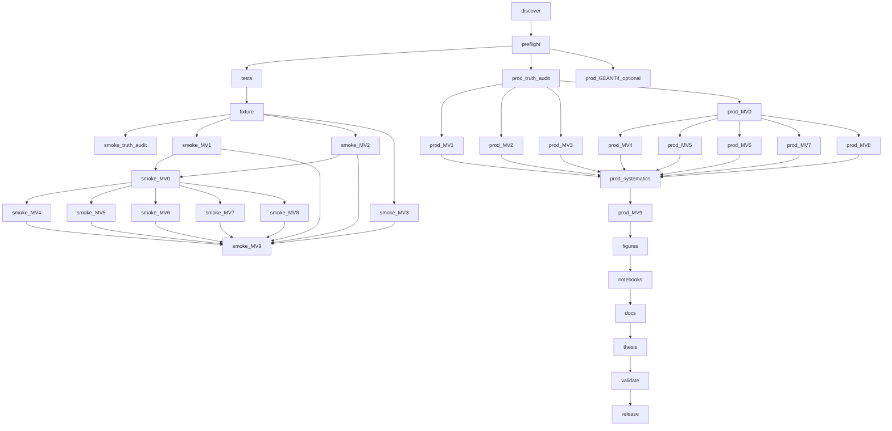

# Execution plan

```mermaid
flowchart TD
  discover
  discover --> preflight
  preflight --> tests
  tests --> fixture
  fixture --> smoke_truth_audit
  fixture --> smoke_MV1
  fixture --> smoke_MV2
  fixture --> smoke_MV3
  smoke_MV1 --> smoke_MV0
  smoke_MV2 --> smoke_MV0
  smoke_MV0 --> smoke_MV4
  smoke_MV0 --> smoke_MV5
  smoke_MV0 --> smoke_MV6
  smoke_MV0 --> smoke_MV7
  smoke_MV0 --> smoke_MV8
  smoke_MV1 --> smoke_MV9
  smoke_MV2 --> smoke_MV9
  smoke_MV3 --> smoke_MV9
  smoke_MV4 --> smoke_MV9
  smoke_MV5 --> smoke_MV9
  smoke_MV6 --> smoke_MV9
  smoke_MV7 --> smoke_MV9
  smoke_MV8 --> smoke_MV9
  preflight --> prod_truth_audit
  preflight --> prod_GEANT4_optional
  prod_truth_audit --> prod_MV1
  prod_truth_audit --> prod_MV2
  prod_truth_audit --> prod_MV3
  prod_truth_audit --> prod_MV0
  prod_MV0 --> prod_MV4
  prod_MV0 --> prod_MV5
  prod_MV0 --> prod_MV6
  prod_MV0 --> prod_MV7
  prod_MV0 --> prod_MV8
  prod_MV1 --> prod_systematics
  prod_MV2 --> prod_systematics
  prod_MV3 --> prod_systematics
  prod_MV4 --> prod_systematics
  prod_MV5 --> prod_systematics
  prod_MV6 --> prod_systematics
  prod_MV7 --> prod_systematics
  prod_MV8 --> prod_systematics
  prod_systematics --> prod_MV9
  prod_MV9 --> figures
  figures --> notebooks
  notebooks --> docs
  docs --> thesis
  thesis --> validate
  validate --> release
```
