# Recursive open-question closure plan

- **All steps closed:** `False`
- **Step count:** `7`

```mermaid
flowchart TD
  OQ_MV4["OQ-MV4: produce_mv4_timing_artifact"]
  calibrated_digitized_mc["calibrated_digitized_mc"] --> OQ_MV4
  timing_truth_boundary_audit["timing_truth_boundary_audit"] --> OQ_MV4
  OQ_MV5["OQ-MV5: produce_mv5_pileup_artifact"]
  calibrated_digitized_mc["calibrated_digitized_mc"] --> OQ_MV5
  controlled_mixture_manifest["controlled_mixture_manifest"] --> OQ_MV5
  OQ_MV6["OQ-MV6: produce_mv6_representation_artifact"]
  calibrated_digitized_mc["calibrated_digitized_mc"] --> OQ_MV6
  fit_split_registry["fit_split_registry"] --> OQ_MV6
  OQ_MV7["OQ-MV7: produce_mv7_pedestal_noise_artifact"]
  real_pedestal_splits["real_pedestal_splits"] --> OQ_MV7
  calibrated_digitized_mc["calibrated_digitized_mc"] --> OQ_MV7
  OQ_MV8["OQ-MV8: produce_mv8_saturation_artifact"]
  calibrated_digitized_mc["calibrated_digitized_mc"] --> OQ_MV8
  dynamic_range_scan["dynamic_range_scan"] --> OQ_MV8
  OQ_SYS["OQ-SYS: submit_systematic_arrays"]
  MV4["MV4"] --> OQ_SYS
  MV5["MV5"] --> OQ_SYS
  MV6["MV6"] --> OQ_SYS
  MV7["MV7"] --> OQ_SYS
  MV8["MV8"] --> OQ_SYS
  OQ_WIKI["OQ-WIKI: publish_final_wiki"]
  release_audit_PASS["release_audit_PASS"] --> OQ_WIKI
  curated_bibliography["curated_bibliography"] --> OQ_WIKI
  full_figure_catalog["full_figure_catalog"] --> OQ_WIKI
```

| Order | Question | Priority | Action | Dependencies | Required evidence | Terminal condition |
|---:|---|---:|---|---|---|---|
| 1 | OQ-MV4 | high | produce_mv4_timing_artifact | calibrated_digitized_mc, timing_truth_boundary_audit | MV4 production artifact, uncertainty intervals, and acceptance decision. | close only after required evidence artifact exists, validates, and claim ledger is updated |
| 2 | OQ-MV5 | high | produce_mv5_pileup_artifact | calibrated_digitized_mc, controlled_mixture_manifest | MV5 production artifact and pile-up recovery diagnostics. | close only after required evidence artifact exists, validates, and claim ledger is updated |
| 3 | OQ-MV6 | medium | produce_mv6_representation_artifact | calibrated_digitized_mc, fit_split_registry | MV6 representation comparison and probe results. | close only after required evidence artifact exists, validates, and claim ledger is updated |
| 4 | OQ-MV7 | high | produce_mv7_pedestal_noise_artifact | real_pedestal_splits, calibrated_digitized_mc | MV7 pedestal/noise closure with per-channel diagnostics. | close only after required evidence artifact exists, validates, and claim ledger is updated |
| 5 | OQ-MV8 | high | produce_mv8_saturation_artifact | calibrated_digitized_mc, dynamic_range_scan | MV8 saturation/dynamic-range study and failure accounting. | close only after required evidence artifact exists, validates, and claim ledger is updated |
| 6 | OQ-SYS | high | submit_systematic_arrays | MV4, MV5, MV6, MV7, MV8 | LUNARC systematic arrays with paired shifts and uncertainty decomposition. | close only after required evidence artifact exists, validates, and claim ledger is updated |
| 7 | OQ-WIKI | medium | publish_final_wiki | release_audit_PASS, curated_bibliography, full_figure_catalog | Release-ready wiki publication with curated bibliography and all QA gates passing. | close only after required evidence artifact exists, validates, and claim ledger is updated |
