# Open questions and recursive study plan

All questions closed: `False`; open count: `7`.

| ID | Status | Priority | Question | Needed evidence |
|---|---:|---:|---|---|
| OQ-MV4 | OPEN | high | Can calibrated digitized MC validate timing observables without truth leakage? | MV4 production artifact, uncertainty intervals, and acceptance decision. |
| OQ-MV5 | OPEN | high | How robust is pile-up detection/reconstruction under controlled mixture lineage? | MV5 production artifact and pile-up recovery diagnostics. |
| OQ-MV6 | OPEN | medium | Which waveform representations preserve physics information without nuisance leakage? | MV6 representation comparison and probe results. |
| OQ-MV7 | OPEN | high | Do pedestal/noise models match held-out data sufficiently for MC validation? | MV7 pedestal/noise closure with per-channel diagnostics. |
| OQ-MV8 | OPEN | high | Where do saturation and dynamic-range effects invalidate reconstruction claims? | MV8 saturation/dynamic-range study and failure accounting. |
| OQ-SYS | OPEN | high | How large are generator, detector, and electronics systematic envelopes? | LUNARC systematic arrays with paired shifts and uncertainty decomposition. |
| OQ-WIKI | OPEN | medium | Are final citations, references, plots, and discussion complete enough for a publication-grade GitHub wiki? | Release-ready wiki publication with curated bibliography and all QA gates passing. |

## Closure DAG

```mermaid
flowchart TD
  OQ_MV4["OQ-MV4: produce_mv4_timing_artifact"]
  calibrated_digitized_mc["calibrated_digitized_mc"] --> OQ_MV4
  timing_truth_boundary_audit["timing_truth_boundary_audit"] --> OQ_MV4
  OQ_MV5["OQ-MV5: produce_mv5_pileup_artifact"]
  calibrated_digitized_mc["calibrated_digitized_mc"] --> OQ_MV5
  controlled_mixture_manifest["controlled_mixture_manifest"] --> OQ_MV5
  OQ_MV6["OQ-MV6: produce_mv6_representation_artifact"]
  calibrated_digitized_mc["calibrated_digitized_mc"] --> OQ_MV6
  fit_split_registry["fit_split_registry"] --> OQ_MV6
  OQ_MV7["OQ-MV7: produce_mv7_pedestal_noise_artifact"]
  real_pedestal_splits["real_pedestal_splits"] --> OQ_MV7
  calibrated_digitized_mc["calibrated_digitized_mc"] --> OQ_MV7
  OQ_MV8["OQ-MV8: produce_mv8_saturation_artifact"]
  calibrated_digitized_mc["calibrated_digitized_mc"] --> OQ_MV8
  dynamic_range_scan["dynamic_range_scan"] --> OQ_MV8
  OQ_SYS["OQ-SYS: submit_systematic_arrays"]
  MV4["MV4"] --> OQ_SYS
  MV5["MV5"] --> OQ_SYS
  MV6["MV6"] --> OQ_SYS
  MV7["MV7"] --> OQ_SYS
  MV8["MV8"] --> OQ_SYS
  OQ_WIKI["OQ-WIKI: publish_final_wiki"]
  release_audit_PASS["release_audit_PASS"] --> OQ_WIKI
  curated_bibliography["curated_bibliography"] --> OQ_WIKI
  full_figure_catalog["full_figure_catalog"] --> OQ_WIKI
```

## Evidence packet templates

All packets closed: `False`; open packet count: `7`.

| Question | Packet status | Required artifacts |
|---|---:|---|
| OQ-MV4 | BLOCKED | reports/mc_validation/artifact_reports/MV4_REPORT.html, reports/mc_validation/systematics/MV4_TIMING_UNCERTAINTIES.json, reports/mc_validation/leakage/MV4_TRUTH_BOUNDARY_AUDIT.json |
| OQ-MV5 | BLOCKED | reports/mc_validation/artifact_reports/MV5_REPORT.html, reports/mc_validation/pileup/MV5_MIXTURE_LINEAGE.json, reports/mc_validation/pileup/MV5_RECOVERY_DIAGNOSTICS.json |
| OQ-MV6 | BLOCKED | reports/mc_validation/artifact_reports/MV6_REPORT.html, reports/mc_validation/representations/MV6_REPRESENTATION_COMPARISON.json, reports/mc_validation/leakage/MV6_NUISANCE_LEAKAGE_AUDIT.json |
| OQ-MV7 | BLOCKED | reports/mc_validation/artifact_reports/MV7_REPORT.html, reports/mc_validation/noise/MV7_PEDESTAL_NOISE_CLOSURE.json, reports/mc_validation/noise/MV7_CHANNEL_DIAGNOSTICS.json |
| OQ-MV8 | BLOCKED | reports/mc_validation/artifact_reports/MV8_REPORT.html, reports/mc_validation/saturation/MV8_DYNAMIC_RANGE_SCAN.json, reports/mc_validation/saturation/MV8_FAILURE_ACCOUNTING.json |
| OQ-SYS | BLOCKED | reports/mc_validation/systematics/SYSTEMATIC_ARRAY_MANIFEST.json, reports/mc_validation/systematics/BOOTSTRAP_INTERVALS.json, reports/mc_validation/systematics/UNCERTAINTY_DECOMPOSITION.json |
| OQ-WIKI | BLOCKED | wiki/WIKI_MANIFEST.json, reports/mc_validation/references/REFERENCE_REGISTRY.json, publication/PUBLICATION_MANIFEST.json, QA_RELEASE_AUDIT.json |

The project should recursively reduce this table until every question has direct evidence, every packet is closed, and `all_questions_closed=true`.
