# Claim dependency tree

This graph recursively exposes how the final-release claim depends on QA gates, wiki traceability, individual claim-ledger rows, frozen evidence artifacts, curated references, and explicit blockers.
Reference edges are dashed because literature anchors explain terminology or standard methods; they do not promote project-specific claims without project artifacts.

```mermaid
flowchart TD
    FINAL["Final release claim"]
    QA["QA release audit"]
    WIKI["Wiki claim evidence matrix"]
    FINAL --> QA
    FINAL --> WIKI
    C_CLAIM_ARTIFACT_VALIDATION["CLAIM-ARTIFACT-VALIDATION (SUPPORTED)"]
    FINAL --> C_CLAIM_ARTIFACT_VALIDATION
    E_VALIDATION_json["VALIDATION.json"]
    C_CLAIM_ARTIFACT_VALIDATION --> E_VALIDATION_json
    E_VALIDATION_SUMMARY_md["VALIDATION_SUMMARY.md"]
    C_CLAIM_ARTIFACT_VALIDATION --> E_VALIDATION_SUMMARY_md
    R_REF_VALIDATION_ARTIFACTS["REF-VALIDATION-ARTIFACTS"]
    C_CLAIM_ARTIFACT_VALIDATION -. reference .-> R_REF_VALIDATION_ARTIFACTS
    R_REF_GEANT4_2003["REF-GEANT4-2003"]
    C_CLAIM_ARTIFACT_VALIDATION -. reference .-> R_REF_GEANT4_2003
    R_REF_GEANT4_2006["REF-GEANT4-2006"]
    C_CLAIM_ARTIFACT_VALIDATION -. reference .-> R_REF_GEANT4_2006
    C_CLAIM_MV1_SUMMARY["CLAIM-MV1-SUMMARY (SUPPORTED)"]
    FINAL --> C_CLAIM_MV1_SUMMARY
    E_reports_mc_validation_summary_metrics_table_csv["reports/mc_validation/summary/metrics_table.csv"]
    C_CLAIM_MV1_SUMMARY --> E_reports_mc_validation_summary_metrics_table_csv
    R_REF_VALIDATION_ARTIFACTS["REF-VALIDATION-ARTIFACTS"]
    C_CLAIM_MV1_SUMMARY -. reference .-> R_REF_VALIDATION_ARTIFACTS
    R_REF_PDG_RPP_2024["REF-PDG-RPP-2024"]
    C_CLAIM_MV1_SUMMARY -. reference .-> R_REF_PDG_RPP_2024
    C_CLAIM_MV2_SUMMARY["CLAIM-MV2-SUMMARY (SUPPORTED)"]
    FINAL --> C_CLAIM_MV2_SUMMARY
    E_reports_mc_validation_summary_metrics_table_csv["reports/mc_validation/summary/metrics_table.csv"]
    C_CLAIM_MV2_SUMMARY --> E_reports_mc_validation_summary_metrics_table_csv
    R_REF_VALIDATION_ARTIFACTS["REF-VALIDATION-ARTIFACTS"]
    C_CLAIM_MV2_SUMMARY -. reference .-> R_REF_VALIDATION_ARTIFACTS
    R_REF_GEANT4_2003["REF-GEANT4-2003"]
    C_CLAIM_MV2_SUMMARY -. reference .-> R_REF_GEANT4_2003
    R_REF_PDG_RPP_2024["REF-PDG-RPP-2024"]
    C_CLAIM_MV2_SUMMARY -. reference .-> R_REF_PDG_RPP_2024
    C_CLAIM_MV3_SUMMARY["CLAIM-MV3-SUMMARY (SUPPORTED)"]
    FINAL --> C_CLAIM_MV3_SUMMARY
    E_reports_mc_validation_summary_metrics_table_csv["reports/mc_validation/summary/metrics_table.csv"]
    C_CLAIM_MV3_SUMMARY --> E_reports_mc_validation_summary_metrics_table_csv
    R_REF_VALIDATION_ARTIFACTS["REF-VALIDATION-ARTIFACTS"]
    C_CLAIM_MV3_SUMMARY -. reference .-> R_REF_VALIDATION_ARTIFACTS
    R_REF_GEANT4_2003["REF-GEANT4-2003"]
    C_CLAIM_MV3_SUMMARY -. reference .-> R_REF_GEANT4_2003
    R_REF_PDG_RPP_2024["REF-PDG-RPP-2024"]
    C_CLAIM_MV3_SUMMARY -. reference .-> R_REF_PDG_RPP_2024
    C_CLAIM_MV4_RELEASE["CLAIM-MV4-RELEASE (BLOCKED)"]
    FINAL --> C_CLAIM_MV4_RELEASE
    B_CLAIM_MV4_RELEASE["blocked: no production artifact yet"]
    C_CLAIM_MV4_RELEASE --> B_CLAIM_MV4_RELEASE
    R_REF_FINAL_BIBLIOGRAPHY_AUDIT["REF-FINAL-BIBLIOGRAPHY-AUDIT"]
    C_CLAIM_MV4_RELEASE -. reference .-> R_REF_FINAL_BIBLIOGRAPHY_AUDIT
    C_CLAIM_MV5_RELEASE["CLAIM-MV5-RELEASE (BLOCKED)"]
    FINAL --> C_CLAIM_MV5_RELEASE
    B_CLAIM_MV5_RELEASE["blocked: no production artifact yet"]
    C_CLAIM_MV5_RELEASE --> B_CLAIM_MV5_RELEASE
    R_REF_FINAL_BIBLIOGRAPHY_AUDIT["REF-FINAL-BIBLIOGRAPHY-AUDIT"]
    C_CLAIM_MV5_RELEASE -. reference .-> R_REF_FINAL_BIBLIOGRAPHY_AUDIT
    C_CLAIM_MV6_RELEASE["CLAIM-MV6-RELEASE (BLOCKED)"]
    FINAL --> C_CLAIM_MV6_RELEASE
    B_CLAIM_MV6_RELEASE["blocked: no production artifact yet"]
    C_CLAIM_MV6_RELEASE --> B_CLAIM_MV6_RELEASE
    R_REF_FINAL_BIBLIOGRAPHY_AUDIT["REF-FINAL-BIBLIOGRAPHY-AUDIT"]
    C_CLAIM_MV6_RELEASE -. reference .-> R_REF_FINAL_BIBLIOGRAPHY_AUDIT
    C_CLAIM_MV7_RELEASE["CLAIM-MV7-RELEASE (BLOCKED)"]
    FINAL --> C_CLAIM_MV7_RELEASE
    B_CLAIM_MV7_RELEASE["blocked: no production artifact yet"]
    C_CLAIM_MV7_RELEASE --> B_CLAIM_MV7_RELEASE
    R_REF_FINAL_BIBLIOGRAPHY_AUDIT["REF-FINAL-BIBLIOGRAPHY-AUDIT"]
    C_CLAIM_MV7_RELEASE -. reference .-> R_REF_FINAL_BIBLIOGRAPHY_AUDIT
    C_CLAIM_MV8_RELEASE["CLAIM-MV8-RELEASE (BLOCKED)"]
    FINAL --> C_CLAIM_MV8_RELEASE
    B_CLAIM_MV8_RELEASE["blocked: no production artifact yet"]
    C_CLAIM_MV8_RELEASE --> B_CLAIM_MV8_RELEASE
    R_REF_FINAL_BIBLIOGRAPHY_AUDIT["REF-FINAL-BIBLIOGRAPHY-AUDIT"]
    C_CLAIM_MV8_RELEASE -. reference .-> R_REF_FINAL_BIBLIOGRAPHY_AUDIT
    C_CLAIM_FINAL_RELEASE["CLAIM-FINAL-RELEASE (BLOCKED)"]
    FINAL --> C_CLAIM_FINAL_RELEASE
    E_QA_RELEASE_AUDIT_json["QA_RELEASE_AUDIT.json"]
    C_CLAIM_FINAL_RELEASE --> E_QA_RELEASE_AUDIT_json
    E_publication_PUBLICATION_MANIFEST_json["publication/PUBLICATION_MANIFEST.json"]
    C_CLAIM_FINAL_RELEASE --> E_publication_PUBLICATION_MANIFEST_json
    R_REF_RUNBOOK["REF-RUNBOOK"]
    C_CLAIM_FINAL_RELEASE -. reference .-> R_REF_RUNBOOK
    R_REF_FINAL_BIBLIOGRAPHY_AUDIT["REF-FINAL-BIBLIOGRAPHY-AUDIT"]
    C_CLAIM_FINAL_RELEASE -. reference .-> R_REF_FINAL_BIBLIOGRAPHY_AUDIT
```

