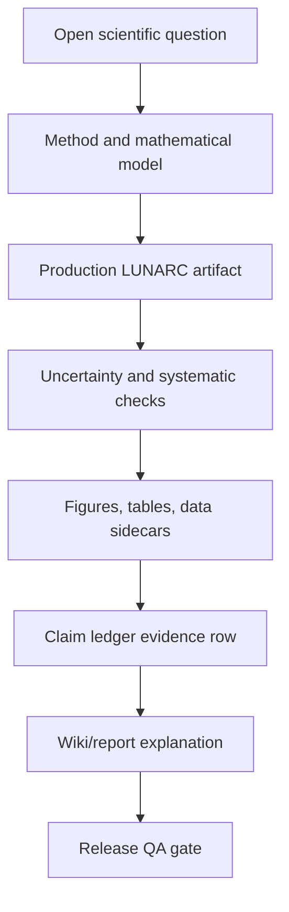

# Study coverage and remaining gaps

Run `20260627T180424Z_2516606_mv4_timing_final` is not a complete scientific closure package. This page makes every currently unstudied or under-studied topic explicit instead hiding it in prose.

All study implementations ready: `False`; blocked study count: `4`.

## Fail-closed coverage table

| Study | Status | Current state | Required next artifact |
|---|---:|---|---|
| MV4 | READY | truth-timing diagnostic implemented; final ADC pickoff calibration remains an open evidence-packet blocker | `reports/mc_validation/systematics/MV4_TIMING_UNCERTAINTIES.json` |
| MV5 | BLOCKED | pile-up overlay skeleton / requires controlled mixture lineage and recovery diagnostics | `reports/mc_validation/pileup/MV5_RECOVERY_DIAGNOSTICS.json` |
| MV6 | BLOCKED | representation comparison skeleton / requires nuisance-leakage-safe waveform comparison | `reports/mc_validation/representations/MV6_REPRESENTATION_COMPARISON.json` |
| MV7 | BLOCKED | pedestal/noise closure skeleton / requires held-out channel diagnostics | `reports/mc_validation/noise/MV7_PEDESTAL_NOISE_CLOSURE.json` |
| MV8 | BLOCKED | saturation/dynamic-range skeleton / requires failure accounting and dynamic-range scan | `reports/mc_validation/saturation/MV8_DYNAMIC_RANGE_SCAN.json` |

## Recursive closure rule

A topic is not considered understood merely because a placeholder module, fixture artifact, or literature reference exists. It remains open until production artifacts, QA gates, plots, uncertainty accounting, claim-ledger evidence, and wiki explanations all agree.

For each blocked study the recursive closure chain is:

Until that chain is complete for MV5-MV8, final MV4 ADC timing calibration, and every open-question evidence packet, the release remains blocked and no final physics conclusion is claimed.
