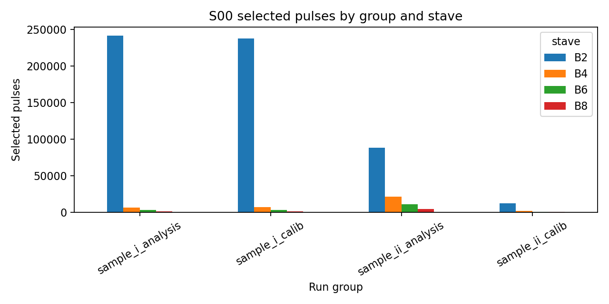

# 00 — Overview

## The measurement

At the Cyclotron Centre Bronowice (CCB, Kraków) a **190 MeV proton beam** strikes a
**deuterated polyethylene (CD₂)** target. Charged particles leaving the target are recorded by
a detector system: trigger scintillators, a TPC, and **two HRD scintillator range stacks**
(Stack A and Stack B), each ~100 cm from the target. The stacks range out charged particles
and act as a **data-driven ΔE–E / range telescope**.

The analysis is **entirely data-driven — there is no Monte Carlo truth**. Particle-type and
energy statements are *sample-level* interpretations, never per-event truth labels.

## What we extract

For each scintillator stave we record an **18-sample waveform at 10 ns spacing**, read out at
**one end via a wavelength-shifting (WLS) fibre**. From each waveform we reconstruct:
- a **pulse amplitude** (baseline-subtracted peak, ADC),
- a **pulse time** (leading-edge / optimal-filter, ns),
- a set of **pulse-shape variables** (tail fraction, late fraction, area/peak, …).

The main analysis uses **B-stack staves B2, B4, B6, B8**; the **A-stack (A1, A3)** is a
decoupled cross-check (see [08_astack.md](08_astack.md)).

## The two physics goals

1. **Timing resolution** — how precisely can a stave (and a multi-stave event) timestamp a
   particle? Established from **same-particle inter-stave time residuals**. See
   [05_timing_resolution.md](05_timing_resolution.md).
2. **Pile-up** — when do overlapping pulses corrupt the time/charge, how often, and at what
   beam rate does it become limiting? See [06_pileup.md](06_pileup.md).

## Headline numbers

| Quantity | Value | Source |
|---|---|---|
| Reproduced B-stack selected-pulse count | **640,737** raw `HRDv` pulse records with `A>1000 ADC` | S00 gate |
| Downstream single-stave timing | B6 ≈ 0.68–0.75 ns, B8 ≈ 0.93 ns, B4 ≈ 1.4–1.5 ns | variance decomposition |
| Combined 3-stave (B4+B6+B8) event time | σ_comb ≈ 0.54 ns (I) / 0.56 ns (II) | App. E |
| Two-ended-readout projection | σ ≈ 0.6–1.0 ns (factor √2) | §13.6 |
| A-stack A1–A3 residual | robust width 1.43 ns, core σ 1.41 ns | §15 |
| Pile-up tolerance with measured live-time | R_max ≈ 3.05 MHz for the same occupancy criterion once τ_eff≈124.8 ns is measured instead of assumed 90 ns | S10 |
| Current-dependent beam pile-up excess @ 20 nA | ≈ 9.2% downstream after subtracting current-independent baseline | App. G / S10 |
| Strongest accepted ML wins | duplicate-readout amplitude/charge, artificial saturation recovery, compact pulse-shape closure | ML closure studies |

## The samples

| Sample | Stack | Former name | Physics enrichment | Role |
|---|---|---|---|---|
| Sample I | B | "30 s" | D-enriched, terminal-B2-like | topology-heavy |
| Sample II | B | "60 s" | p-enriched, penetrating | clean timing reference |
| Sample III | A | (= Sample I runs) | — | A-stack cross-check |
| Sample IV | A | (= Sample II runs) | — | A-stack, low stats |

## Reading order

Start with [FINDINGS_SUMMARY.md](FINDINGS_SUMMARY.md), then read the thesis narrative in
[ANALYSIS_REPORT.md](ANALYSIS_REPORT.md). For the fully explicit "why each step exists"
audit trail, read [METHOD_LOGIC_TRACE.md](METHOD_LOGIC_TRACE.md). The detailed notes follow:
`01` setup → `02` data/runs → `03` pulse reconstruction → `04` timing calibration →
`05` timing resolution → `06` pile-up → `07` ML → `08` A-stack → `09` open questions.
Term definitions are in [glossary.md](glossary.md), the plot map is in
[FIGURE_INDEX.md](FIGURE_INDEX.md), and citations are in [references.md](references.md).
