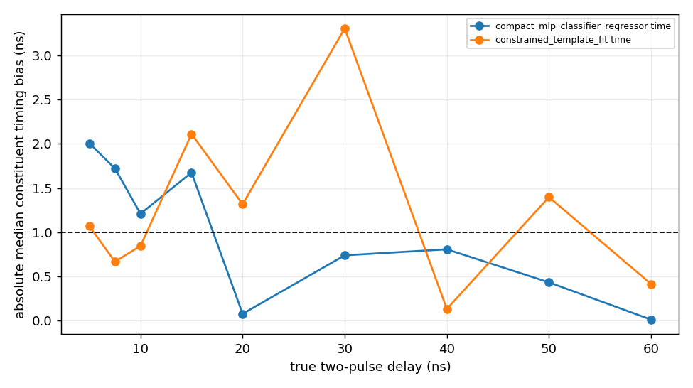
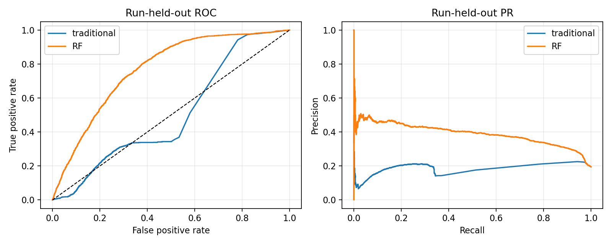

# 07 — ML methods (and how they are benchmarked)

> **Project rule:** every ML method must be paired with a **traditional (non-ML) baseline** and
> reported as a **head-to-head benchmark**. ML only earns its place if it beats a solid
> conventional method on a fair, held-out comparison. The repo-level study ledger is
> `studies/STUDIES.md`; this docs mirror keeps the rule here so the Markdown remains readable
> even when `/docs/` is copied without the surrounding repository.

All ML in the notes is **data-driven (no MC truth)**. Labels are weak / internally-defined.
The implementations are, on the whole, **methodologically careful** — but with real soft spots
flagged below for each.

## A. Event-level clean-timing classifier (App. A)
- **Model:** random forest. **Features:** B2/B4/B6/B8 amplitudes & log-amps, template quality,
  tail/late fractions, quench proxy, hit flags & multiplicities. *Deliberately excludes* the
  timing span / pair residuals / run / sample → guards against learning the label.
- **Weak labels:** clean = ≥2 downstream staves & downstream span <5 ns & all-span <10 ns;
  topology-violating = ≥2 downstream & (downstream span >10 ns OR B2 displaced >20 ns).
- **Split by run** (not random). 12,147 events (10,636 clean : 1,511 violating, **~7:1**).
- **Performance:** test ROC AUC 0.985, PR AUC 0.998, Brier 0.036; small train–test gap.
- **Traditional baseline to beat:** simple cuts on Δt_B / downstream span / q_template.
- ⚠ RF probabilities are **miscalibrated** (S-shaped) — ranking only; needs isotonic/logistic
  calibration. Class imbalance 7:1. Output is **clean-timing probability, NOT** a
  proton/deuteron/pile-up truth probability.

## A.4 Ridge-regression timing-residual correction
- Ridge (α=10 **fixed, unscanned**) on shape features to model the leftover residual *after*
  the physics timewalk correction. Test RMSE 1.574 → 1.416 ns (~10% gain), train/test parity.
- **Traditional baseline:** the existing analytic timewalk f_i(A,x) + a polynomial fit.
- ⚠ α not scanned; gain modest; quadratic feature expansion with a single penalty (S07).

## B. Pulse-level injection classifiers (App. B)
- **Validation by injection (no MC):** corrupt clean real waveforms with known dropout /
  two-pulse pile-up; the uncorrupted primary is the truth target. Split by run.
- RF tagging: dropout test AUC 0.999; pile-up test AUC 0.995.
- **Timing recovery:** pile-up sep ≥3 bins 2.07 → 0.61 ns; sep <3 bins 3.20 → 1.82 ns;
  dropout recoverable 0.00 → 0.65 ns, unrecoverable 5.63 → 2.31 ns.
- **Traditional baseline:** bounded two-pulse template fit. In representative injection studies,
  the template-like method keeps a lower failure rate while compact ML reaches shorter apparent
  live-time and lower conditional RMS.
- Honest conclusion: ML cannot recover destroyed leading-edge information by magic. It should
  separate clean, recoverable, and unrecoverable regimes, and adoption must include failure rate.

## G/H. Pile-up rate & weak supervision
- **G — injection tolerance scan** → the old 90 ns occupancy headline was about 4.2 MHz, but
  measured live-time moves the comparable combined criterion to about 3.05 MHz (see
  [06_pileup.md](06_pileup.md)).
- **H — weakly-supervised current classifier (CWoLa):** RF on **shape only** (balanced per
  stave & current) distinguishes 20 nA vs 2 nA. Test AUC **0.676** — *deliberately not*
  near-perfect (perfect ⇒ trivial instrumental difference / memorisation). Run-transfer folds
  46↔47 AUC 0.59–0.64. Score↔injected-pile-up score move together (Δ≈12%).
- **Traditional baseline:** the raw multi-stave / downstream-fraction current comparison
  (1.56% vs 2.68%) and the f(I)=f₀+kI fit.

## I. Timing-control-region classifier (App. I)
- **Labels from extremes:** D_t<3 ns (clean) vs **D_t>50 ns (gross, only 72 events)**;
  intermediate scored after. Features = **waveform shape only** (D_t, R_t, inter-stave timing
  forbidden as inputs).
- Test AUC 0.958 but **AP 0.614**, train AUC 1.000 → optimism from rare positives.
- **Traditional baseline:** a direct D_t cut and the curvature C_t/σ_C consistency variable.
- ⚠ Label is partly self-referential (D_t defines labels and is later "rejected"); 72 positives
  ⇒ bootstrap CIs mandatory (S12). Use as a **tail-finder/ranking** variable, not a quantitative
  pile-up fraction.

## Cross-cutting strengths (keep these)
Split-by-run everywhere; run-transfer folds; label-defining variables excluded from features;
explicit refusal to over-interpret (proxies ≠ truth; RF prob ≠ calibrated prob).

## Cross-cutting weaknesses (study targets)
Class imbalance (7:1; 72 positives); calibration; unscanned hyperparameters; missing χ²/ndf;
thin Sample II/IV stats; and transfer across run family, topology, current, and saturation.
Deep and compact learned models have now been tested in selected timing, representation,
two-pulse, and energy panels; they are accepted only where they beat a strong conventional
baseline under the same split.

