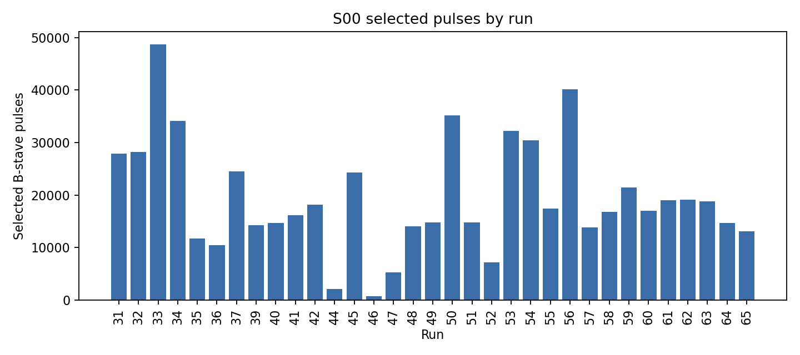
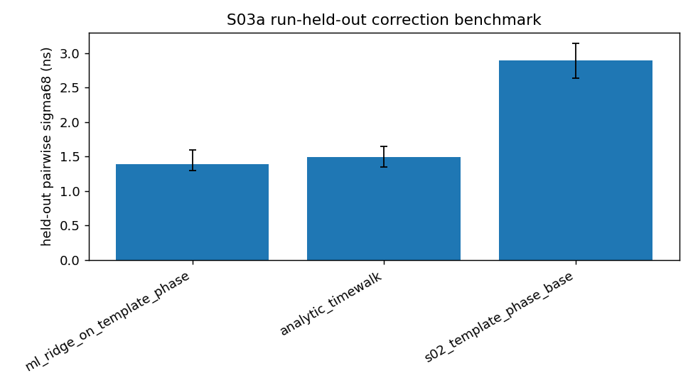
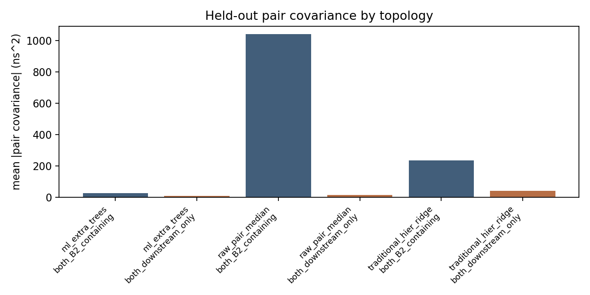
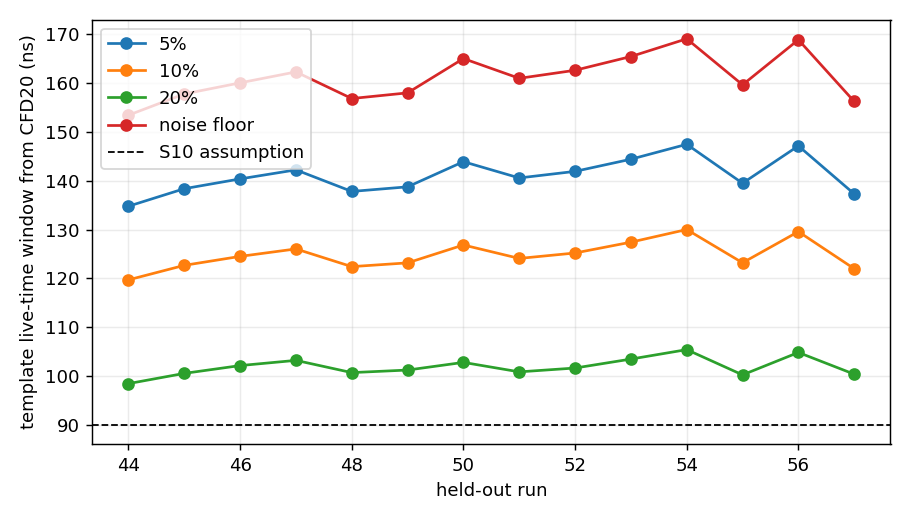
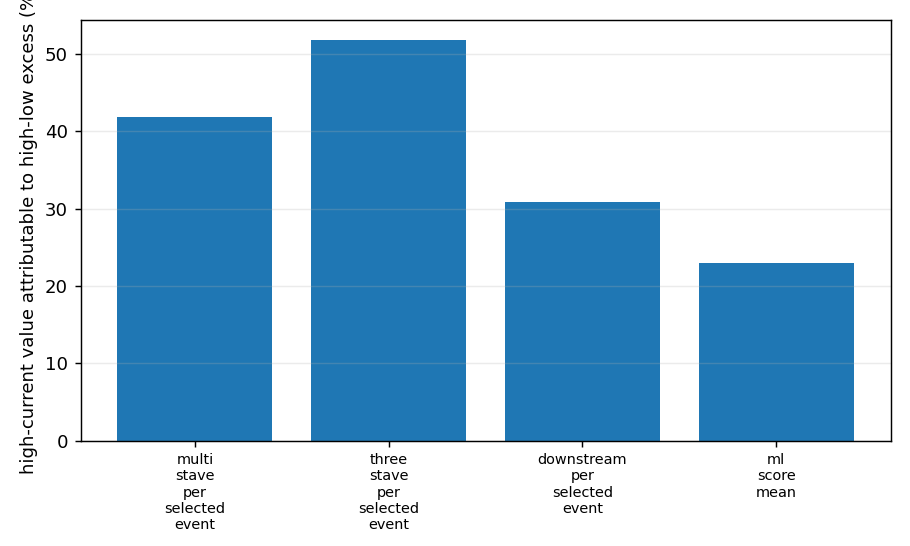
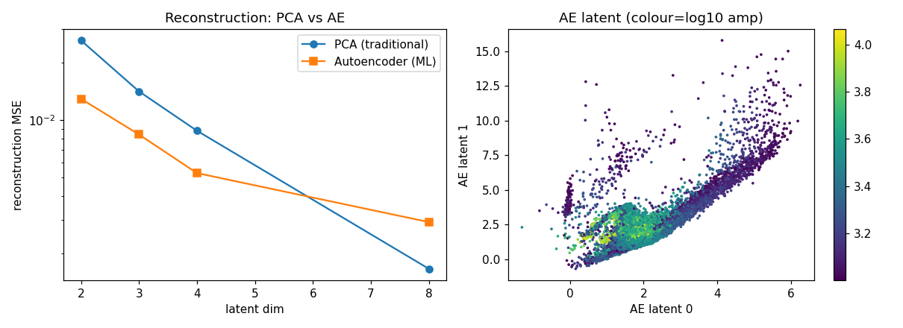
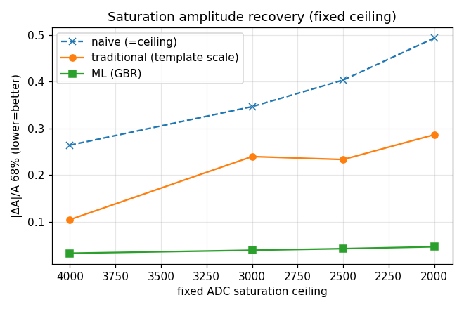
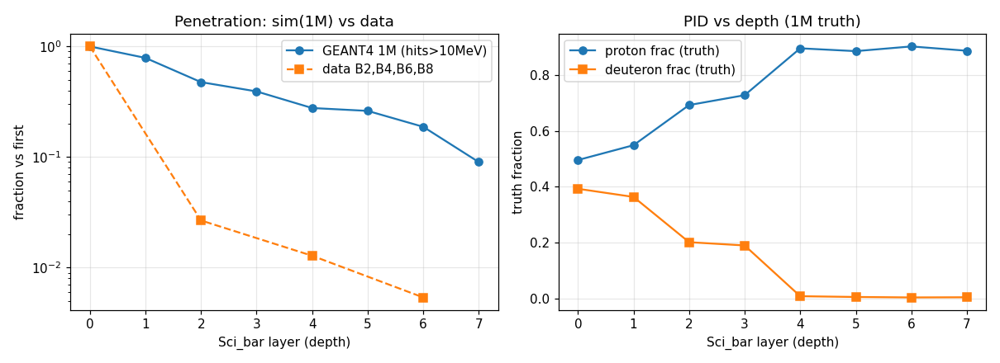

# Findings Summary

This document is the short, reader-facing summary of the CCB test-beam analysis.
The full narrative is in [ANALYSIS_REPORT.md](ANALYSIS_REPORT.md), and the
thesis-style LaTeX source is in [latex/main.tex](latex/main.tex).

## Executive verdict

The programme does not show that ML should replace the traditional analysis. It
shows where ML is useful. ML wins when the target is independent and the missing
information is genuinely in waveform shape: duplicate-readout amplitude/charge,
artificial saturation recovery, compact pulse-shape representation, and some
injected two-pulse recovery tasks. Traditional or physics-anchored methods remain
preferred for amplitude timewalk, Poisson/live-time pile-up scaling, and
GEANT4-truth energy calibration.

## Reproduced data anchor

The raw B-stack pulse gate is closed. Reading `HRDv`, using even B-stack staves
B2/B4/B6/B8, estimating the baseline from samples 0-3, and selecting pulses with
`A > 1000 ADC` gives exactly 640,737 selected B-stave pulse records. This count
is the entry condition for the downstream claims.

## Timing

The first residual-correction scan made ML look dominant, but the stronger
comparison showed that most of the gain is conventional amplitude timewalk. A
Ridge residual model on template phase reaches about 1.39 ns sigma68, while an
explicit amplitude timewalk model reaches about 1.50 ns on the same benchmark.
That is close enough that the transparent analytic correction is the production
candidate unless a later model wins with a larger, run-held-out margin.

B2-containing timing residuals are a topology problem, not a generic timing
failure. Downstream B4/B6/B8 timing is much cleaner and should define precision
event-time estimates.

## Pile-up and live-time

The old pile-up headline used `tau_eff = 90 ns` as an assumption. Direct
waveform live-time measurements do not support that value. The traditional
10-percent tail-crossing estimate is 124.79 ns with a bootstrap interval near
123-126 ns, which rescales the same occupancy requirement from about 4.22 MHz to
about 3.05 MHz.

Current-dependent pile-up scores contain a large current-independent baseline.
The honest beam-related statement is the high-current excess, not the raw score.

## Pulse shape and ML

Pulse shapes are compact. The first three PCA components capture most of the
shape variance, and eight components are already near complete. A small
autoencoder wins in the very compact regime, but PCA catches up when enough
linear components are retained.

The largest accepted ML wins are independent waveform-shape closures:
duplicate-readout amplitude/charge and artificial saturation recovery. These are
not the same as absolute per-event energy truth, but they demonstrate that
waveform shape contains recoverable calibration information.

## Energy, PID, and GEANT4

The data-only HRD waveform programme cannot prove per-event particle identity or
absolute deposited energy. GEANT4 is the required truth bridge. In the current
truth-anchored energy panel, the traditional GEANT4 Birks lookup is the best
held-out method; neural and tree models do not supersede the physics prior.

## Remaining scientific risks

The main open risks are event-level energy/PID truth, real pile-up truth,
pedestal validation from a true zero-signal source, and transfer of accepted ML
closures across run family, topology, saturation, and current shifts.
