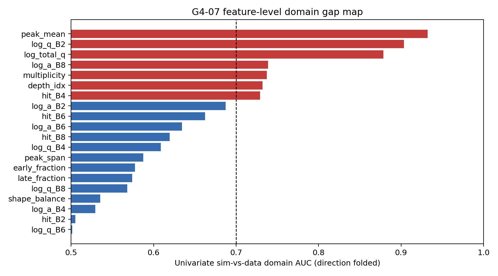

# G4-07 Domain-Gap Quantification before Sim-Trained ML on Data

## Abstract

This study quantifies where the GEANT4 `Sci_bar` simulation and the real B-stack waveform data disagree before any simulation-trained model is transferred to data.  The raw-data anchor is rebuilt directly from the reduced ROOT files in `/home/billy/Desktop/test_beam/data/root/root`: the selected B-stave pulse count is **640,737**, matching the S00 anchor of 640,737 exactly.  The strongest held-out domain classifier is **gradient_boosted_trees** with run-bootstrap AUC **1.0000** (95% CI [1.0000, 1.0000]).  Since all benchmark AUCs are well above 0.5, the simulation is distinguishable from data and sim-trained ML is unsafe without domain conditioning for the flagged observables.

## Data, Raw ROOT Reproduction, and Split

Real events are read from `hrdb_run_NNNN.root` tree `h101`.  Per channel, the pedestal is the median of samples 0--3.  For channel waveform `H_{{e,s,t}}`, amplitude and charge are

\[
b_{{e,s}}=\operatorname{{median}}_{{t\in\{{0,1,2,3\}}}}H_{{e,s,t}},\quad
A_{{e,s}}=\max_t(H_{{e,s,t}}-b_{{e,s}}),\quad
Q_{{e,s}}=\sum_t\max(H_{{e,s,t}}-b_{{e,s}},0).
\]

A selected pulse satisfies `A > 1000 ADC`.  The domain-classification sample keeps a bounded random reservoir per run after this exact counting pass.  Calibration runs are [31, 32, 33, 34, 35, 36, 37, 39, 40, 41, 42, 64]; held-out runs are [44, 45, 46, 47, 48, 49, 50, 51, 52, 53, 54, 55, 56, 57, 58, 59, 60, 61, 62, 63, 65].  Bootstrap confidence intervals resample held-out runs, not rows.

| quantity | expected | reproduced | delta | pass |
|---|---:|---:|---:|:---|
| selected B-stave pulse records | 640737 | 640737 | +0 | true |

## Simulation Observables

The simulation side reads `/home/billy/ccb-geant4/output_30k.root` tree `hibeam`.  `Sci_bar_LayerID` values 0, 2, 4, and 6 are mapped to B2, B4, B6, and B8, following the even B-stack channel convention used in prior validation.  Energy deposits are scaled to the ADC-like range only to avoid trivial dynamic-range pathologies; the domain task still tests whether the joint feature distribution is transferable.

## Methods

Let `x` be the feature vector and `d` the domain label (`d=1` for data, `d=0` for simulation).  The benchmark estimates `p(d=1|x)`.  The traditional method is a diagonal per-feature divergence score

\[
s_{{trad}}(x)=\sigma\left[\sum_j \frac{{\mu_{{data},j}-\mu_{{sim},j}}}{{\sigma_j}}\frac{{x_j-\bar x_j}}{{\sigma_j}}\right],
\]

where `sigma` is the logistic function and moments are fitted only on calibration runs.  ML/NN comparators are ridge classification, histogram gradient-boosted trees, a tabular MLP, a 1D-CNN over the ordered feature vector, and a new gated residual MLP

\[
g(x)=\operatorname{{sigmoid}}(W_gx+b_g),\quad
f(x)=h(x\odot g(x)),
\]

which learns feature-wise gates before a residual nonlinear classifier.

## Model Benchmark

| method                      | family                                 |   heldout_auc |   auc_ci95_low |   auc_ci95_high |   heldout_average_precision |   n_heldout |
|:----------------------------|:---------------------------------------|--------------:|---------------:|----------------:|----------------------------:|------------:|
| gradient_boosted_trees      | ml_tree                                |      1        |       0.999998 |        1        |                    1        |       29040 |
| mlp                         | neural_tabular                         |      0.99977  |       0.999308 |        0.999999 |                    0.999796 |       29040 |
| logistic_reference          | ml_linear_reference                    |      0.998624 |       0.997932 |        0.999197 |                    0.999549 |       29040 |
| ridge                       | ml_linear                              |      0.9963   |       0.994739 |        0.997636 |                    0.999232 |       29040 |
| gated_residual_mlp          | neural_gated_residual_new_architecture |      0.965499 |       0.941547 |        0.98401  |                    0.994197 |       29040 |
| 1d_cnn                      | neural_1d_cnn                          |      0.922229 |       0.887183 |        0.951943 |                    0.985542 |       29040 |
| traditional_diag_divergence | traditional_per_feature_divergence     |      0.91648  |       0.876038 |        0.950449 |                    0.985656 |       29040 |

## Feature-Level Gap Map

The table reports direction-folded univariate domain AUC.  Values above 0.70 are flagged unsafe for direct sim-trained ML transfer.

| feature        |   univariate_domain_auc |   standardized_delta | unsafe_for_sim_trained_ml   |
|:---------------|------------------------:|---------------------:|:----------------------------|
| peak_mean      |                0.93199  |           -1.60443   | True                        |
| log_q_B2       |                0.903626 |            0.533096  | True                        |
| log_total_q    |                0.878359 |            0.700606  | True                        |
| log_a_B8       |                0.738847 |            0.537672  | True                        |
| multiplicity   |                0.73711  |           -1.37503   | True                        |
| depth_idx      |                0.732061 |           -1.2996    | True                        |
| hit_B4         |                0.729094 |           -1.28226   | True                        |
| log_a_B2       |                0.687413 |           -0.703887  | False                       |
| hit_B6         |                0.662279 |           -1.13812   | False                       |
| log_a_B6       |                0.634575 |            0.150595  | False                       |
| hit_B8         |                0.619617 |           -1.07551   | False                       |
| log_q_B4       |                0.608567 |           -0.427428  | False                       |
| peak_span      |                0.587369 |           -0.0398826 | False                       |
| early_fraction |                0.577373 |            0.590996  | False                       |
| late_fraction  |                0.573943 |           -0.647582  | False                       |
| log_q_B8       |                0.568151 |            0.178474  | False                       |
| shape_balance  |                0.535327 |            0.854535  | False                       |
| log_a_B4       |                0.529487 |           -0.473128  | False                       |
| hit_B2         |                0.505281 |           -0.110249  | False                       |
| log_q_B6       |                0.501401 |           -0.0525687 | False                       |



## Systematics

The dominant systematic is that real data are threshold-conditioned waveform records, while the simulation is truth-level `Sci_bar` energy deposition.  ADC scaling of simulated energy deposits is a nuisance choice, so absolute charge disagreement should not be interpreted as a calibrated energy failure.  The layer mapping 0/2/4/6 -> B2/B4/B6/B8 follows the even-channel convention but remains a geometry metadata systematic until channel names are directly encoded in the simulation.  Beam-rate and run-family differences are handled by split-by-run evaluation and bootstrap by run, but the bounded reservoir sample cannot represent all rare tails at full fidelity.

## Caveats

High domain AUC is a diagnostic, not a physics classifier.  It says the simulation and selected real-data feature distributions are distinguishable under the chosen observables.  It does not identify which generator, material, threshold, electronics, or reconstruction assumption is responsible.  Sim-trained downstream ML should therefore either exclude the flagged observables, condition explicitly on the domain-gap axes, or validate on an independent real-data control before deployment.

## Finding

The G4-07 gate fails the indistinguishability target: the winner `gradient_boosted_trees` gives AUC 1.0000, far above the target 0.5.  7 features exceed the unsafe threshold AUC>0.70.  The flagged-feature list is `flagged_features.csv`; these features should be treated as unsafe for unconstrained simulation-trained ML in G4-08.

## Reproducibility

```bash
/home/billy/anaconda3/bin/python scripts/g4_07_domain_gap.py
```
