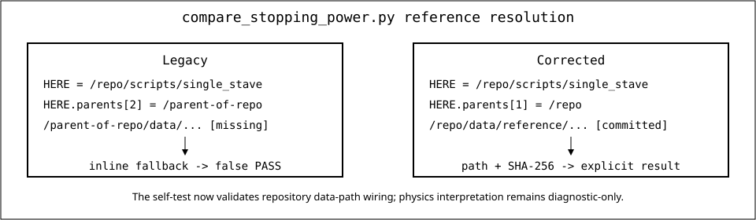

# Stopping-power reference-path and self-test audit

- **Task:** `AUD-G4-004`
- **Session UTC:** `2026-07-23T10:04:54Z`
- **Initial remote `main`:** `5a4bdfc3f0099f2b6e8c3891b5a2a05f57ecf770`
- **Reviewed script blob:** `2212b4faf330adb40adffb6dc5334698443d8aa3`
- **Reviewed reference-data blob:** `7e953dd346caedcee6da54180fb636b890a64040`
- **Status:** reference-path defect fixed and regression-tested; physics closure remains `PARTIAL`.



## Confirmed defect

For a checkout at `/repo`, the script directory is `/repo/scripts/single_stave`.
`Path.parents` is zero-indexed:

```text
HERE.parents[0] = /repo/scripts
HERE.parents[1] = /repo
HERE.parents[2] = /parent-of-repo
```

The previous default used:

```python
DEFAULT_REF = HERE.parents[2] / "data" / "reference" / "stopping_power" / "pstar_polystyrene.csv"
```

It therefore resolved outside the repository. The repository copy at
`/repo/data/reference/stopping_power/pstar_polystyrene.csv` was not read by the
default command.

The defect was masked because `self_test()` silently created a tiny inline
reference whenever the incorrect path did not exist. A local reproduction in a
synthetic checkout measured:

```text
DEFAULT_REF /tmp/data/reference/stopping_power/pstar_polystyrene.csv
default exists False
self_test 0
```

Thus a zero exit status did not demonstrate that the committed PSTAR table was
present, readable, or numerically exercised.

## Corrected behavior

The script now:

1. Defines the repository root as `HERE.parents[1]`.
2. Resolves the default reference below that root.
3. Fails the self-test when the selected reference is missing.
4. Prints the selected reference path, SHA-256, and parsed row count.
5. Uses a temporary directory that is removed after the synthetic test.
6. Labels the comparison `DIAGNOSTIC_ONLY` rather than treating numerical
   agreement as accepted stopping-power closure.

The CLI self-test respects an explicitly supplied `--reference`; without one it
must use the committed repository table.

## Reproducible validation

```text
python -m py_compile \
  scripts/single_stave/compare_stopping_power.py \
  tests/test_compare_stopping_power_reference_path.py

python -m pytest tests/test_compare_stopping_power_reference_path.py -q
```

Focused result:

```text
3 passed in 0.55s
```

The regression verifies:

- the default path is the repository data path;
- a missing reference fails closed;
- the self-test succeeds from an unrelated working directory;
- the selected path and measured SHA-256 are printed;
- the inline-reference fallback is absent;
- output states `SCIENTIFIC STATUS: DIAGNOSTIC_ONLY`.

## Scientific interpretation and better method

NIST defines stopping power as the average rate of **projectile energy loss**
per path length. Geant4 documents `G4Step::GetTotalEnergyDeposit()` as local
energy deposited by energy-loss processes plus energy assigned to secondaries
that were not generated below production thresholds. Energy carried away by
generated secondaries is not part of that local deposit. The current event
ntuple also stores the configured incident kinetic energy, not an energy sampled
along the scored track.

Therefore `sum(edep_scint_raw_MeV) / sum(track_len_scint_mm)` is a useful local
energy-deposition diagnostic, but it is not automatically identical to PSTAR
total stopping power. Numerical tolerance must not be promoted to physics
validation without one of these controlled methods:

1. compare Geant4 `G4EmCalculator::ComputeTotalDEDX` for the configured particle,
   energy, material, production cuts, and physics list against the reference;
2. record primary entry and exit kinetic energy and compare the measured path
   length with the reference integral over the actual energy interval;
3. demonstrate containment and quantify energy carried by escaping generated
   secondaries before interpreting local deposition as total projectile loss.

The deuteron `S_d(E) ~= S_p(E/2)` relation remains an approximation and must be
reported separately from the direct proton PSTAR comparison.

## Primary documentation

- NIST PSTAR/ASTAR output and methods:
  <https://physics.nist.gov/PhysRefData/Star/Text/programs.html>
- NIST definition of stopping power:
  <https://physics.nist.gov/PhysRefData/Star/Text/appendix.html>
- [Geant4 tracking and total-energy-deposit semantics][g4-tracking]
- [Geant4 `G4EmCalculator` stopping-power interface][g4-em]

## Boundary

No Geant4 executable, ROOT file, Slurm job, detector simulation, real-data table,
or stopping-power result was generated in this session. The correction validates
reference selection and self-test provenance only. An accepted physics closure
is tracked separately and remains incomplete.

[g4-tracking]: https://geant4.web.cern.ch/documentation/pipelines/master/bfad_html/ForApplicationDevelopers/TrackingAndPhysics/tracking.html
[g4-em]: https://geant4.web.cern.ch/documentation/pipelines/master/bfad_html/ForApplicationDevelopers/TrackingAndPhysics/physicsProcess.html
