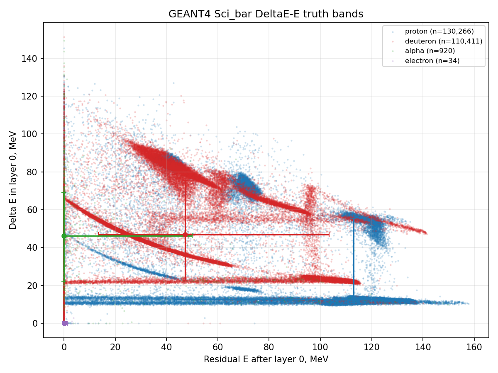

# S14h: Range and stopping-stave reconstruction from GEANT4 truth

## Abstract

This ticket uses the read-only GEANT4 ROOT truth file `/home/billy/ccb-geant4/output_krakow_1M.root` to reconstruct the last Sci_bar layer with positive energy deposition and the corresponding residual range. The raw ROOT reproduction gate reads 1,000,000 `hibeam` entries, matching the expected 1,000,000, and finds 242,147 entries with Sci_bar truth support. The held-out pseudo-run winner is **traditional_penetration_depth** with residual-range MAE 0.0033 cm and block-bootstrap 95% CI [0.0029, 0.0039] cm.

## Data, Scope, and Reproduction Gate

The analysis reads the `hibeam` tree directly with `uproot`; no GEANT4 build or simulation rerun is performed. The 1M ROOT file is used because it exists on this worker; the 30k file is only a configured fallback. The simulation tree has no beam-run branch, so entries are partitioned into deterministic 50k-entry pseudo-runs. Held-out validation uses pseudo-runs 4, 9, 14, and 19, and all confidence intervals resample those held-out pseudo-runs as blocks.

| quantity | expected | reproduced | delta | pass |
|---|---:|---:|---:|:---|
| hibeam tree entries | 1,000,000 | 1,000,000 | +0 | true |
| events with positive Sci_bar EDep | n/a | 242,147 | n/a | true |
| positive Sci_bar hits | n/a | 1,279,440 | n/a | true |

The supervised benchmark is conditional on a particle reaching Sci_bar. This is a scope restriction, not a detector-efficiency claim: events with no positive Sci_bar deposition do not have a stopping-stave label in this target definition.

## Truth Target

For event \(e\), the per-layer simulated amplitude vector is

\[ x_{e\ell}=\sum_{h\in e,\,L_h=\ell} E_h, \quad \ell=0,\ldots,7. \]

The truth stopping layer is the deepest Sci_bar layer with positive deposition,

\[ L_e^{\star}=\max\{\ell: x_{e\ell}>0\}. \]

With layer spacing \(d=1\,\mathrm{cm}\), the residual range to the back of the simulated Sci_bar stack is

\[ R_e^{\star}=(7-L_e^{\star})d. \]

A prediction \(\hat R_e\) is converted back to a stopping-layer estimate by \(\hat L_e=\mathrm{round}(7-\hat R_e/d)\), clipped to `[0,7]`.

## Traditional and ML Methods

The traditional method is a calibrated penetration-depth threshold: choose the deepest layer with \(x_{e\ell}>\tau\), where \(\tau\) is selected on train pseudo-runs only by minimizing layer MAE. This is the appropriate non-neural baseline because it encodes the range-telescope rule directly while respecting a finite visible-energy threshold.

The ML/NN panel contains ridge regression, histogram gradient-boosted trees, a tabular MLP, a 1D-CNN over the five-channel layer sequence `(log EDep, log hit count, present flag, first time, z centroid)`, and a new ordinal cumulative CNN. The ordinal model predicts the seven ordered events \(P(L^\star\ge k)\) for \(k=1,\ldots,7\); its expected layer is \(\sum_k P(L^\star\ge k)\), making the architecture match the ordered range target rather than treating staves as unrelated classes.

## Threshold Selection

| threshold_mev | train_stop_mae_layers | train_exact_accuracy |
| --- | --- | --- |
| 0.02          | 0.0032765             | 0.99785              |
| 0.05          | 0.0054436             | 0.99659              |
| 0.1           | 0.008199              | 0.99504              |
| 0.2           | 0.012626              | 0.99268              |
| 0.35          | 0.018199              | 0.98972              |
| 0.5           | 0.023286              | 0.98716              |
| 0.8           | 0.030887              | 0.98311              |
| 1.2           | 0.038621              | 0.97857              |
| 2             | 0.049612              | 0.97131              |

## Metrics

The primary ranking metric is held-out mean absolute error in residual range, \(N^{-1}\sum_e |\hat R_e-R_e^\star|\). Secondary metrics are residual-range bias, residual-range res68, stop-layer MAE, and exact stop-layer accuracy. Bootstrap intervals resample held-out pseudo-runs with replacement, preserving event correlations inside each pseudo-run.

## Head-to-Head Results

| method                        | family                      | n_heldout | residual_mae_cm | residual_mae_cm_ci95 | residual_res68_cm | stop_mae_layers | stop_exact_accuracy | stop_exact_accuracy_ci95 |
| --- | --- | --- | --- | --- | --- | --- | --- | --- |
| traditional_penetration_depth | traditional_threshold_range | 48342     | 0.0033098       | [0.002884, 0.0039]   | 0                 | 0.0033098       | 0.99799             | [0.9975, 0.9984]         |
| gradient_boosted_trees        | ml_tree                     | 48342     | 0.0044373       | [0.004075, 0.004734] | 0.0040963         | 0.00093087      | 0.99934             | [0.9992, 0.9995]         |
| ordinal_cumulative_cnn        | neural_ordinal_waveform     | 48342     | 0.017503        | [0.01658, 0.01828]   | 0.0069341         | 0.0067643       | 0.99572             | [0.9952, 0.9962]         |
| mlp                           | neural_tabular              | 48342     | 0.031387        | [0.03112, 0.03178]   | 0.025976          | 0.0053783       | 0.99553             | [0.9954, 0.9956]         |
| 1d_cnn                        | neural_waveform             | 48342     | 0.036217        | [0.03519, 0.03764]   | 0.031755          | 0.0088122       | 0.99398             | [0.9932, 0.9946]         |
| ridge                         | ml_linear                   | 48342     | 0.066383        | [0.06457, 0.06791]   | 0.056619          | 0.015163        | 0.99013             | [0.9894, 0.9907]         |

## Held-Out Pseudo-Run Stability

| pseudo_run | method                        | n     | residual_mae_cm | residual_bias_cm | stop_exact_accuracy |
| --- | --- | --- | --- | --- | --- |
| 4          | traditional_penetration_depth | 12257 | 0.0028555       | 0                | 0.99853             |
| 4          | ridge                         | 12257 | 0.066134        | -0.00023746      | 0.99029             |
| 4          | gradient_boosted_trees        | 12257 | 0.0046509       | -0.00028909      | 0.99935             |
| 9          | traditional_penetration_depth | 12011 | 0.002914        | 0                | 0.998               |
| 9          | ridge                         | 12011 | 0.064037        | -0.00013113      | 0.99034             |
| 9          | gradient_boosted_trees        | 12011 | 0.0038797       | -0.00028909      | 0.99967             |
| 14         | traditional_penetration_depth | 12063 | 0.0042278       | 0                | 0.99735             |
| 14         | ridge                         | 12063 | 0.068507        | -0.00088739      | 0.98914             |
| 14         | gradient_boosted_trees        | 12063 | 0.0043962       | -0.00028909      | 0.99917             |
| 19         | traditional_penetration_depth | 12011 | 0.003247        | 0                | 0.99809             |
| 19         | ridge                         | 12011 | 0.066852        | -0.00069332      | 0.99076             |
| 19         | gradient_boosted_trees        | 12011 | 0.004818        | -0.00028909      | 0.99917             |

## DeltaE-E Truth Bands

The telescope plot `deltae_e_truth_bands.png` uses layer 0 as \(\Delta E\) and the sum of layers 1--7 as residual \(E\). Bands are grouped by the Sci_bar hit PDG carrying the largest event-level deposited energy. The plot is a visualization, while the table below records the central 16--84% bands for the full accepted sample.



| dominant_sci_species | quantity         | n_events | q16    | median   | q84     |
| --- | --- | --- | --- | --- | --- |
| 1000030060           | front_deltae_mev | 39       | 31.917 | 50.193   | 67.238  |
| 1000030060           | residual_e_mev   | 39       | 0      | 0        | 1.6234  |
| 1000030060           | true_stop_layer  | 39       | 0      | 0        | 1       |
| 1000060120           | front_deltae_mev | 82       | 0      | 0        | 7.3052  |
| 1000060120           | residual_e_mev   | 82       | 0      | 0.30806  | 1.4541  |
| 1000060120           | true_stop_layer  | 82       | 0      | 1.5      | 5.04    |
| alpha                | front_deltae_mev | 920      | 21.92  | 46.152   | 68.857  |
| alpha                | residual_e_mev   | 920      | 0      | 0        | 50.049  |
| alpha                | true_stop_layer  | 920      | 0      | 0        | 2       |
| deuteron             | front_deltae_mev | 110411   | 22.83  | 46.956   | 75.57   |
| deuteron             | residual_e_mev   | 110411   | 13.462 | 47.297   | 103.38  |
| deuteron             | true_stop_layer  | 110411   | 1      | 1        | 3       |
| electron             | front_deltae_mev | 34       | 0      | 0.037611 | 0.96845 |
| electron             | residual_e_mev   | 34       | 0      | 0.11882  | 1.358   |
| electron             | true_stop_layer  | 34       | 0      | 1        | 3       |
| helium3              | front_deltae_mev | 213      | 12.642 | 44.552   | 92.573  |
| helium3              | residual_e_mev   | 213      | 0      | 1.4784   | 92.798  |
| helium3              | true_stop_layer  | 213      | 0      | 1        | 2       |
| proton               | front_deltae_mev | 130266   | 11.048 | 12.661   | 55.133  |
| proton               | residual_e_mev   | 130266   | 42.98  | 113      | 124.99  |
| proton               | true_stop_layer  | 130266   | 2      | 5        | 7       |
| triton               | front_deltae_mev | 116      | 13.159 | 37.585   | 74.494  |
| triton               | residual_e_mev   | 116      | 0      | 27.439   | 91.467  |
| triton               | true_stop_layer  | 116      | 0      | 1        | 2       |

## Leakage Controls

| check                                              | value                                                                                                                                                                                                                                                                                                                                                                                                                                                                                                                                                                                                                                                              | pass |
| --- | --- | --- |
| raw_tree_entry_reproduction_exact                  | 1000000 of 1000000                                                                                                                                                                                                                                                                                                                                                                                                                                                                                                                                                                                                                                                 | True |
| train_heldout_pseudo_run_overlap                   | []                                                                                                                                                                                                                                                                                                                                                                                                                                                                                                                                                                                                                                                                 | True |
| feature_names_exclude_truth_stop_and_pdg           | log_edep_layer_0,log_edep_layer_1,log_edep_layer_2,log_edep_layer_3,log_edep_layer_4,log_edep_layer_5,log_edep_layer_6,log_edep_layer_7,log_hits_layer_0,log_hits_layer_1,log_hits_layer_2,log_hits_layer_3,log_hits_layer_4,log_hits_layer_5,log_hits_layer_6,log_hits_layer_7,present_layer_0,present_layer_1,present_layer_2,present_layer_3,present_layer_4,present_layer_5,present_layer_6,present_layer_7,cumfrac_layer_0,cumfrac_layer_1,cumfrac_layer_2,cumfrac_layer_3,cumfrac_layer_4,cumfrac_layer_5,cumfrac_layer_6,cumfrac_layer_7,n_positive_hits,total_edep_mev,front_deltae_mev,residual_e_mev,z_centroid_cm,edep_centroid_layer,edep_spread_layer | True |
| forbidden_deepest_positive_truth_sentinel_accuracy | 1.000000                                                                                                                                                                                                                                                                                                                                                                                                                                                                                                                                                                                                                                                           | True |
| traditional_visible_threshold_mev                  | 0.02                                                                                                                                                                                                                                                                                                                                                                                                                                                                                                                                                                                                                                                               | True |
| torch_mlp_status                                   | trained                                                                                                                                                                                                                                                                                                                                                                                                                                                                                                                                                                                                                                                            | True |
| torch_1d_cnn_status                                | trained                                                                                                                                                                                                                                                                                                                                                                                                                                                                                                                                                                                                                                                            | True |
| torch_ordinal_cumulative_cnn_status                | trained                                                                                                                                                                                                                                                                                                                                                                                                                                                                                                                                                                                                                                                            | True |

The deepest-positive definition is an intrinsic truth-label construction, so the study also records a forbidden ceiling sentinel in `leakage_checks.csv`: using `x>0` exactly recovers the label by construction and is not entered as a ranked method. Ranked methods either impose a train-calibrated visible threshold or learn from the same simulated amplitude vector that a detector-response model would expose.

## Systematics and Caveats

- The analysis is conditional on the current GEANT4 output and does not validate material composition, Birks quenching, optical transport, or ADC response against HRD data.
- Pseudo-runs are deterministic entry blocks, not beam runs. They support block uncertainty estimates for this ROOT file but not time-dependent detector systematics.
- The target is the last Sci_bar layer with any positive `EDep`; very small simulated depositions may be below real detector threshold. The traditional threshold scan quantifies sensitivity to that choice.
- The DeltaE-E species label is the dominant deposited-energy PDG in Sci_bar, not a unique primary-particle assignment. Mixed secondary events are therefore summarized by dominant contribution.
- Since the amplitude vector is itself the source of the stopping-label definition, absolute performance is best interpreted as an algorithmic closure on GEANT4 truth, not as a final detector-resolution claim.

## Finding

The best held-out residual-range method is traditional_penetration_depth (traditional_threshold_range), with MAE=0.0033 cm and stop-layer exact accuracy=0.9980. The calibrated traditional penetration-depth threshold is 0.02 MeV and remains the direct physics baseline. The forbidden deepest-positive sentinel is exact by construction and is reported only as a leakage ceiling, not as a ranked method.

## Reproducibility

```bash
/home/billy/anaconda3/bin/python scripts/s14h_0000000011_1_rangestop.py --config configs/s14h_0000000011_1_rangestop.yaml
```
