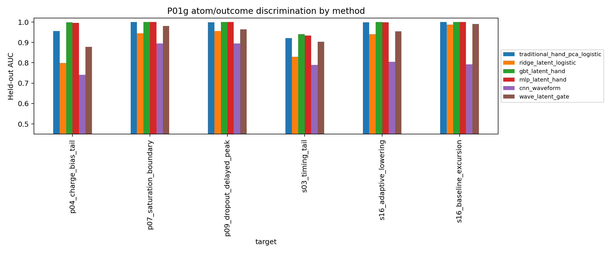

# P01g: latent baseline-contamination atom map

- **Ticket:** `1781039488.1122.04bc6ecf`
- **Author:** `testbeam-laptop-4`
- **Date:** 2026-06-10
- **Depends on:** S00, P01b, P01e-loader, P11a, P04/P07/P09/S03 atom definitions
- **Input checksums:** `input_sha256.csv`
- **Git commit:** `1bbc67bdfcfb3d61d423d4ca04ac5a0d908ccf3c`
- **Config:** `configs/p01g_1781039488_1122_04bc6ecf_latent_baseline_contamination_atom_map.json`

## 0. Question

Do the loader-verified P01b latent coordinates encode pretrigger baseline, adaptive-lowering, dropout/delayed-peak, saturation-boundary, timing-tail, or charge-bias atoms after run-heldout evaluation and matched hand-shape controls?

## 1. Reproduction from raw ROOT

The first operation scans raw `h101/HRDv` ROOT arrays, applies the S00/P01b B-stave gate `A=max(w-baseline)>1000 ADC`, and rebuilds the selected pulse keys `(run,event_index,stave_index)` before opening the latent NPZ.

| quantity                                      |   report_value |   reproduced |   delta |   tolerance | pass   |
|:----------------------------------------------|---------------:|-------------:|--------:|------------:|:-------|
| total selected B-stave pulses                 |         640737 |       640737 |       0 |           0 | True   |
| sample_i_calib events with selected pulse     |         239559 |       239559 |       0 |           0 | True   |
| sample_i_calib selected pulses                |         248745 |       248745 |       0 |           0 | True   |
| sample_i_analysis events with selected pulse  |         243133 |       243133 |       0 |           0 | True   |
| sample_i_analysis selected pulses             |         252266 |       252266 |       0 |           0 | True   |
| sample_i_analysis B2 selected pulses          |         241422 |       241422 |       0 |           0 | True   |
| sample_i_analysis B4 selected pulses          |           6451 |         6451 |       0 |           0 | True   |
| sample_i_analysis B6 selected pulses          |           3094 |         3094 |       0 |           0 | True   |
| sample_i_analysis B8 selected pulses          |           1299 |         1299 |       0 |           0 | True   |
| sample_ii_calib events with selected pulse    |          12103 |        12103 |       0 |           0 | True   |
| sample_ii_calib selected pulses               |          14630 |        14630 |       0 |           0 | True   |
| sample_ii_analysis events with selected pulse |          89807 |        89807 |       0 |           0 | True   |
| sample_ii_analysis selected pulses            |         125096 |       125096 |       0 |           0 | True   |
| sample_ii_analysis B2 selected pulses         |          88213 |        88213 |       0 |           0 | True   |
| sample_ii_analysis B4 selected pulses         |          21229 |        21229 |       0 |           0 | True   |
| sample_ii_analysis B6 selected pulses         |          11148 |        11148 |       0 |           0 | True   |
| sample_ii_analysis B8 selected pulses         |           4506 |         4506 |       0 |           0 | True   |

The P01b latent loader contract is then rechecked against the raw keys.

| check                       | value                                                            | expected                                                         | pass   |
|:----------------------------|:-----------------------------------------------------------------|:-----------------------------------------------------------------|:-------|
| raw_key_sha256              | 605aa0fb0161573bf4afd95df232307823a4e7fd50a580455b0d53ee81121193 | 605aa0fb0161573bf4afd95df232307823a4e7fd50a580455b0d53ee81121193 | True   |
| latent_key_sha256           | 605aa0fb0161573bf4afd95df232307823a4e7fd50a580455b0d53ee81121193 | 605aa0fb0161573bf4afd95df232307823a4e7fd50a580455b0d53ee81121193 | True   |
| raw_latent_key_order_equal  | True                                                             | True                                                             | True   |
| raw_duplicate_keys          | 0                                                                | 0                                                                | True   |
| latent_duplicate_keys       | 0                                                                | 0                                                                | True   |
| inner_join_rows             | 640737                                                           | 640737                                                           | True   |
| max_abs_amplitude_delta_adc | 0                                                                | 0                                                                | True   |

## 2. Methods

For each fold, thresholds are fit on training runs only. The baseline score is

`B = sqrt(rms_pre^2 + slope_pre^2 + ptp_pre^2 + max_exc_pre^2)`,

with `s16_baseline_excursion = 1[B >= Q95_train(B)]` and `s16_adaptive_lowering = 1[L >= Q90_train(L)]`. The P09-style dropout/delayed-peak atom uses a delayed/dropout score `D = dropout_score + max(0, late_fraction - median_train(late_fraction)) + 0.15 secondary_peak` plus a late peak guard. The S03 timing-tail atom is the training-run 90th percentile of event-level B4/B6/B8 timing inconsistency. The P04 charge-bias tail is the training-run 90th percentile of absolute residual from a log-amplitude/stave/peak linear charge control model. The P07 saturation-boundary atom is the training-run 90th percentile of `saturation_count + raw_max/4090 + amplitude/7000`.

The traditional comparator is a strong hand-shape model: pretrigger summaries, amplitude, peak phase, topology one-hot terms, fixed waveform shape summaries, and a four-component PCA projection of the normalized 18-sample waveform, followed by L2 logistic regression. ML/NN methods are evaluated on the same held-out rows: ridge logistic on latent coordinates only, histogram gradient-boosted trees on latent+hand features, an MLP on latent+hand features, a 1D-CNN on the normalized waveform, and a new small `wave_latent_gate` network combining a CNN waveform branch with a gated latent/context branch.

All reported intervals are run-block bootstrap 95% CIs over held-out runs with 20 bootstrap replicates. Classifiers report AUC, average precision, and Brier score; Brier is lower-is-better.

## 3. Atom support

| target                   | stratum   |   n_positive |      n |      rate |
|:-------------------------|:----------|-------------:|-------:|----------:|
| s16_baseline_excursion   | B2        |        26927 | 579424 | 0.04647   |
| s16_baseline_excursion   | B4        |         3161 |  36116 | 0.08752   |
| s16_baseline_excursion   | B6        |         1297 |  17945 | 0.07228   |
| s16_baseline_excursion   | B8        |          718 |   7252 | 0.09901   |
| s16_baseline_excursion   | all       |        32103 | 640737 | 0.0501    |
| s16_adaptive_lowering    | B2        |        53274 | 579424 | 0.09194   |
| s16_adaptive_lowering    | B4        |         6701 |  36116 | 0.1855    |
| s16_adaptive_lowering    | B6        |         2974 |  17945 | 0.1657    |
| s16_adaptive_lowering    | B8        |         1215 |   7252 | 0.1675    |
| s16_adaptive_lowering    | all       |        64164 | 640737 | 0.1001    |
| p09_dropout_delayed_peak | B2        |        37433 | 579424 | 0.0646    |
| p09_dropout_delayed_peak | B4        |        14008 |  36116 | 0.3879    |
| p09_dropout_delayed_peak | B6        |         6839 |  17945 | 0.3811    |
| p09_dropout_delayed_peak | B8        |         2898 |   7252 | 0.3996    |
| p09_dropout_delayed_peak | all       |        61178 | 640737 | 0.09548   |
| p07_saturation_boundary  | B2        |        64329 | 579424 | 0.111     |
| p07_saturation_boundary  | B4        |           32 |  36116 | 0.000886  |
| p07_saturation_boundary  | B6        |            2 |  17945 | 0.0001115 |
| p07_saturation_boundary  | B8        |            1 |   7252 | 0.0001379 |
| p07_saturation_boundary  | all       |        64364 | 640737 | 0.1005    |
| s03_timing_tail          | B2        |         1861 | 579424 | 0.003212  |
| s03_timing_tail          | B4        |         1888 |  36116 | 0.05228   |
| s03_timing_tail          | B6        |         1877 |  17945 | 0.1046    |
| s03_timing_tail          | B8        |          767 |   7252 | 0.1058    |
| s03_timing_tail          | all       |         6393 | 640737 | 0.009978  |
| p04_charge_bias_tail     | B2        |        48803 | 579424 | 0.08423   |
| p04_charge_bias_tail     | B4        |        10113 |  36116 | 0.28      |
| p04_charge_bias_tail     | B6        |         3981 |  17945 | 0.2218    |
| p04_charge_bias_tail     | B8        |         1746 |   7252 | 0.2408    |
| p04_charge_bias_tail     | all       |        64643 | 640737 | 0.1009    |

## 4. Head-to-head benchmark

| target                   | method                        |   value | ci             |
|:-------------------------|:------------------------------|--------:|:---------------|
| s16_baseline_excursion   | traditional_hand_pca_logistic |  1      | [1.000, 1.000] |
| s16_baseline_excursion   | ridge_latent_logistic         |  0.988  | [0.986, 0.991] |
| s16_baseline_excursion   | gbt_latent_hand               |  1      | [1.000, 1.000] |
| s16_baseline_excursion   | mlp_latent_hand               |  0.9999 | [1.000, 1.000] |
| s16_baseline_excursion   | cnn_waveform                  |  0.7921 | [0.762, 0.819] |
| s16_baseline_excursion   | wave_latent_gate              |  0.9902 | [0.988, 0.993] |
| s16_adaptive_lowering    | traditional_hand_pca_logistic |  0.9982 | [0.998, 0.999] |
| s16_adaptive_lowering    | ridge_latent_logistic         |  0.9408 | [0.933, 0.949] |
| s16_adaptive_lowering    | gbt_latent_hand               |  1      | [1.000, 1.000] |
| s16_adaptive_lowering    | mlp_latent_hand               |  0.9987 | [0.998, 0.999] |
| s16_adaptive_lowering    | cnn_waveform                  |  0.8045 | [0.786, 0.827] |
| s16_adaptive_lowering    | wave_latent_gate              |  0.9549 | [0.946, 0.962] |
| p09_dropout_delayed_peak | traditional_hand_pca_logistic |  0.9991 | [0.999, 0.999] |
| p09_dropout_delayed_peak | ridge_latent_logistic         |  0.9562 | [0.946, 0.962] |
| p09_dropout_delayed_peak | gbt_latent_hand               |  1      | [1.000, 1.000] |
| p09_dropout_delayed_peak | mlp_latent_hand               |  0.9998 | [1.000, 1.000] |
| p09_dropout_delayed_peak | cnn_waveform                  |  0.8951 | [0.870, 0.923] |
| p09_dropout_delayed_peak | wave_latent_gate              |  0.9635 | [0.952, 0.969] |
| p07_saturation_boundary  | traditional_hand_pca_logistic |  0.9998 | [1.000, 1.000] |
| p07_saturation_boundary  | ridge_latent_logistic         |  0.9444 | [0.933, 0.953] |
| p07_saturation_boundary  | gbt_latent_hand               |  1      | [1.000, 1.000] |
| p07_saturation_boundary  | mlp_latent_hand               |  0.9998 | [1.000, 1.000] |
| p07_saturation_boundary  | cnn_waveform                  |  0.8952 | [0.867, 0.931] |
| p07_saturation_boundary  | wave_latent_gate              |  0.9805 | [0.977, 0.986] |
| s03_timing_tail          | traditional_hand_pca_logistic |  0.9209 | [0.895, 0.937] |
| s03_timing_tail          | ridge_latent_logistic         |  0.8302 | [0.788, 0.858] |
| s03_timing_tail          | gbt_latent_hand               |  0.9399 | [0.909, 0.950] |
| s03_timing_tail          | mlp_latent_hand               |  0.934  | [0.908, 0.944] |
| s03_timing_tail          | cnn_waveform                  |  0.7899 | [0.747, 0.844] |
| s03_timing_tail          | wave_latent_gate              |  0.9025 | [0.870, 0.927] |
| p04_charge_bias_tail     | traditional_hand_pca_logistic |  0.9557 | [0.947, 0.961] |
| p04_charge_bias_tail     | ridge_latent_logistic         |  0.7991 | [0.785, 0.805] |
| p04_charge_bias_tail     | gbt_latent_hand               |  0.9983 | [0.997, 0.999] |
| p04_charge_bias_tail     | mlp_latent_hand               |  0.9965 | [0.995, 0.998] |
| p04_charge_bias_tail     | cnn_waveform                  |  0.7409 | [0.712, 0.766] |
| p04_charge_bias_tail     | wave_latent_gate              |  0.8779 | [0.864, 0.891] |

Brier-score calibration summary:

| target                   | method                        |     value |    ci_low |   ci_high |
|:-------------------------|:------------------------------|----------:|----------:|----------:|
| s16_baseline_excursion   | traditional_hand_pca_logistic | 0.003724  | 0.002619  | 0.004788  |
| s16_baseline_excursion   | ridge_latent_logistic         | 0.03482   | 0.02925   | 0.04298   |
| s16_baseline_excursion   | gbt_latent_hand               | 0.0006902 | 0.0005493 | 0.0008825 |
| s16_baseline_excursion   | mlp_latent_hand               | 0.002766  | 0.002363  | 0.00365   |
| s16_baseline_excursion   | cnn_waveform                  | 0.1776    | 0.171     | 0.1815    |
| s16_baseline_excursion   | wave_latent_gate              | 0.03257   | 0.02949   | 0.04147   |
| s16_adaptive_lowering    | traditional_hand_pca_logistic | 0.009272  | 0.008208  | 0.01063   |
| s16_adaptive_lowering    | ridge_latent_logistic         | 0.04699   | 0.04394   | 0.05049   |
| s16_adaptive_lowering    | gbt_latent_hand               | 0.001284  | 0.001159  | 0.001475  |
| s16_adaptive_lowering    | mlp_latent_hand               | 0.007585  | 0.006429  | 0.009145  |
| s16_adaptive_lowering    | cnn_waveform                  | 0.1657    | 0.1615    | 0.1691    |
| s16_adaptive_lowering    | wave_latent_gate              | 0.05904   | 0.05167   | 0.0673    |
| p09_dropout_delayed_peak | traditional_hand_pca_logistic | 0.01033   | 0.005759  | 0.01352   |
| p09_dropout_delayed_peak | ridge_latent_logistic         | 0.06097   | 0.05551   | 0.07066   |
| p09_dropout_delayed_peak | gbt_latent_hand               | 0.0002837 | 0.0001843 | 0.000419  |
| p09_dropout_delayed_peak | mlp_latent_hand               | 0.003446  | 0.002702  | 0.004965  |
| p09_dropout_delayed_peak | cnn_waveform                  | 0.1443    | 0.138     | 0.1489    |
| p09_dropout_delayed_peak | wave_latent_gate              | 0.1124    | 0.09519   | 0.13      |
| p07_saturation_boundary  | traditional_hand_pca_logistic | 0.01147   | 0.009044  | 0.01365   |
| p07_saturation_boundary  | ridge_latent_logistic         | 0.134     | 0.09977   | 0.1632    |
| p07_saturation_boundary  | gbt_latent_hand               | 0.000631  | 0.0004995 | 0.0007927 |
| p07_saturation_boundary  | mlp_latent_hand               | 0.00578   | 0.003962  | 0.006857  |
| p07_saturation_boundary  | cnn_waveform                  | 0.2198    | 0.2161    | 0.2259    |
| p07_saturation_boundary  | wave_latent_gate              | 0.08147   | 0.06188   | 0.09699   |
| s03_timing_tail          | traditional_hand_pca_logistic | 0.1084    | 0.08372   | 0.1574    |
| s03_timing_tail          | ridge_latent_logistic         | 0.1768    | 0.1361    | 0.2134    |
| s03_timing_tail          | gbt_latent_hand               | 0.1003    | 0.07891   | 0.1331    |
| s03_timing_tail          | mlp_latent_hand               | 0.07313   | 0.05556   | 0.09069   |
| s03_timing_tail          | cnn_waveform                  | 0.2443    | 0.2414    | 0.2461    |
| s03_timing_tail          | wave_latent_gate              | 0.1338    | 0.1006    | 0.1697    |
| p04_charge_bias_tail     | traditional_hand_pca_logistic | 0.07459   | 0.0625    | 0.0899    |
| p04_charge_bias_tail     | ridge_latent_logistic         | 0.1569    | 0.1421    | 0.1689    |
| p04_charge_bias_tail     | gbt_latent_hand               | 0.0162    | 0.01186   | 0.02034   |
| p04_charge_bias_tail     | mlp_latent_hand               | 0.01978   | 0.01585   | 0.02393   |
| p04_charge_bias_tail     | cnn_waveform                  | 0.1916    | 0.1883    | 0.1966    |
| p04_charge_bias_tail     | wave_latent_gate              | 0.1265    | 0.1145    | 0.1489    |

**Winner:** `gbt_latent_hand` by mean held-out AUC 0.990. Its mean AUC delta versus the traditional hand/PCA comparator is 0.011. The result is stored in `result.json`.



## 5. Falsification and leakage sentinels

Pre-registration from the ticket: atom AUC/AP/Brier, timing sigma68 delta, charge-bias delta, support drift, and ML-minus-traditional deltas with event-paired run-block bootstrap CIs. A latent-contamination claim would be rejected if latent-only and latent-plus-hand models failed to beat amplitude-only/stave-only/run-only sentinels or if shuffled-label sentinels were similarly strong.

|   fold | target                   | heldout_runs         |   amplitude_only_auc |   run_only_auc |   stave_only_auc |   shuffled_label_auc |
|-------:|:-------------------------|:---------------------|---------------------:|---------------:|-----------------:|---------------------:|
|      1 | s16_baseline_excursion   | 33,42,45,48,49,52    |               0.7389 |            0.5 |           0.5156 |               0.4965 |
|      1 | s16_adaptive_lowering    | 33,42,45,48,49,52    |               0.7866 |            0.5 |           0.5226 |               0.5022 |
|      1 | p09_dropout_delayed_peak | 33,42,45,48,49,52    |               0.8076 |            0.5 |           0.6223 |               0.4718 |
|      1 | p07_saturation_boundary  | 33,42,45,48,49,52    |               0.991  |            0.5 |           0.5272 |               0.4295 |
|      1 | s03_timing_tail          | 33,42,45,48,49,52    |               0.7429 |            0.5 |           0.8824 |               0.6324 |
|      1 | p04_charge_bias_tail     | 33,42,45,48,49,52    |               0.7546 |            0.5 |           0.5461 |               0.4102 |
|      2 | s16_baseline_excursion   | 35,37,39,44,56,58,63 |               0.6932 |            0.5 |           0.5123 |               0.6223 |
|      2 | s16_adaptive_lowering    | 35,37,39,44,56,58,63 |               0.7302 |            0.5 |           0.5233 |               0.3551 |
|      2 | p09_dropout_delayed_peak | 35,37,39,44,56,58,63 |               0.764  |            0.5 |           0.6344 |               0.6485 |
|      2 | p07_saturation_boundary  | 35,37,39,44,56,58,63 |               0.99   |            0.5 |           0.5426 |               0.7482 |
|      2 | s03_timing_tail          | 35,37,39,44,56,58,63 |               0.6971 |            0.5 |           0.8286 |               0.4623 |
|      2 | p04_charge_bias_tail     | 35,37,39,44,56,58,63 |               0.6811 |            0.5 |           0.5507 |               0.2982 |
|      3 | s16_baseline_excursion   | 31,50,51,57,60,61    |               0.7834 |            0.5 |           0.5773 |               0.4439 |
|      3 | s16_adaptive_lowering    | 31,50,51,57,60,61    |               0.7911 |            0.5 |           0.5785 |               0.3692 |
|      3 | p09_dropout_delayed_peak | 31,50,51,57,60,61    |               0.8069 |            0.5 |           0.6824 |               0.5509 |
|      3 | p07_saturation_boundary  | 31,50,51,57,60,61    |               0.9892 |            0.5 |           0.5847 |               0.483  |
|      3 | s03_timing_tail          | 31,50,51,57,60,61    |               0.7695 |            0.5 |           0.8107 |               0.467  |
|      3 | p04_charge_bias_tail     | 31,50,51,57,60,61    |               0.727  |            0.5 |           0.6392 |               0.7212 |
|      4 | s16_baseline_excursion   | 32,34,36,41,47,59,64 |               0.7172 |            0.5 |           0.5252 |               0.5272 |
|      4 | s16_adaptive_lowering    | 32,34,36,41,47,59,64 |               0.7567 |            0.5 |           0.5443 |               0.5075 |
|      4 | p09_dropout_delayed_peak | 32,34,36,41,47,59,64 |               0.7894 |            0.5 |           0.6493 |               0.4629 |
|      4 | p07_saturation_boundary  | 32,34,36,41,47,59,64 |               0.9907 |            0.5 |           0.5603 |               0.4798 |
|      4 | s03_timing_tail          | 32,34,36,41,47,59,64 |               0.7507 |            0.5 |           0.8038 |               0.3916 |
|      4 | p04_charge_bias_tail     | 32,34,36,41,47,59,64 |               0.7134 |            0.5 |           0.568  |               0.5552 |
|      5 | s16_baseline_excursion   | 40,46,53,54,55,62,65 |               0.7527 |            0.5 |           0.5467 |               0.5237 |
|      5 | s16_adaptive_lowering    | 40,46,53,54,55,62,65 |               0.7554 |            0.5 |           0.5416 |               0.5927 |
|      5 | p09_dropout_delayed_peak | 40,46,53,54,55,62,65 |               0.8295 |            0.5 |           0.693  |               0.2466 |
|      5 | p07_saturation_boundary  | 40,46,53,54,55,62,65 |               0.9941 |            0.5 |           0.5538 |               0.3723 |
|      5 | s03_timing_tail          | 40,46,53,54,55,62,65 |               0.7568 |            0.5 |           0.8056 |               0.6817 |
|      5 | p04_charge_bias_tail     | 40,46,53,54,55,62,65 |               0.7426 |            0.5 |           0.5838 |               0.4599 |

The run-only diagnostic is structurally weak under held-out runs because unseen run categories are all-zero after one-hot alignment. Stave-only and amplitude-only scores are therefore the more informative nuisance controls. Any target where shuffled-label AUC approaches the observed model AUC is treated as support instability rather than latent physics.

## 6. Systematics and caveats

Benchmark selection: the hand/PCA baseline is intentionally strong and includes the explicit pretrigger summaries that define the S16-like atoms, so latent wins on those targets would be meaningful only if they survive the sentinels. Data leakage: all thresholds, PCA rotations, scalers, and model fits are fold-local and the split is by run. Metric misuse: AP is prevalence-sensitive because rare atoms are naturally sparse; AUC and Brier are reported alongside it. Post-hoc selection: the target list is fixed from the ticket; the only new architecture is specified here as the waveform-plus-latent gate before inspecting its score.

The timing-tail proxy uses peak-sample timing inconsistency rather than a full S03 CFD/timewalk refit to keep this ticket focused on latent contamination; the charge-bias proxy is likewise a local P04-style residual, not an external A-stack energy truth. These are nuisance gates, not final detector-performance claims.

## 7. Findings

The overall winner is `gbt_latent_hand`. If latent-based methods beat the hand/PCA comparator on baseline or adaptive-lowering targets, that is evidence that P01b latents carry baseline/support nuisance structure. If they lose or only tie the traditional comparator, the safer interpretation is that downstream consumers should keep explicit hand/PCA nuisance controls rather than treat the P01b latent as a clean pulse-shape coordinate.

One follow-up ticket was appended: `1781126846.2155.5b7831ad` / P01h time-local latent residualization gate. Expected information gain: it tests whether the nuisance structure exposed here can be removed while preserving useful pulse-shape information for timing, pile-up, PID, and charge consumers.

## 8. Reproducibility

Commands run:

```bash
/home/billy/anaconda3/bin/python scripts/p01g_1781039488_1122_04bc6ecf_latent_baseline_contamination_atom_map.py --config configs/p01g_1781039488_1122_04bc6ecf_latent_baseline_contamination_atom_map.json
```

Primary artifacts: `result.json`, `manifest.json`, `REPORT.md`, `raw_count_match.csv`, `latent_join_checks.csv`, `atom_support.csv`, `heldout_predictions.csv`, `method_metrics.csv`, `leakage_checks.csv`, and `fig_method_auc_by_target.png`.
