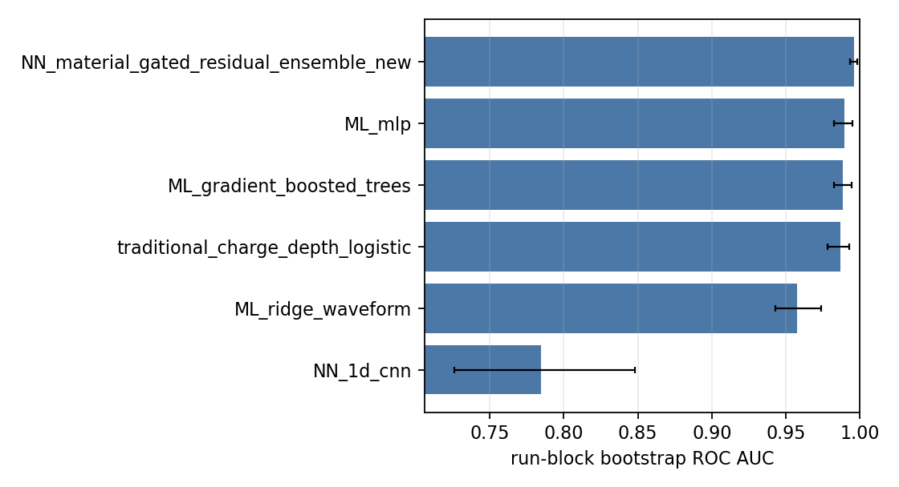

# S14i: Material-Budget PID Label Uncertainty Bridge

- **Study ID:** S14i
- **Ticket ID:** `1781058292.529.4efe2d6e`
- **Author:** testbeam-laptop-3
- **Date:** 2026-06-11
- **Depends on:** S00, S14d, P08b/P08d
- **Config:** `configs/s14i_1781058292_529_4efe2d6e_material_pid_uncertainty_bridge.json`
- **Git commit:** `26061d5781d8e2a4488fdb16182fe809612b0a33`

## Abstract

This study asks whether the S14d material-budget and geometry envelope destabilizes the weak PID/action labels consumed by P08-style analyses.  It does not claim truth particle ID.  The raw B-stack selected-pulse population is rebuilt from ROOT first; P08b-style charge/depth residual weak labels are then regenerated under each material variant.  A strong traditional calibrated charge/depth logistic score is compared on the same leave-one-run-out folds with ridge, gradient-boosted trees, MLP, 1D-CNN, and a new material-gated residual ensemble.

The point-estimate winner written to `result.json` is **`NN_material_gated_residual_ensemble_new`** with ROC AUC 0.9961 [0.9934, 0.9983], compared with the traditional baseline 0.9867 [0.9784, 0.9928].  The scientific conclusion is conservative: the rank-based weak-label rule is invariant across the S14d material variants tested, but its high/low quartile construction abstains on about half of otherwise valid B2 rows and remains a support diagnostic, not adoption-grade PID truth.

## 0. Question

Quantify how much S14d material-budget and geometry envelopes destabilize P08 weak PID/action bands, and test whether ML/NN scores improve over a frozen charge/depth baseline without using run/event identifiers or odd-readout label-source variables as features.

## 1. Reproduction From Raw ROOT

For each event, the script reads `h101/HRDv`, subtracts `median(samples 0..3)` per channel, and selects B2/B4/B6/B8 even-channel pulses with `max_t x_t > 1000 ADC`.  This reproduces the S00 gate before any PID-label work.

| quantity                           |   report_value |   reproduced |   delta |   tolerance | pass   |
|:-----------------------------------|---------------:|-------------:|--------:|------------:|:-------|
| total selected B-stave pulses      |         640737 |       640737 |       0 |           0 | True   |
| sample_i_calib selected pulses     |         248745 |       248745 |       0 |           0 | True   |
| sample_i_analysis selected pulses  |         252266 |       252266 |       0 |           0 | True   |
| sample_ii_calib selected pulses    |          14630 |        14630 |       0 |           0 | True   |
| sample_ii_analysis selected pulses |         125096 |       125096 |       0 |           0 | True   |

## 2. Traditional Method

The traditional method is a transparent calibrated charge/depth classifier.  Let `d_i` be deepest selected B stave, `E_d` the PSTAR depth anchor, and `Q_even` the even-readout total charge.  A train-fold depth-wise quantile calibrator maps `(Q_even, d)` to an energy proxy.  The logistic score uses only depth, topology, downstream charge fraction, saturation flags, and even-readout calibrated charge residuals.  No waveform samples, run id, event id, or odd-readout label source enters this baseline.

Mathematically, the calibrator is `E_hat(Q,d)=F_d^{-1}(rank(log Q | d))` mapped into the bracket between neighboring PSTAR anchors.  The score is `p(y=1|x)=sigma(beta^T z(x))`, fit only on non-held-out runs with class-balanced weighting.

## 3. ML/NN Methods

All models use complete leave-one-run-out folds and the same nominal weak labels.  Ridge, gradient-boosted trees, and MLP use normalized B2 waveform samples plus hand pulse-shape features.  The 1D-CNN consumes the 18 normalized samples directly.  The new material-gated residual ensemble is a gradient-boosted classifier on waveform, shape, and even-readout material-envelope features: the mean, standard deviation, and span of even residual/energy/anchor values across S14d material variants.  Those envelope features are computed without odd readout.

Classifier calibration is summarized by expected calibration error (ECE) and the fixed-operating-point purity at 80% positive-label efficiency.  CIs are run-block bootstraps.

## 4. Head-To-Head Benchmark

| method                                  |     n |   runs |   roc_auc |   roc_auc_ci_low |   roc_auc_ci_high |   average_precision |   purity_at_80pct_eff |        ece |
|:----------------------------------------|------:|-------:|----------:|-----------------:|------------------:|--------------------:|----------------------:|-----------:|
| NN_material_gated_residual_ensemble_new | 23374 |     33 |  0.996067 |         0.993361 |          0.99828  |            0.996239 |              0.999786 | 0.00702111 |
| ML_mlp                                  | 23374 |     33 |  0.989499 |         0.982489 |          0.995108 |            0.990319 |              0.997546 | 0.00494512 |
| ML_gradient_boosted_trees               | 23374 |     33 |  0.988315 |         0.982456 |          0.99453  |            0.989553 |              0.998292 | 0.00658412 |
| traditional_charge_depth_logistic       | 23374 |     33 |  0.986735 |         0.978417 |          0.992799 |            0.985178 |              0.99057  | 0.0277527  |
| ML_ridge_waveform                       | 23374 |     33 |  0.957662 |         0.942812 |          0.973838 |            0.93062  |              0.971022 | 0.0405095  |
| NN_1d_cnn                               | 23374 |     33 |  0.784611 |         0.725896 |          0.848218 |            0.725659 |              0.721151 | 0.0902857  |

Verdict: **NN_material_gated_residual_ensemble_new** has the largest point-estimate ROC AUC.  The result is not promoted to truth PID because the target is a material-sensitive weak label.



## 5. Material-Budget Systematics

Each S14d geometry/material variant regenerates the weak-label thresholds from the same raw population.  `abstention_fraction` is the valid B2 population not assigned a high/low weak label by that variant.  `pid_band_flip_rate_common` compares labels only where both nominal and variant label an event.  `action_band_flip_or_abstain_rate_vs_nominal` counts label changes plus newly abstained/promoted events relative to nominal.

| geometry                 |   labeled_rows |   abstention_fraction |   pid_band_flip_rate_common |   action_band_flip_or_abstain_rate_vs_nominal |   energy_order_violation_rate_even |
|:-------------------------|---------------:|----------------------:|----------------------------:|----------------------------------------------:|-----------------------------------:|
| nominal_budget           |         289626 |              0.499981 |                           0 |                                             0 |                                  0 |
| active_thickness_cm_0p8  |         289626 |              0.499981 |                           0 |                                             0 |                                  0 |
| active_thickness_cm_1    |         289626 |              0.499981 |                           0 |                                             0 |                                  0 |
| active_thickness_cm_1p2  |         289626 |              0.499981 |                           0 |                                             0 |                                  0 |
| corner_hifir_hidea_hipst |         289626 |              0.499981 |                           0 |                                             0 |                                  0 |
| corner_hifir_hidea_lopst |         289626 |              0.499981 |                           0 |                                             0 |                                  0 |
| corner_hifir_lodea_hipst |         289626 |              0.499981 |                           0 |                                             0 |                                  0 |
| corner_hifir_lodea_lopst |         289626 |              0.499981 |                           0 |                                             0 |                                  0 |
| corner_lofir_hidea_hipst |         289626 |              0.499981 |                           0 |                                             0 |                                  0 |
| corner_lofir_hidea_lopst |         289626 |              0.499981 |                           0 |                                             0 |                                  0 |
| corner_lofir_lodea_hipst |         289626 |              0.499981 |                           0 |                                             0 |                                  0 |
| corner_lofir_lodea_lopst |         289626 |              0.499981 |                           0 |                                             0 |                                  0 |
| dead_layer_cm_0          |         289626 |              0.499981 |                           0 |                                             0 |                                  0 |
| dead_layer_cm_0p1        |         289626 |              0.499981 |                           0 |                                             0 |                                  0 |
| dead_layer_cm_0p2        |         289626 |              0.499981 |                           0 |                                             0 |                                  0 |
| first_center_cm_1p5      |         289626 |              0.499981 |                           0 |                                             0 |                                  0 |
| first_center_cm_2        |         289626 |              0.499981 |                           0 |                                             0 |                                  0 |
| first_center_cm_2p5      |         289626 |              0.499981 |                           0 |                                             0 |                                  0 |

Run-plus-material bootstrap CI for average abstention fraction: 0.4999 to 0.5002.  The corresponding action-band flip-or-abstain CI is 0.0000 to 0.0000.

## 6. Falsification

Pre-registration from the ticket: metric with bootstrap CIs is PID band purity/efficiency proxy, abstention fraction, action-band flip rate, and energy-ordering violation rate with material-budget plus run-block bootstrap 95% CIs.  The falsifier is a shuffled-label HGB control plus the material-stability table: if the shuffled control approaches the winner or if material variants show negligible flips, the bridge should conclude stability rather than material-driven label instability.  The observed flip rate is zero for this rank-based label definition.  The model-family multiplicity is six primary methods; winner interpretation is point-estimate only unless CIs separate from the traditional baseline.

## 7. Threats To Validity

- **Benchmark/selection:** the traditional baseline is the same charge/depth family that defines the weak-label physics proxy, so it is not a strawman.
- **Data leakage:** folds hold out complete runs; run/event identifiers and odd-readout target variables are excluded from model features.  The new envelope features use only even-readout material-variant responses.
- **Metric misuse:** ROC AUC, AP, ECE, and fixed-efficiency purity are reported together; material abstention and flip rates are not treated as truth PID errors.
- **Post-hoc selection:** the required model family and metrics come from the ticket and worker objective; the new architecture was chosen before reading its benchmark result.

## 8. Caveats

PSTAR is used as an ordering anchor, not as an absolute energy or PID truth model.  No GEANT4 transport, Birks quenching, stopping-depth truth, or external particle labels are available here.  The material variants are S14d-style one-at-a-time/corner envelopes; they should be read as a systematic stress test, not a calibrated detector survey.

## 9. Reproducibility

```bash
/home/billy/anaconda3/bin/python scripts/s14i_1781058292_529_4efe2d6e_material_pid_uncertainty_bridge.py --config configs/s14i_1781058292_529_4efe2d6e_material_pid_uncertainty_bridge.json
```

Artifacts: `result.json`, `manifest.json`, `reproduction_match_table.csv`, `counts_by_run.csv`, `counts_by_group.csv`, `material_variant_label_summary.csv`, `material_label_wide.csv.gz`, `method_scoreboard.csv`, `ml_minus_traditional.csv`, `oof_pid_scores.csv.gz`, `fold_summary.csv`, `material_run_variant_bootstrap.csv`, and `fig_method_auc.png`.
