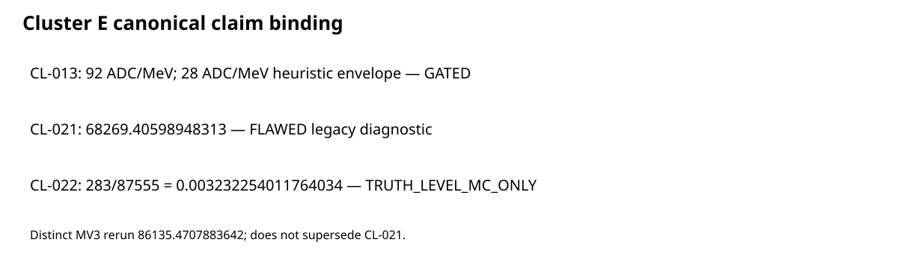

# CCB Test-Beam — Canonical Project Dashboard

## Canonical claims

| Claim | Exact statement | Status | Limitation |
|---|---|---|---|
| CL-013 | **92 ADC/MeV** with **28 ADC/MeV** heuristic envelope | **GATED** | Not a confidence interval; `BLK-MV0-001` remains. |
| CL-021 | Pearson chi2/ndf = **68269.40598948313** | **FLAWED** | Legacy diagnostic, not accepted closure; `BLK-MV3-LEGACY-001` remains. |
| CL-022 | **283/87555** = **0.003232254011764034** early-peak morphology rate | **TRUTH_LEVEL_MC_ONLY** | Total truth-MC rate, not C12 identity; `AUD-ANOM-001` remains. |

## Distinct diagnostics

The later Cluster D MV3 rerun reports chi2/ndf = **86135.4707883642** and does **not supersede CL-021**. The former MV0 v1 value **110 ADC/MeV** does **not supersede CL-013**. Early-peak species composition does not replace CL-022 **283/87555** and does not identify beam data as C12.

Generated at `2026-07-26T153018Z` from base commit `ca71b0f0b83f5bcd189c173cf7d8e28b287bc34f`. Full Git blob and SHA-256 identities are in `reports/studies/clusterE/provenance.json`. This validates claim binding only; no production calibration, accepted closure, C12 data identity, or detector performance is established.

The prior `PROJECT_DASHBOARD_OVERVIEW.png` is historical.
