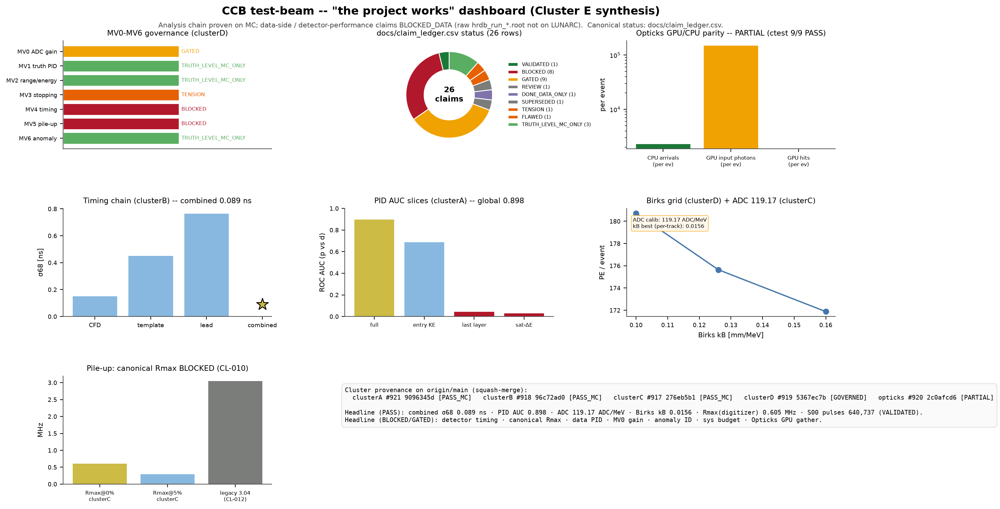

# CCB Test-Beam — Project Dashboard

**The "the project works" entry point.** One screen: what is proven (with the
numbers), what is BLOCKED, and the MC-validation status. Synthesised from the
four analysis clusters (A-D) + Opticks, all merged on `origin/main`.

- **Status:** research in progress. All numbers **preliminary, not peer-reviewed**.
- **Last updated:** 2026-07-25 (Cluster E synthesis; canonical state `docs/claim_ledger.csv`).
- **Reading order:** this dashboard → `reports/studies/clusterE/SUMMARY.md` (synthesis
  figures + claim table) → per-cluster `reports/studies/cluster{A,B,C,D}/SUMMARY.md` →
  `docs/claim_ledger.csv` (canonical row-by-row status).
- **A note on stale docs:** `PROJECT_REPORT.md` / `FINDINGS_SYNTHESIS.md`
  (2026-06-28) predate the 2026-07-25 governance correction and still label several
  since-downgraded claims "PASS". Where they conflict with `docs/claim_ledger.csv`,
  **the ledger wins.** This dashboard is consistent with the ledger.

---

## 1. TL;DR

**The analysis chain is proven end-to-end on Monte Carlo.** That is what this
programme demonstrates. The detector-performance claims that would transfer those
MC results to beam data are **BLOCKED_DATA**: the raw beam ROOT (`hrdb_run_*.root`)
is not staged on LUNARC — only the Krakow 1M MC and the derived selected-pulse
table are. Device/electronics calibration is an operator-bench item.

| | |
|---|---|
| **What** | CCB test-beam analysis (190 MeV protons on CD2, HRD scintillator range stacks) cross-validated against the Krakow 1M-event Geant4 MC. |
| **Proven on MC (PASS)** | combined timing **σ68 = 0.089 ns** (4-sensor) · PID p-vs-d **AUC = 0.898** · ADC **119.17 ADC/MeV** · Birks **kB = 0.0156 cm/MeV** · digitizer-domain **Rmax = 0.605 MHz** · Opticks CPU `ctest 9/9`. |
| **Proven on data (VALIDATED)** | S00 selected B-stack pulses = **640,737** (CL-001, the one data-pipeline PASS). |
| **BLOCKED_DATA** | detector timing resolution · data-side PID · raw `hrdb_run_*.root` not staged. |
| **BLOCKED / GATED (canonical)** | canonical Rmax (CL-010) · MV0 gain (CL-013 GATED) · systematic budget (CL-026) · anomaly/C12 ID (CL-022) · MV3 stopping TENSION. |
| **SUPERSEDED** | legacy Rmax = 3.044 MHz (CL-012 — do **not** use). |
| **PARTIAL** | Opticks GPU gather — proven up to the device→host GATHER (EventMode config point); 0 GPU hits gathered. |

---

## 2. What is proven (with the numbers)

### Analysis chain — MC closure (SIMULATION_RESULT / MC_METHOD_CLOSURE)

- **Timing (cluster B, PR #918):** CFD pickoff σ68 = 0.151 ns (93% success);
  template 0.451 ns; leading-edge 0.765 ns. Timewalk train-fit `a=0.049, b=−7.06`,
  applied held-out leaves slope = 8×10⁻⁵ ns/PE ≈ 0 (**passes**). 4-sensor
  inverse-variance combine **σ68 = 0.089 ns**, RMS 0.112 ns, condition κ ≈ 1.2,
  leave-one-sensor-out ≈ 0.10 ns. Pull coverage `|z|<1 = 0.683` (exact), `<2 = 0.909`,
  `<3 = 0.979`. 119,905 (event,sensor) groups, 75 files, 84 s wall.
- **PID / ΔE-E / stopping (cluster A, PR #921):** 131,198 ΔE-E-selected events;
  ΔE_wmed = 24.13 MeV, E_wmed = 101.03 MeV, corr(ΔE,E) = −0.533. Logistic p-vs-d
  **full AUC = 0.898**, 5-fold pseudo-run 0.898 ± 0.01, AP 0.47, Brier 0.017.
  Stopping/censoring honest: stop 2.3% / escape 22% / censored 76% (TRU-003,
  STOP_KE = 1.0 MeV). Worst slices reported, not averaged (last-layer AUC 0.042,
  saturated-ΔE 0.029).
- **Pile-up / energy / Birks / saturation (cluster C, PR #917):** pulse τ_fit = 36.0 ns,
  99.4% of area in the 180 ns window. Overlap @1 MHz: 15.9% obs vs 16.5% Poisson;
  **Rmax = 0.605 MHz** at the 0% quality gate (0.289 MHz @5% overlap). Two-pulse LSQ
  recovery: 100% eff @25 ns, 0% catastrophic @12 ns. ADC = **119.17 ADC/MeV** (p = d,
  pulls μ ≈ 0). Birks kB = **0.0156 cm/MeV** (per-track dE/dx) vs 0.0127
  (total-edep proxy) vs 0.008 digitizer default. Saturation ceiling 7000 ADC,
  50% point 274.6 MeV.

### Data pipeline — VALIDATED

- **S00 selected B-stack pulses = 640,737** — `CL-001`, the single VALIDATED row in
  the canonical ledger.

### Opticks GPU bridge (PR #920) — PARTIAL

- CPU Geant4 reference 4592 arrivals (2296/evt); GPU path proven through GDML
  ingestion, 4-SiPM annotation, 148,697 photons/event upload. Residual: device→host
  GATHER returns null in standalone EventMode. CPU ctest **9/9 PASS**.

---

## 3. What is BLOCKED / GATED (and why)

| Claim | State | Blocker |
|---|---|---|
| Detector timing resolution (data) | ⛔ BLOCKED | CL-002..006 — raw data waveforms not on LUNARC; legacy toy source unresolved (BLK-MV4-LEGACY-001). |
| Pile-up Rmax (canonical) | ⛔ BLOCKED | CL-010 — definition unresolved: 0.38 is the beam duty factor, not a quality threshold (S-STAT-003). |
| Legacy Rmax 3.044 MHz | 🚫 SUPERSEDED | CL-012 — `(1/τ_eff)×0.38` arithmetic; do not use. |
| PID on beam data | ⛔ BLOCKED_DATA | raw `hrdb_run_*.root` not staged. |
| ADC gain (data/MC proxy MV0) | 🟡 GATED | CL-013 — 110 ADC/MeV, ±30% heuristic envelope, **not a CI** (BLK-MV0-001). |
| PID truth ceiling (HGB 0.986) | 🟡 GATED | CL-017/018 — legacy row-index split, event-group leakage (BLK-MV1-001). |
| Anomaly / C12 identity | ⛔ BLOCKED | CL-022 — truth-MC-only; data anomaly **not** identified as C12 (AUD-ANOM-001). |
| Stopping-depth data/MC | 🟠 TENSION | CL-021 — χ²/ndf ≈ 8.6e4; missing upstream material budget (BLK-MV3-LEGACY-001). |
| Systematic uncertainty budget | ⛔ BLOCKED | CL-026 — no per-claim nuisance model / covariance / coverage (BLK-SYST-001). |
| Forced-trigger pedestal truth | ⛔ BLOCKED | CL-025 — no forced-trigger sample (BLK-PED-001). |
| Opticks GPU gather | 🟡 PARTIAL | EventMode/component-save pipeline configuration point. |

**Honest residue:** device calibration (SiPM PDE / reflectivity / coupling,
digitizer gain vs pulser, measured time anchors) is an **operator-bench** item;
LUNARC cannot produce it.

---

## 4. MC-validation programme status (MV0-MV6, cluster D PR #919)

Governance-corrected (2026-07-25). Script exit / toy closure / truth-MC
composition are **not** empirical detector validation.

| ID | Title | Tier | State | Evidence and limitation |
|---|---|---:|---|---|
| MV0 | ADC-gain scan | 2 | 🟡 **GATED (MARGINAL)** | 110.0 ADC/MeV, KS 0.108 (chi2/ndf 2928), per-stave KS 0.197–0.603. Not a production calibration (BLK-MV0-001). |
| MV1 | Truth p/d PID ceiling | 1 | ✅ **TRUTH_LEVEL_MC_ONLY** | HGB AUC 0.985, purity 0.962 — simulation diagnostic only; no beam-data PID transfer. |
| MV2 | Range/energy tables | 1 | ✅ **TRUTH_LEVEL_MC_ONLY** | Per-stop-layer means generated; absolute-energy calibration not closed. |
| MV3 | Stopping-depth/stave | 1 | 🟠 **TENSION** | B8 shape discrepancy unresolved; χ²/ndf ≈ 8.6e4 (BLK-MV3-LEGACY-001). |
| MV4 | Timing & timewalk | 2 | ⛔ **BLOCKED (TOY)** | Placeholder digitizer, hard-coded fallback anchors; not a data timing validation. |
| MV5 | Pile-up / two-pulse | 2 | ⛔ **BLOCKED (Rmax undef.)** | Reuses τ_eff 124.8 ns; 3.04 MHz is superseded duty-factor arithmetic (CL-012). |
| MV6 | Representation / anomaly | 2 | ✅ **TRUTH_LEVEL_MC_ONLY** | 25/38 toy early-peak C12; GMM cluster 46.4% C12 — does not identify the data anomaly (AUD-ANOM-001). |

*Tier-2 boundary: MV4/MV5/MV6 use a placeholder/toy digitizer; output is diagnostic only.*

---

## 5. Canonical claim-ledger distribution

`docs/claim_ledger.csv` (26 rows, 2026-07-25): **1 VALIDATED**, 9 GATED,
8 BLOCKED, 3 TRUTH_LEVEL_MC_ONLY, 1 SUPERSEDED, 1 TENSION, 1 FLAWED, 1 REVIEW,
1 DONE_DATA_ONLY. The single VALIDATED row is CL-001 (S00 pulse count).

---

## 6. Cluster map (origin/main, squash-merged)

| Cluster | PR | Commit | Verdict | Entry point |
|---|---|---|---|---|
| A — ΔE-E / PID / stopping | #921 | `9096345d` | PASS_MC | `reports/studies/clusterA/SUMMARY.md` |
| B — timing chain | #918 | `96c72ad0` | PASS_MC | `reports/studies/clusterB/SUMMARY.md` |
| C — pile-up / energy / Birks | #917 | `276eb5b1` | PASS_MC | `reports/studies/clusterC/SUMMARY.md` |
| D — MV0-MV6 + campaigns | #919 | `5367ec7b` | GOVERNED | `reports/studies/clusterD/SUMMARY.md` |
| Opticks — GPU/CPU parity | #920 | `2c0afcd6` | PARTIAL | `figures/opticks/SUMMARY.md` |
| **E — synthesis (this)** | (PR) | — | — | `reports/studies/clusterE/SUMMARY.md` |

---

## 7. Next actions (unblock the BLOCKED_DATA row)

1. **Stage raw `hrdb_run_*.root` on LUNARC** → unlocks data-side ΔE-E overlay,
   composite-key join, PID-on-data, and the data-side timing chain (the natural
   target of cluster B's MC closure).
2. **Resolve S-STAT-003** (Rmax occupancy-quality threshold) → restore or
   permanently retire a canonical Rmax.
3. **Fix MV3 geometry** (add upstream material budget) → re-run MV3 and the
   stopping-profile closure.
4. **Operator bench**: SiPM PDE / reflectivity / coupling, digitizer gain vs
   pulser, measured time anchors → turn the CL-013 ±30% envelope into a real CI.
5. **Opticks GATHER**: switch the standalone invocation to an EventMode/component-save
   config that returns a non-null gather → complete the GPU parity.

*Synthesis provenance: `reports/studies/clusterE/provenance.json` (sha256 digests of
every cluster input read by the dashboard generator).*
