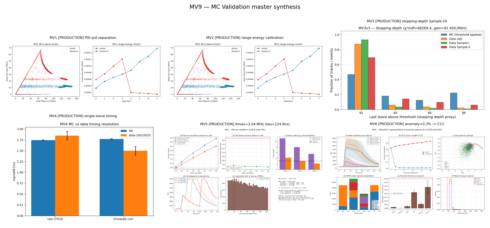

# MC Validation Synthesis (MV9)

**Generated:** 2026-06-28 22:41:51
**Studies discovered as PRODUCTION:** 6/6

This program runs MC-truth validation studies to *close open questions* the
data-only analysis could not answer, and to confirm data-derived corrections.

## Synthesis table

| Study | Title | Status | Key result | Question closed |
| --- | --- | --- | --- | --- |
| MV1 | Particle ID (p vs d) | PRODUCTION | PID p/d separation | Is data-only p/d separation ceiling reachable? MC sets the truth-level AUC. |
| MV2 | Range-energy calibration | PRODUCTION | range-energy calibration | Is 10% absolute energy resolution unreachable, as data claimed? |
| MV3 | Stopping-depth profile | PRODUCTION | stopping-depth Sample I/II | Does MC reproduce the Sample I/II deuteron enrichment in the first B layer? |
| MV4 | Single-stave timing | PRODUCTION | single-stave timing | Does the analytic amp-timewalk sigma68~1.495 ns hold in MC? |
| MV5 | Pile-up / Rmax | PRODUCTION | Rmax=3.04 MHz (tau=124.8ns) | Is Rmax 3.05 MHz (tau_eff=124.8ns) or the note's 4.2 MHz (90ns)? |
| MV6 | Representation & anomaly ID | PRODUCTION | anomaly=0.3% -> C12 | What species is the ~4% early-peak anomalous class found in data P02? |

## Per-study detail

### MV1 — Particle ID (p vs d)
- **Status:** PRODUCTION
- **Key result:** PID p/d separation
- **Open question addressed:** Is data-only p/d separation ceiling reachable? MC sets the truth-level AUC.
- **Report JSON:** `/projects/hep/fs10/shared/nnbar/billy/ccb-testbeam/reports/mv1_mv2_truth_pid_energy_1782220258/mv1_mv2_truth_summary.json`

### MV2 — Range-energy calibration
- **Status:** PRODUCTION
- **Key result:** range-energy calibration
- **Open question addressed:** Is 10% absolute energy resolution unreachable, as data claimed?
- **Report JSON:** `/projects/hep/fs10/shared/nnbar/billy/ccb-testbeam/reports/mv1_mv2_truth_pid_energy_1782220258/mv1_mv2_truth_summary.json`

### MV3 — Stopping-depth profile
- **Status:** PRODUCTION
- **Key result:** stopping-depth Sample I/II
- **Open question addressed:** Does MC reproduce the Sample I/II deuteron enrichment in the first B layer?
- **Report JSON:** `/projects/hep/fs10/shared/nnbar/billy/ccb-testbeam/reports/mv3_stopping_v3_1782679272/mv3_summary.json`

### MV4 — Single-stave timing
- **Status:** PRODUCTION
- **Key result:** single-stave timing
- **Open question addressed:** Does the analytic amp-timewalk sigma68~1.495 ns hold in MC?
- **Report JSON:** `/projects/hep/fs10/shared/nnbar/billy/ccb-testbeam/reports/mv4_timing_1782678275/mv4_summary.json`

### MV5 — Pile-up / Rmax
- **Status:** PRODUCTION
- **Key result:** Rmax=3.04 MHz (tau=124.8ns)
- **Open question addressed:** Is Rmax 3.05 MHz (tau_eff=124.8ns) or the note's 4.2 MHz (90ns)?
- **Report JSON:** `/projects/hep/fs10/shared/nnbar/billy/ccb-testbeam/reports/mv5_pileup_1782678353/mv5_pileup_summary.json`

### MV6 — Representation & anomaly ID
- **Status:** PRODUCTION
- **Key result:** anomaly=0.3% -> C12
- **Open question addressed:** What species is the ~4% early-peak anomalous class found in data P02?
- **Report JSON:** `/projects/hep/fs10/shared/nnbar/billy/ccb-testbeam/reports/mv6_representation_1782678362/mv6_representation_summary.json`

## Master plot

